Now let me create comprehensive C4 code-level documentation. This will be detailed and cover all the specified modules:

Based on my analysis of the jig project's top-level source files, here is the C4 Code-level documentation:

---

# C4 Code Level: Jig Agent Orchestration Framework

## Overview

**Name**: Jig Runtime & Orchestration System

**Description**: Jig is an AI agent orchestration framework for Claude Code. The core runtime orchestrates Claude agents through multi-phase ticket workflows, managing agent spawning, ticket state progression, inter-agent communication, and event broadcasting to connected TUI clients via WebSocket.

**Location**: `/Users/brent/Projects/personal/jig/jig/`

**Language**: Python 3.11+

**Purpose**: Provide a complete runtime for long-running agent orchestration, enabling:
- Background daemon process hosting the orchestrator and WebSocket server
- Multi-phase ticket workflow execution with role-specific agents
- Agent spawning, lifecycle management, and tool access via MCP servers
- Real-time TUI client communication via typed WebSocket protocol
- Persistent state management across tickets, threads, and checkpoints
- Deadlock detection and resolution via age-based escalation

---

## Architecture Overview

The jig runtime follows a **three-layer architecture**:

```
┌─────────────────────────────────────────────────────────┐
│                  Daemon & CLI Layer                     │
│  (daemon.py, cli.py)                                    │
│  ├─ Daemon lifecycle: start/stop/status                 │
│  └─ CLI commands: init, daemon, validate, etc.          │
└────────────────────────┬────────────────────────────────┘
                         │
┌────────────────────────▼────────────────────────────────┐
│              Orchestrator & Coordination                 │
│  (orchestrator.py, coordinator.py, ws_server.py)        │
│  ├─ Main state machine: ticket dispatch & progression   │
│  ├─ Multi-layer build-plan coordination                 │
│  ├─ WebSocket event broadcasting to TUI clients         │
│  └─ Deadlock detection & resolution                     │
└────────────────────────┬────────────────────────────────┘
                         │
┌────────────────────────▼────────────────────────────────┐
│              Agent Execution & MCP Layer                 │
│  (agent.py, mcp_server.py, runtime.py)                  │
│  ├─ Agent spawning via Claude Code SDK                  │
│  ├─ MCP tool server factory & tool handlers             │
│  ├─ MCP context wrapping for ticket/phase/role scoping  │
│  └─ Agent prompt building & capability compilation      │
└─────────────────────────────────────────────────────────┘
```

---

## Core Code Elements

### 1. **daemon.py** — Background Daemon Lifecycle

**Purpose**: Manage the long-running background daemon process that hosts the orchestrator. The daemon runs detached from the TUI; closing the TUI does not stop in-flight agents.

**Key Classes**:

| Class | Purpose |
|-------|---------|
| `DaemonPaths` | Frozen dataclass tracking `.jig/run/` runtime files (PID, socket address, stderr log, container ID) |
| `DaemonStatus` | Reports daemon run-state: running flag, PID/container ID, stale flag, last error from stderr |
| `DaemonStartResult` | Result of `daemon_start()`: PID/addr, optional container ID, list of orphaned containers removed |
| `DaemonAlreadyRunning` | Exception raised when a live daemon already exists |

**Key Functions**:

| Function | Signature | Purpose |
|----------|-----------|---------|
| `daemon_paths` | `(project_path: Path, *, ensure: bool = False) -> DaemonPaths` | Compute daemon file paths under `.jig/run/` |
| `daemon_status` | `(project_path: Path) -> DaemonStatus` | Inspect daemon run-state: PID/container file, orphan detection via port listen check |
| `daemon_start` | `(project_path: Path, *, ws_port: int \| None = None, docker: bool = False, _command_override: Sequence[str] \| None = None) -> DaemonStartResult` | Fork background daemon (host mode) or launch detached container (docker mode); auto-allocate ephemeral port if needed; brief poll for immediate-death cases |
| `daemon_stop` | `(project_path: Path, *, timeout: float = 5.0) -> bool` | Stop running daemon: SIGTERM → SIGKILL (host), or `docker stop` (docker); clean up state files; return True if daemon was running |
| `_port_in_use` | `(port: int) -> bool` | Check if a TCP port is listening |
| `_allocate_ws_port` | `(preferred: int = 19100) -> int` | Return preferred port if free, else OS-assigned ephemeral port |
| `_pid_on_port` | `(port: int) -> int \| None` | Resolve PID of process listening on port via `lsof` |
| `_process_alive` | `(pid: int) -> bool` | Check if PID is a live process via signal 0 |
| `_tail_err` | `(paths: DaemonPaths) -> str \| None` | Read last non-empty line of daemon.err |

**Dependencies**:
- `jig.container` — Docker availability checks, container lifecycle
- Standard library: `os`, `signal`, `socket`, `subprocess`, `time`, `pathlib`

**Location**: `/Users/brent/Projects/personal/jig/jig/daemon.py` (432 lines)

---

### 2. **orchestrator.py** — Main State Machine & Scheduler

**Purpose**: Singleton orchestrator instance that drives ticket state progression through workflow phases. Maintains the service loop, spawns agents for ready tickets, applies federation review, detects deadlocks, and handles phase completion/failure logic.

**Key Classes**:

| Class | Purpose |
|-------|---------|
| `Orchestrator` | Main stateful orchestrator; manages ticket lifecycle, agent spawning, phase progression, thread/checkpoint stores, deadlock detection |

**Key Methods**:

| Method | Signature | Purpose |
|--------|-----------|---------|
| `__init__` | `(*, project: Project, emitter: EventEmitter, ...)` | Initialize orchestrator with project, stores, prompt registry |
| `startup` | `async (self) -> None` | Boot the service loop: resume in-progress tickets, start deadlock sweep, stall detection, start-ready-tickets loop |
| `shutdown` | `async (self) -> None` | Graceful shutdown: cancel tasks, close stores, kill orphan Claude processes |
| `reload` | `async (self) -> None` | Reload config (roles, workflows) without stopping the orchestrator |
| `_run_service_loop` | `async (self) -> None` | Main event loop: await scheduler messages, dispatch ready tickets, handle TUI messages (reload, emergency reset) |
| `_handle_schedule` | `async (self, ticket_id: str) -> None` | Called by scheduler to run a ready ticket: spawn agent, record phase start, await completion, update phase status |
| `_run_ticket` | `async (self, ticket_id: str) -> None` | Drive one ticket through its current phase: check thread for unresolved blocking entries, wait if needed, spawn agent, record phase result |
| `_start_ready_tickets` | `async (self) -> None` | Dispatch loop: find all ready-to-run tickets, schedule each one |
| `_run_deadlock_loop` | `async (self) -> None` | Sweep blocking entries periodically for age-based escalation (nudge after 4h, escalate after 24h) |
| `_run_stall_loop` | `async (self) -> None` | Monitor agent thinking-block heartbeats; auto-kill agents that stall beyond timeout |
| `_run_review_federation` | `async (self, ticket_id: str, ticket) -> None` | Dispatch reviewer agents to assess merged work; gate resolution on feedback |
| `_on_ticket_completed` | `async (self, ticket_id: str, ticket) -> None` | Phase completion handler: record phase success, trigger federation or auto-advance to next phase |
| `_on_ticket_failed` | `async (self, ticket_id: str, ticket) -> None` | Phase failure handler: mark ticket FAILED, optionally trigger conflict-resolver or replan agents |
| `_ensure_planning_ticket` | `async (self) -> None` | Ensure the special `"plan"` ticket exists for Planner PM handoffs |
| `_wait_for_thread_unblock` | `async (self, ticket_id: str) -> None` | Poll for thread-entry resolution when a phase is blocked by a Question/Objection/Escalation |
| `_run_agent_with_analytics` | `async (self, ctx: AgentSpawnContext, *, spawned_by: str = "orchestrator") -> str` | Spawn agent via SDK; capture thinking blocks, tool calls, results; emit analytics events |

**Key Attributes**:

| Attribute | Type | Purpose |
|-----------|------|---------|
| `_project` | `Project` | Project metadata and paths |
| `_tickets` | `TicketStore` | Persistent ticket store |
| `_threads` | `ThreadStore` | Persistent thread-entry store (questions, objections, handoffs, notes) |
| `_memory` | `MemoryStore` | Agent memory/context store |
| `_checkpoints` | `CheckpointStore` | Agent checkpoint/deferred store |
| `_bus` | `MessageBus` | Internal message queue (TUI messages, scheduler notifications) |
| `_emitter` | `EventEmitter` | Event broadcast to WebSocket clients |
| `_prompt_registry` | `PromptRegistry` | Cached role prompts |
| `_deadlock_sweep_task` | `asyncio.Task \| None` | Background task for deadlock sweeps |
| `_stall_detector` | `StallDetector` | Tracks agent thinking-block heartbeats |
| `_service_task` | `asyncio.Task \| None` | Main event-loop task |
| `_active_tickets` | `dict[str, asyncio.Task]` | In-flight ticket tasks |

**Dependencies**:
- `jig.agent` — `run_agent()` to spawn Claude agents
- `jig.coordinator` — `Coordinator` for multi-layer dispatch
- `jig.config` — `load_config()`, `OrchestratorSection`, `DeadlockSection`
- `jig.deadlock` — `sweep_blocking_entries()` for age-based escalation
- `jig.store.tickets`, `jig.store.threads`, `jig.store.memory`, `jig.store.checkpoints`, `jig.store` — Persistent stores
- `jig.stall_detector` — Agent liveness monitoring
- `jig.analytics` — Event emission for analytics pipeline
- Analytics schema modules for event types
- `jig.dev_env.orchestrator_hook` — Dev environment provisioning per agent

**Location**: `/Users/brent/Projects/personal/jig/jig/orchestrator.py` (3,400+ lines, contains large methods)

---

### 3. **coordinator.py** — Multi-Layer Build-Plan Dispatcher

**Purpose**: Implements the v2 PM coordination layer. Materializes bones/MVP/final layer tickets from the build plan; advances layer status; checks ordering constraints; manages DEFERRED queue triage.

**Key Classes**:

| Class | Purpose |
|-------|---------|
| `Coordinator` | Manages build-plan state, layer materialization, layer-status tracking per epic |
| `CycleResult` | Summary of one `dispatch_cycle()` call: newly created ticket IDs, layer name, action summary |
| `DeferredEntry` | Deferred queue entry for a ticket awaiting promotion to a layer |
| `TriageDecision` | Decision from triage (promote, reject, defer, skip) |
| `PromotionContext` | Context for promotion operations (epic, layer, ticket, reason) |

**Key Methods**:

| Method | Signature | Purpose |
|--------|-----------|---------|
| `__init__` | `(project_path: Path, orchestrator_emitter: EventEmitter \| None = None)` | Initialize coordinator with project path and optional analytics emitter |
| `materialize_ready_tickets` | `async (self, ticket_ids: list[str], size: Size = "standard", author: str = "planner_v2", phase: str = "development") -> list[str]` | One-shot bones-layer materialization (backward-compat path) |
| `materialize_layer` | `async (self, epic_id: str, layer: LayerName, author: str, reason: str = "") -> list[Ticket]` | Create all bones/MVP/final tickets for one epic×layer from build-plan |
| `advance_layer_status` | `async (self, epic_id: str, layer: LayerName, new_status: LayerStatusEnum) -> None` | Update layer status in build-plan |
| `next_layer_ready` | `async (self, epic_id: str) -> LayerName \| None` | Determine which layer to advance next per `OrderingRule` (bones_first, etc.) |
| `dispatch_cycle` | `async (self, author: str = "coordinator-v2") -> CycleResult` | Single dispatch cycle: materialize bones, check MVP readiness, return action summary |

**Key Attributes**:

| Attribute | Type | Purpose |
|-----------|------|---------|
| `_project_path` | `Path` | Project root |
| `_plan` | `BuildPlan \| None` | Cached build plan (loaded on demand) |
| `_emitter` | `EventEmitter \| None` | Analytics emitter (optional) |

**Exported Symbols**:

```python
BONES_DEFAULT_DEV_TIER: str = "standard"
DEFAULT_AUTHOR: str = "coordinator-v2"
_LAYER_ORDER: tuple[str, ...] = ("bones", "mvp", "final")
```

**Dependencies**:
- `jig.spec_loader` — `load_build_plan()`, `write_build_plan()`
- `jig.store.tickets` — `TicketStore`
- `jig.schemas.plan` — `BuildPlan`, `Epic`, `LayerName`, `LayerStatus`, `OrderingRule`
- `jig.atomic` — Atomic file writes
- `jig.ticket` — `Ticket`, `Size`, `TicketStatus`, `WorkType`

**Location**: `/Users/brent/Projects/personal/jig/jig/coordinator.py` (700+ lines)

---

### 4. **agent.py** — Agent Spawning & Prompt Building

**Purpose**: Spawns Claude Code agents via the SDK in streaming input mode. Compiles capabilities, resolves context URIs, loads MCP tools, and manages agent lifecycle including thinking block detection, tool invocation logging, and result extraction.

**Key Classes**:

| Class | Purpose |
|-------|---------|
| `RunAgentResult` | Result of running an agent: status (success/failed/blocked/needs_info), final text, thinking blocks, tool calls, state changes |
| `AgentCheckRunner` | For check agents (narrowly scoped, read-only, bounded timeout) |

**Key Functions**:

| Function | Signature | Purpose |
|----------|-----------|---------|
| `run_agent` | `async (ctx: AgentSpawnContext) -> RunAgentResult` | Main agent spawn entry point: build prompt, compile capabilities, create MCP server, run SDK query loop, return result |
| `build_agent_prompt` | `(ctx: AgentSpawnContext) -> str` | Compose initial system + user prompt from phase config, role prompt, context resolution, ticket metadata |
| `build_initial_prompt` | `(ctx: AgentSpawnContext) -> str` | Build the initial user-facing prompt (role task + context references) |
| `_sanitize_for_tui` | `(text: str, limit: int = 120) -> str` | Strip ANSI/control chars, collapse whitespace for TUI single-line rendering |
| `_tool_detail` | `(tool_name: str, tool_input: dict) -> str` | Extract short human-readable detail from tool call for TUI display |
| `_thinking_config` | `() -> ThinkingConfigAdaptive` | Return adaptive thinking config for the SDK |

**Key Attributes** (in `RunAgentResult`):

| Attribute | Type | Purpose |
|-----------|------|---------|
| `status` | `str` | One of: success, failed, blocked, needs_info |
| `final_text` | `str` | Agent's final text output |
| `thinking_blocks` | `list[dict]` | Extracted thinking blocks from response |
| `tool_calls` | `list[dict]` | Tool invocations made by agent |
| `state_changes` | `dict[str, Any]` | Ticket/thread state mutations from tool calls |

**Tool Security**:

The module enforces role-based tool access via `_STRICT_DENY_BUILTINS` (frozenset of dangerous tools: Bash, Edit, Write, Read, etc.) and `_strict_disallowed_tools()` function. Strict-tools roles (PO, SA) get an allowlist enforced by the SDK.

**Dependencies**:
- `claude_agent_sdk` — SDK query, tool decorator, MCP server factory
- `jig.mcp_server` — `create_agent_mcp_server()`
- `jig.capability_compiler` — `compile()` and `materialize()` functions
- `jig.context_resolver` — `resolve_context_uris()`
- `jig.prompt_builder` — `build_initial_prompt()`
- `jig.skill_loader` — `load_all_skills()`, `match_skills()`
- `jig.persistence` — `load_role()`, `list_roles()`, `load_conventions()`
- `jig.sandbox` — Bwrap sandbox config/transport
- `jig.runtime` — `AgentSpawnContext`, `SpawnReason`

**Location**: `/Users/brent/Projects/personal/jig/jig/agent.py` (1,200+ lines)

---

### 5. **runtime.py** — Agent Spawn Context & Enums

**Purpose**: Defines the data structures passed to agent spawning: spawn reason enum, agent context dataclass bundling project/ticket/stores/phase/role info.

**Key Classes**:

| Class | Purpose |
|-------|---------|
| `SpawnReason` | Enum: PHASE_PRIMARY, QA_RESPONDER, EVALUATOR, CONFLICT_RESOLVER, REPLAN — reasons for spawning an agent |
| `AgentSpawnContext` | Frozen dataclass carrying complete spawn context: role, ticket, worktree, project, all stores, phase config, optional extra env |

**Key Fields** (in `AgentSpawnContext`):

| Field | Type | Purpose |
|-------|------|---------|
| `role` | `str` | Role name (e.g., "developer", "po", "sa") |
| `role_cfg` | `RoleConfig` | Role configuration from `.jig/roles/<role>.yaml` |
| `spawn_reason` | `SpawnReason` | Reason for spawn (phase_primary, evaluator, etc.) |
| `ticket` | `Ticket` | The ticket this agent is working on |
| `parent` | `Ticket \| None` | Parent ticket (for subtasks) |
| `worktree_path` | `Path` | Worktree directory for agent to work in |
| `project` | `Project` | Project metadata |
| `tickets` | `TicketStore` | Persistent ticket store |
| `threads` | `ThreadStore` | Persistent thread-entry store |
| `memory` | `MemoryStore` | Agent memory store |
| `bus` | `MessageBus` | Internal message bus |
| `checkpoints` | `CheckpointStore \| None` | Optional checkpoint store |
| `phase` | `PhaseConfig \| None` | Phase config (None for non-phase spawns like QA_RESPONDER) |
| `initial_bus_message` | `dict \| None` | Optional initial bus message for agent |
| `extra_env` | `dict[str, str] \| None` | Extra environment variables to inject into SDK |
| `analytics_emitter` | `object \| None` | Analytics emitter (narrowly typed to avoid import cycles) |
| `on_thinking` | `Callable[[], None] \| None` | Callback on each thinking heartbeat (for stall detection) |

**Dependencies**:
- `jig.models` — `PhaseConfig`, `RoleConfig`
- `jig.project` — `Project`
- `jig.store` — `MessageBus`
- `jig.ticket` — `Ticket`
- Standard library: `dataclasses`, `enum`, `pathlib`

**Location**: `/Users/brent/Projects/personal/jig/jig/runtime.py` (62 lines)

---

### 6. **ws_server.py** — WebSocket Event Broadcaster

**Purpose**: Asyncio WebSocket server for broadcasting real-time orchestrator state to connected TUI clients. Implements a typed message protocol with topic subscriptions, event history replay, and snapshot delivery.

**Key Classes**:

| Class | Purpose |
|-------|---------|
| `WebSocketServer` | Asyncio WebSocket server; manages client connections, event relay, topic subscriptions, history buffer, pending prompts |

**Key Methods**:

| Method | Signature | Purpose |
|--------|-----------|---------|
| `__init__` | `(emitter: EventEmitter, host: str = "127.0.0.1", port: int = 19100, orchestrator: "Orchestrator \| None" = None, project_path: Path \| None = None)` | Initialize WS server with emitter, host, port |
| `start` | `async (self) -> None` | Start listening for client connections; begin event relay task |
| `stop` | `async (self) -> None` | Close server socket, cancel relay task, clean up client connections |
| `_handle_client` | `async (self, websocket: ServerConnection) -> None` | Per-client coroutine: receive messages, route to handler, catch disconnection |
| `_handle_incoming` | `async (self, websocket: ServerConnection, raw: str) -> None` | Parse incoming JSON; dispatch on message type (subscribe, get_prompt, reply_prompt, legacy history request) |
| `_relay_events` | `async (self) -> None` | Drain event emitter queue; broadcast to all connected clients with topic filtering |
| `_safe_send` | `async (self, websocket: ServerConnection, message: str) -> None` | Send message with swallowed ConnectionClosed exception |

**Message Protocol**:

**Snapshot** (sent once per subscribe):
```json
{"type": "snapshot", "topic": "tickets", "data": [...]}
```

**Event** (sent per state change):
```json
{"type": "event", "topic": "tickets", "kind": "ticket_created", "data": {...}}
```

**Subscription**:
```json
{"type": "subscribe", "topics": ["tickets", "threads", "agents"]}
```

**Key Functions**:

| Function | Signature | Purpose |
|----------|-----------|---------|
| `snapshot_envelope` | `(topic: str, data: Any) -> dict` | Build a snapshot message envelope |
| `event_envelope` | `(topic: str, kind: str, data: Any) -> dict` | Build a typed event message envelope |

**Key Attributes**:

| Attribute | Type | Purpose |
|-----------|------|---------|
| `_host` | `str` | Bind address (127.0.0.1 or 0.0.0.0 in container) |
| `_port` | `int` | WebSocket port (19100 or allocated ephemeral) |
| `_clients` | `set[ServerConnection]` | Connected WebSocket clients |
| `_queue` | `asyncio.Queue[JigEvent]` | Event emitter subscription queue |
| `_history` | `collections.deque[str]` | Last 1000 events for replay on connect |
| `_subscriptions` | `dict[ServerConnection, set[str]]` | Per-client topic subscriptions |
| `_pending_prompts` | `dict[str, dict]` | Prompts awaiting reply from TUI client |
| `_prompt_registry` | `PromptRegistry` | Cached prompt configurations |

**Valid Topics**:
- `tickets`
- `threads`
- `agents`
- `spec`
- `events`
- `prompts`

**Dependencies**:
- `websockets` — Asyncio WebSocket server
- `jig.events` — `EventEmitter`, `JigEvent`
- `jig.persistence` — `load_role()`, `load_workflow()`
- `jig.ticket_mcp` — Ticket MCP tool handlers
- `jig.prompt_registry` — `PromptRegistry`
- Standard library: `asyncio`, `json`, `logging`

**Location**: `/Users/brent/Projects/personal/jig/jig/ws_server.py` (700+ lines)

---

### 7. **mcp_server.py** — MCP Tool Server Factory

**Purpose**: Factory function that creates an SDK MCP server exposing all Jig-specific tools (ticket ops, thread ops, ontology ops, checkpoints, etc.). Wraps handlers with contextvar scope (ticket_id, phase, role, agent_id) and enforces ticket-scope security.

**Key Function**:

| Function | Signature | Purpose |
|----------|-----------|---------|
| `create_agent_mcp_server` | `(*, tickets: TicketStore, threads: ThreadStore, memory: MemoryStore, bus: MessageBus, agent_role: str, agent_cfg: RoleConfig, worktree_path: Path, project_path: Path, valid_roles: frozenset[str] = frozenset(), package_manager: str = "", checkpoints: CheckpointStore \| None = None, phase_name: str = "", can_waive: frozenset[str] = frozenset(), phase_questions_to: frozenset[str] = frozenset(), phase_escalation_targets: frozenset[str] = frozenset(), ticket_id: str = "", analytics_emitter: "AnalyticsEmitter \| None" = None)` | Create SDK MCP server with all tool handlers scoped to the spawn context |

**Key Wrapper Function**:

| Function | Signature | Purpose |
|----------|-----------|---------|
| `_wrap_with_context` | `(handler: ToolHandler, *, ticket_id: str \| None, phase: str \| None, role: str \| None, agent_id: str \| None, enforce_ticket_scope: bool = False) -> ToolHandler` | Wrap MCP handler to set contextvars (ticket_id, phase, role, agent_id) at the call boundary; optionally enforce ticket-scope security (SEC-I1) |

**Security**:

- **SEC-I1**: Ticket-scope enforcement — when `enforce_ticket_scope=True` and the agent is bound to a ticket, reject cross-ticket tool calls (e.g., reading or commenting on a different ticket).
- `cross_ticket_access=True` (for roles like orchestrator/planner_pm) opt out of the check.

**Tools Registered**:

The factory imports and registers handlers from:
- `jig.checkpoint_mcp` — Checkpoint operations
- `jig.init_mcp` — Initialization
- `jig.planner_pm_mcp` — Planner operations
- `jig.po_l0_mcp`, `jig.po_l1_mcp`, `jig.po_l2_mcp`, `jig.po_l3_mcp` — PO tools (layered)
- `jig.po_ontology_mcp` — Ontology edits
- `jig.quartermaster` — Quartermaster tools
- `jig.reviewer_mcp` — Reviewer `post_comment` operation; `reviewer_get_diff` and `reviewer_read_file` (scoped diff/read for roles with `reads_glob`) registered inline in `mcp_server.py`
- `jig.sa_incremental_mcp`, `jig.sa_mcp` — SA tools
- `jig.thread_mcp` — Thread operations (questions, answers, objections, handoffs, escalations)
- `jig.ticket_mcp` — Ticket CRUD operations
- `jig.vd_mcp` — Value-driven operations

**Dependencies**:
- `claude_agent_sdk` — SDK tool decorator, MCP server factory
- `jig.models` — `RoleConfig`
- `jig.store` — Store interfaces
- `jig.logging_setup` — Contextvar bindings
- All MCP handler modules (listed above)

**Location**: `/Users/brent/Projects/personal/jig/jig/mcp_server.py` (3,000+ lines, contains all tool handler registrations)

---

### 8. **cli.py** — Command-Line Interface

**Purpose**: Click-based CLI for jig operations: project initialization, daemon control, validation, simulation, and per-project ticket/agent inspection.

**Key Functions**:

| Function | Signature | Purpose |
|----------|-----------|---------|
| `cli` | `() -> None` | Root Click group for all subcommands |
| `init` | `(name: str, force: bool, brief_file: Path \| None, auto: bool) -> None` | Initialize a new jig project: run PO conversation (or load brief), generate spec, architecture, scaffold tickets |
| `daemon` | `(subcommand, ...)` | Daemon subgroup: `start`, `serve`, `stop`, `status` |
| `validate` | `(path: Path, ...) -> None` | Validate project structure: check stores, config, workflows, specs |

**Key CLI Subcommands**:

- `jig init <name>` — Bootstrap new project
- `jig daemon start` — Start background daemon
- `jig daemon stop` — Stop background daemon
- `jig daemon status` — Query daemon status
- `jig validate` — Validate project structure
- `jig build` — Build Docker image
- Simulation / analysis subcommands (wired in from `jig.sim.cli`)
- Per-commit hooks (wired from `jig.hooks.per_commit_runner`)

**Key Module-Level Functions**:

| Function | Signature | Purpose |
|----------|-----------|---------|
| `_report_section_locks` | `async (project_path: Path, ticket_id: str) -> None` | Report which sections are locked on a ticket (for `jig validate --ticket-id`) |

**Dependencies**:
- `click` — CLI framework
- `jig.daemon` — Daemon start/stop
- `jig.orchestrator` — Orchestrator spawning
- `jig.ws_server` — WebSocket server
- `jig.init_workflow` — `run_init()` for project initialization
- `jig.worktree` — Worktree cleanup
- Standard library: `asyncio`, `os`, `subprocess`

**Location**: `/Users/brent/Projects/personal/jig/jig/cli.py` (2,000+ lines)

---

### 9. **config.py** — Project Configuration Models

**Purpose**: Pydantic models for `.jig/config.yaml` with validation. Covers project metadata, workflow catalog, ownership assignments, role wiring, escalation config, and orchestrator knobs.

**Key Classes**:

| Class | Purpose |
|-------|---------|
| `Config` | Top-level config model: project, workflows, ownership, roles, escalation, deadlock, orchestrator, self_approval, profile |
| `WorkflowsSection` | Workflow catalog: global defaults, available list, per-work-type overrides |
| `OwnershipSection` | Field ownership (who controls spec sections, architecture, capability policy, etc.) |
| `RolesSection` | PO / SA role wiring (assignment kind, human, helper template) |
| `EscalationSection` | Default human escalation contact |
| `OrchestratorSection` | Orchestrator knobs: run_review_federation, canonicalize_mode |
| `DeadlockSection` | Age-based deadlock thresholds: nudge_after_s, escalate_after_s |
| `ProfileSection` | Project profile binding: SA role depth + per-size workflow routing; defaults preserve legacy behaviour when absent |
| `RoleAssignment` | Role staffing (human, human_with_helper, agent, or unset) |
| `SpecOwnership` | Ownership of spec fields (behaviors, acceptance_criteria, design, technical_risks) |
| `WorkflowTypeEntry` | Per-work-type workflow selection (default_by_size, available list) |

**Exported Functions**:

| Function | Signature | Purpose |
|----------|-----------|---------|
| `load_config` | `(project_path: Path) -> Config` | Load `.jig/config.yaml`; raises FileNotFoundError if absent |
| `save_config` | `(project_path: Path, config: Config) -> None` | Write `.jig/config.yaml` atomically |
| `resolve_workflow` | `(config: Config, *, work_type: str, size: str, explicit: str \| None = None) -> str` | Resolve workflow name per priority order: explicit → by_type.default_by_size → by_type.available[0] → default_by_size → "default" |
| `validate_workflow_references` | `(config: Config, known_workflows: list[str]) -> list[str]` | Check workflow references against catalog; return list of warning messages |

**Literals & Vocabularies**:

```python
RoleAssignmentKind = Literal["", "human", "human_with_helper", "agent"]
SelfApprovalPolicy = Literal["warn", "blocked"]
```

**Dependencies**:
- `pydantic` — Model validation
- `yaml` — YAML parsing
- `jig.project` — `Project` model
- Standard library: `pathlib`

**Location**: `/Users/brent/Projects/personal/jig/jig/config.py` (305 lines)

---

### 10. **models.py** — Domain Models for Phases & Roles

**Purpose**: Pydantic models for workflow phase/role configuration: role capabilities, evaluator specs, phase task templates, acceptance criteria, automation gates.

**Key Classes**:

| Class | Purpose |
|-------|---------|
| `RoleConfig` | Role configuration: phase/response prompts, allowed tools, context (default/required), allowed MCPs, strict_tools flag, capabilities, cross_ticket_access, allow_add_dependency |
| `PhaseConfig` | Phase configuration: name, role, task template, acceptance criteria, automated checks, evaluator spec, thread routing (questions_to, escalation_targets), capability overrides |
| `WorkflowConfig` | Workflow configuration: name, list of phases |
| `MergeStrategy` | Enum: DIRECT, SQUASH, PR, FEATURE_BRANCH |
| **Evaluator types** (discriminated union): `PreviousPhaseRoleEvaluator`, `SpecificRoleEvaluator`, `AutomatedOnlyEvaluator`, `SpecificHumanEvaluator`, `MultiEvaluator` |

**Key Evaluator Specs**:

| Type | Purpose | Example |
|------|---------|---------|
| `previous_phase_role` | Actor from prior phase for same role | Code reviewer evaluates fix |
| `specific_role` | Any actor with named role | SA reviews dev work |
| `automated_only` | Checks determine acceptance | CI tests pass → auto-accept |
| `specific_human` | Named human must evaluate | Security team approves |
| `multi` | Multiple evaluators (all accept, any reject) | Security + PM approval |

**Key Fields** (in `RoleConfig`):

| Field | Type | Purpose |
|-------|------|---------|
| `role` | `str` | Role identifier (e.g., "developer", "po") |
| `phase_prompt` | `str` | System prompt for this role in its phase |
| `response_prompt` | `str` | Optional response-specific prompt |
| `allowed_tools` | `list[str]` | Allowed SDK tools (strict_tools=True restricts to these) |
| `default_context` | `list[str]` | Context URIs to resolve (warnings on failure) |
| `required_context` | `list[str]` | Context URIs (spawn fails if unresolvable) |
| `allowed_mcps` | `list[str]` | Allowed MCP tools |
| `strict_tools` | `bool` | Enforce allowed_tools via SDK disallowed_tools list (default False) |
| `capabilities` | `CapabilityDeclaration \| None` | Tool/path/param capability constraints |
| `cross_ticket_access` | `bool` | Permit cross-ticket tool calls (default False) |
| `allow_add_dependency` | `bool` | Permit `add_dependency` tool (runs pkg manager outside bwrap) |
| `reads_glob` | `list[str]` | Include glob patterns for reviewer file-scoping; empty = unscoped (default `[]`) |
| `reads_exclude` | `list[str]` | Exclude glob patterns for reviewer file-scoping; exclude wins over include (default `[]`) |
| `skills` | `list[str]` | Skill names to install in the agent's per-spawn Claude Code plugin; empty = all jig skills installed (default `[]`) |

**Dependencies**:
- `pydantic` — Model validation, discriminated unions
- `jig.capabilities` — `CapabilityDeclaration`
- Standard library: `enum`, `typing`

**Location**: `/Users/brent/Projects/personal/jig/jig/models.py` (185 lines)

---

### 11. **events.py** — Event System

**Purpose**: Simple pub-sub event system for broadcasting workflow state changes to WebSocket subscribers.

**Key Classes**:

| Class | Purpose |
|-------|---------|
| `JigEvent` | Dataclass: type (str), data (dict); serializable to JSON |
| `EventEmitter` | Pub-sub broker: manage subscribers (asyncio queues), emit events to all subscribers |

**Key Methods** (in `EventEmitter`):

| Method | Signature | Purpose |
|--------|-----------|---------|
| `subscribe` | `(self) -> asyncio.Queue[JigEvent]` | Register new subscriber; return queue |
| `unsubscribe` | `(self, queue: asyncio.Queue[JigEvent]) -> None` | Unregister subscriber |
| `emit` | `async (self, event: JigEvent) -> None` | Broadcast event to all subscribers |

**Dependencies**:
- Standard library: `asyncio`, `dataclasses`, `json`

**Location**: `/Users/brent/Projects/personal/jig/jig/events.py` (32 lines)

---

### 12. **thread.py** — Typed Thread Entries

**Purpose**: Pydantic models for Phase 4 typed thread-entry store. Every conversation entry (Question, Answer, Objection, Handoff, Escalation, etc.) is a discriminated union member with its own type and schema.

**Key Classes** (discriminated union members):

| Type | Purpose | Gating Semantics |
|------|---------|------------------|
| `Question` | Targeted Q&A (questioner opens, asker closes) | Blocking until resolved |
| `Answer` | Response to a question | Resolves question |
| `Objection` | Reviewer gate (objector closes or waiver bypasses) | Blocking until resolved/waived |
| `Resolution` | Resolves objection | Closes objection |
| `Waiver` | Authorized bypass of objection | Closes objection |
| `Decision` | Non-obvious choice with rationale (mirrored to `/decisions/`) | Non-blocking (audit trail) |
| `Handoff` | Phase completion record (evaluator accepts/rejects) | Blocks phase advance until accepted |
| `Escalation` | "Beyond my scope" signal | Blocking (routes to escalation target) |
| `Uncertain` | "Route me" signal (orchestrator converts to Q or Escalation) | Blocking until conversion |
| `Note` | Freeform observation | Non-blocking (auto-resolved) |
| `Proposal` | Owned-artifact change request | Blocking until accepted/rejected/waived |
| `SystemEvent` | Legacy commit/phase_run/status_change audit records | Non-blocking |

**Key Base Class**:

| Class | Purpose |
|-------|---------|
| `_ThreadEntryBase` | Shared envelope: ticket_id, author, timestamp, id, kind |

**Key Fields** (shared across most entries):

| Field | Type | Purpose |
|-------|------|---------|
| `ticket_id` | `str` | Ticket this entry is on |
| `author` | `str` | Who posted it (role, user, system) |
| `timestamp` | `datetime` | When posted (tz-aware UTC) |
| `kind` | `Literal[...]` | Entry type (discriminator for union) |
| `is_blocking` | property | Whether this entry blocks phase advance |
| `is_resolved` | property | Whether this entry is resolved |

**Key Helper Classes**:

| Class | Purpose |
|-------|---------|
| `DeferredItem` | Deferred-queue item: id, item (string), reason, status (open/done/promoted/accepted), promoted_ticket_id |

**Dependencies**:
- `pydantic` — Model validation, discriminated unions, Field
- `jig.store.models` — `StoreModel` base class
- Standard library: `uuid`, `datetime`, `typing`

**Location**: `/Users/brent/Projects/personal/jig/jig/thread.py` (600+ lines)

---

### 13. **ticket.py** — Ticket Models & Enums

**Purpose**: Pydantic models for persistent ticket records, work-type enums, size enums, and plan metadata views.

**Key Classes**:

| Class | Purpose |
|-------|---------|
| `Ticket` | Main ticket record: id, title, description, status, work_type, size, assignee, created/updated timestamps, phase index, module/epic/suite metadata, plan fields (layer, dev_tier, etc.) |
| `TicketStatus` | Enum: NEW, READY, IN_PROGRESS, BLOCKED, RESOLVED, FAILED, COMPLETED, DEFERRED |
| `WorkType` | Enum: FEATURE, BUGFIX, REFACTOR, SPIKE, PERF, MIGRATION, DOCS, BRIEF, ARCHITECTURE, PLANNING, CANONICALIZE, PROFILE |
| `Size` | Enum: XS, S, M, L, XL |
| `TicketPlanMetadata` | Typed view over v2 planning fields (suite_id, module_id, epic_id, layer, dev_tier, etc.) |
| `TicketTouches` | Explicit cross-boundary declarations (modules, capabilities, APIs, events, data stores, migrations, etc.) |

**Key Fields** (in `Ticket`):

| Field | Type | Purpose |
|-------|------|---------|
| `id` | `str` | Unique identifier |
| `title` | `str` | Human-readable title |
| `status` | `TicketStatus` | Current status |
| `work_type` | `WorkType` | Classification (feature, bugfix, etc.) |
| `size` | `Size` | Effort estimate |
| `module_id` | `str \| None` | Module touched (v2 plan) |
| `epic_id` | `str \| None` | Epic this ticket is part of |
| `layer` | `str \| None` | Bones / MVP / final |
| `dev_tier` | `str \| None` | Standard / senior / sa |

**Allowed Vocabulary**:

```python
_ALLOWED_LAYERS: frozenset[str] = {"bones", "mvp", "final"}
_ALLOWED_DEV_TIERS: frozenset[str] = {"standard", "senior", "sa"}
```

**Dependencies**:
- `pydantic` — Model validation
- `jig.store.models` — `StoreModel`
- `jig.safe_path` — Path validation
- Standard library: `datetime`, `enum`

**Location**: `/Users/brent/Projects/personal/jig/jig/ticket.py` (400+ lines)

---

### 14. **phase.py** — Phase Tracking Helpers

**Purpose**: Shared helpers for computing the current phase index of a ticket based on SystemEvent records.

**Key Function**:

| Function | Signature | Purpose |
|----------|-----------|---------|
| `current_phase_index` | `async (threads: ThreadStore, ticket_id: str, workflow: WorkflowConfig) -> int` | Return index of first phase that hasn't succeeded; return `len(workflow.phases)` if all done |

**How It Works**:

- Queries thread store for SystemEvent entries of type `phase_run`
- Collects all phases with `phase_result: "success"`
- Returns index of first phase not in succeeded set
- Used by orchestrator and hooks runner to answer "what phase is this ticket on?"

**Dependencies**:
- `jig.models` — `WorkflowConfig`
- `jig.store.threads` — `ThreadStore`

**Location**: `/Users/brent/Projects/personal/jig/jig/phase.py` (40 lines)

---

### 15. **planner_pm_mcp.py** — Planner PM MCP Handler

**Purpose**: MCP tool handler for the v2 Planner PM. Receives complete BuildPlan payload, validates against schema, writes atomically to `.jig/plan/build-plan.yaml`, and hands off to Coordinator.

**Key Function**:

| Function | Signature | Purpose |
|----------|-----------|---------|
| `handle_plan_finalize` | `async (*, tickets: TicketStore, threads: ThreadStore, bus: MessageBus, project_path: Path, plan: Any, author: str) -> str` | Validate and finalize build plan; write to disk; post Handoff entry; publish context update message; trigger resolver |

**Validation Rules**:

1. `plan` validates against `BuildPlan` schema (Pydantic)
2. No ticket ID appears more than once (cross-epic or cross-layer duplicate)
3. At least one bones-layer ticket exists (bones_first ordering needs one to dispatch first)

**Atomic Writes**:

Failures leave `build-plan.yaml` untouched; only success writes.

**Helper Functions**:

| Function | Signature | Purpose |
|----------|-----------|---------|
| `_coerce_build_plan` | `(raw: Any) -> BuildPlan` | Validate raw dict or BuildPlan instance |
| `_validate_unique_ticket_ids` | `(plan: BuildPlan) -> None` | Reject duplicate ticket IDs across epic×layer |
| `_validate_some_bones_layer_populated` | `(plan: BuildPlan) -> None` | Reject plans with zero bones tickets |

**Exported Symbols**:

```python
PLANNER_TICKET_ID: str = "plan"
PLANNER_NEXT_PHASE: str = "coordinator"
```

**Dependencies**:
- `jig.schemas.plan` — `BuildPlan`, `LayerName`
- `jig.spec_loader` — `write_build_plan()`
- `jig.store` — `TicketStore`, `ThreadStore`, `MessageBus`
- `jig.thread` — `Handoff`
- `jig.handoff_resolve` — `resolve_after_handoff()`

**Location**: `/Users/brent/Projects/personal/jig/jig/planner_pm_mcp.py` (201 lines)

---

### 16. **helper_spawn.py** — Helper-Agent Spawner for Proposals

**Purpose**: Spawns short-lived helper agents for `human_with_helper` proposal routing. Helpers read context, draft a response, submit via one-shot MCP tool, and exit. The draft lands as a Note on the ticket thread.

**Key Function**:

| Function | Signature | Purpose |
|----------|-----------|---------|
| `spawn_helper_for_proposal` | `async (*, project_path: Path, threads: ThreadStore, proposal: Proposal, routing: OwnerRouting, cwd: Path \| None = None, timeout_s: float = HELPER_DEFAULT_TIMEOUT_S) -> str \| None` | Spawn helper agent; return posted Note id on success; None if skipped/failed |

**Helper Contract**:

- **Side-effecting tool**: `submit_helper_draft` (one call, immutable)
- **Read-only tools**: `Read`, `Grep`, `Glob`
- **Forbidden**: `Write`, `Bash`, sub-agents, other MCPs (even if role template permits)
- **Timeout**: Default 120s, configurable
- **Best-effort**: Timeouts, crashes, missing submission → log warning, return None, proposal routes normally

**Key Classes**:

| Class | Purpose |
|-------|---------|
| `CapturedDraft` | TypedDict slot for spawner to capture draft text; `submit_helper_draft` writes into it |

**Key Functions**:

| Function | Signature | Purpose |
|----------|-----------|---------|
| `build_helper_draft_tool` | `(captured: CapturedDraft)` | Build SDK tool bound to captured dict |
| `create_helper_mcp_server` | `(captured: CapturedDraft)` | Create scoped MCP server with only `submit_helper_draft` |
| `_build_helper_prompt` | `(proposal: Proposal) -> str` | Initial prompt summarizing proposal |
| `_fresh_slot` | `() -> CapturedDraft` | Initialize empty captured dict |

**Exported Symbols**:

```python
HELPER_DEFAULT_TIMEOUT_S: float = 120.0
```

**Dependencies**:
- `claude_agent_sdk` — SDK query, tool, MCP server
- `jig.persistence` — `load_role()`
- `jig.store.threads` — `ThreadStore`
- `jig.thread` — `Note`, `Proposal`
- `jig.ownership` — `OwnerRouting`
- Standard library: `asyncio`, `logging`, `pathlib`

**Location**: `/Users/brent/Projects/personal/jig/jig/helper_spawn.py` (266 lines)

---

## Dependency Graph

```
┌─────────────────────────────────────────────────────────┐
│  CLI Layer (cli.py)                                     │
│  ├─ orchestrator.py (Orchestrator instance)             │
│  ├─ daemon.py (daemon start/stop/status)               │
│  └─ ws_server.py (WebSocket server)                     │
└────────────────────┬────────────────────────────────────┘
                     │
         ┌───────────┼───────────┐
         │           │           │
         ▼           ▼           ▼
    ┌─────────┐ ┌──────────┐ ┌──────────────┐
    │orchestr-│ │coordinat-│ │ws_server.py  │
    │ator.py  │ │or.py     │ │(broadcasts)  │
    └────┬────┘ └──────────┘ └──────────────┘
         │
         ├─ agent.py (spawns agents)
         │  ├─ runtime.py (AgentSpawnContext)
         │  ├─ mcp_server.py (MCP tool factory)
         │  └─ prompt_builder.py (initial prompt)
         │
         ├─ config.py (load_config)
         ├─ models.py (RoleConfig, PhaseConfig)
         ├─ phase.py (current_phase_index)
         ├─ ticket.py (Ticket, TicketStatus)
         ├─ thread.py (ThreadEntry types)
         ├─ events.py (EventEmitter)
         │
         └─ stores:
            ├─ jig.store.tickets (TicketStore)
            ├─ jig.store.threads (ThreadStore)
            ├─ jig.store.memory (MemoryStore)
            └─ jig.store.checkpoints (CheckpointStore)
```

**MCP Tool Handlers** (registered in mcp_server.py):

```
mcp_server.py
├─ checkpoint_mcp.py
├─ init_mcp.py
├─ planner_pm_mcp.py (handle_plan_finalize)
├─ po_l0_mcp.py, po_l1_mcp.py, po_l2_mcp.py, po_l3_mcp.py
├─ po_ontology_mcp.py
├─ quartermaster.py
├─ reviewer_mcp.py
├─ sa_incremental_mcp.py, sa_mcp.py
├─ thread_mcp.py (thread operations)
├─ ticket_mcp.py (ticket CRUD)
└─ vd_mcp.py
```

**Helper Tools** (spawned as needed):

```
agent.py (spawns agents)
├─ helper_spawn.py (spawns helpers for proposals)
├─ sanbox.py (bwrap sandboxing)
└─ skill_loader.py (loads Claude Code skills)
```

---

## Key Interaction Flows

### Flow 1: Daemon Startup → Orchestrator → Service Loop

```
CLI.daemon_start(project_path)
  │
  └─> daemon.py:daemon_start()
        └─ Forks subprocess: `jig daemon serve`
             │
             └─> CLI.daemon_serve()
                  │
                  └─> orchestrator.py:Orchestrator(...)
                       │
                       └─> startup()
                            ├─ resume_in_progress()
                            ├─ start _run_service_loop() [async task]
                            ├─ start _run_deadlock_loop() [async task]
                            ├─ start _run_stall_loop() [async task]
                            └─ start _start_ready_tickets() loop [async task]
```

### Flow 2: Agent Spawn → MCP Tools → State Mutation

```
Orchestrator._start_ready_tickets()
  │
  └─> _handle_schedule(ticket_id)
       │
       └─> _run_ticket(ticket_id)
            │
            └─> agent.py:run_agent(AgentSpawnContext)
                 │
                 ├─ build_agent_prompt()
                 ├─ create_agent_mcp_server() [mcp_server.py]
                 │   └─ Registers all tool handlers
                 │
                 └─> SDK query() [streaming]
                      │
                      └─> Agent invokes MCP tools
                           │
                           └─> MCP handlers mutate state
                                ├─ ticket_mcp: create/update tickets
                                ├─ thread_mcp: post Q/A/Objection/Handoff
                                ├─ planner_pm_mcp: finalize build plan
                                └─ (other MCPs...)
```

### Flow 3: WebSocket Client Connection & Event Relay

```
Client connects to ws://localhost:19100
  │
  └─> ws_server.py:_handle_client()
       │
       └─ Client sends: {"type": "subscribe", "topics": ["tickets", "threads"]}
            │
            └─> Store subscription in _subscriptions[client]
                 │
                 └─> _relay_events() [async task]
                      │
                      └─ Drain event queue, broadcast to subscribed clients
```

### Flow 4: Orchestrator Deadlock Detection & Resolution

```
orchestrator.py:_run_deadlock_loop() [runs every 60s]
  │
  └─> deadlock.py:sweep_blocking_entries()
       │
       ├─ Find all unresolved blocking entries (Question, Objection, etc.)
       ├─ Check age against thresholds:
       │  ├─ After 4h → post nudge Note
       │  └─ After 24h → escalate + mark ticket NEEDS_INFO
       └─ Post system notes/escalations
```

---

## Store & Persistence Architecture

The orchestrator manages four persistent stores:

| Store | File | Purpose |
|-------|------|---------|
| `TicketStore` | `.jig/store/tickets.jsonl` | All tickets (immutable append, live mutations via update) |
| `ThreadStore` | `.jig/store/comments.jsonl` | All thread entries (Questions, Answers, Handoffs, Notes, etc.) |
| `MemoryStore` | `.jig/store/memory/` | Per-agent memory/context cache |
| `CheckpointStore` | `.jig/store/checkpoints.jsonl` | Agent checkpoints and deferred-queue items |

---

## Message Bus & Event Broadcasting

**Internal Message Bus** (`jig.store.MessageBus`):

- Used by CLI/orchestrator to send control messages (reload, emergency-reset)
- Also used by MCP handlers (planner_pm_mcp, etc.) to publish context updates
- Consumed by orchestrator's `_run_service_loop()`

**Event Emitter** (`jig.events.EventEmitter`):

- Pub-sub for real-time state changes
- Subscribers: WebSocket relay task in `ws_server.py`
- Broadcasted events: ticket state changes, phase runs, agent results, etc.

---

## Configuration & Role System

**Configuration Files**:

| File | Purpose |
|------|---------|
| `.jig/config.yaml` | Project-level config (workflows, ownership, roles, escalation, orchestrator knobs) |
| `.jig/roles/<role>.yaml` | Role definition: prompts, allowed tools, context, capabilities |
| `.jig/workflows/<name>.yaml` | Workflow definition: phase list with role assignments, evaluators, gates |

**Role Binding**:

- `RoleConfig` loaded from `.jig/roles/<role>.yaml`
- Passed into `AgentSpawnContext` when spawning an agent
- Enforces: allowed_tools, context requirements, capability constraints, cross_ticket_access

---

## Security Boundaries

1. **Ticket Scope** (SEC-I1): Agents bound to a ticket cannot cross-ticket access unless `cross_ticket_access=True`
2. **Tool Access**: Strict-tools roles (PO, SA) only get explicitly allowed tools
3. **MCP Scoping**: `_wrap_with_context()` sets contextvar boundaries at tool boundary
4. **Capability Constraints**: Role + phase capabilities compile to tool/path/param rules
5. **Sandbox**: Agent processes run in bwrap sandbox (Linux) with specified capabilities
6. **Secrets**: NEVER decrypt sops/sealed-secrets; use env var / secretKeyRef references

---

## Performance & Scalability Considerations

1. **Async-first**: Orchestrator runs full async event loop for I/O concurrency
2. **Deadlock sweep**: 60-second cadence balances responsiveness vs. CPU load
3. **Event history**: 1000-event ring buffer in WebSocket server for client replay
4. **Port allocation**: Ephemeral port support lets multiple projects run daemons concurrently
5. **Message batching**: WebSocket relay batches events within 200ms windows

---

## Testing & Development Hooks

- `cli.py:_command_override` seam for test-friendly daemon spawning
- `orchestrator.py:_run_agent_with_analytics` signature supports direct invocation in tests
- `helper_spawn.py` functions exposed for direct testing without MCP wiring
- Simulator (`jig.sim.cli`) provides synthetic operator for scenario testing

---

## Summary Table

| Module | Lines | Key Responsibility | Complexity |
|--------|-------|-------------------|------------|
| daemon.py | 432 | Daemon lifecycle (start/stop/status) | Low |
| orchestrator.py | 3400+ | Main state machine, agent dispatch, deadlock detection | Very High |
| coordinator.py | 700+ | Build-plan materialization, layer dispatch | High |
| agent.py | 1200+ | Agent spawning, prompt building, capability compilation | Very High |
| runtime.py | 62 | Data structures (AgentSpawnContext, SpawnReason) | Low |
| ws_server.py | 700+ | WebSocket server, event relay, TUI protocol | High |
| mcp_server.py | 3000+ | MCP tool server factory, all tool registrations | Very High |
| cli.py | 2000+ | CLI commands, daemon control, validation | High |
| config.py | 305 | Configuration models, workflow resolution | Medium |
| models.py | 185 | Role/phase/evaluator models | Medium |
| events.py | 32 | Simple pub-sub event system | Low |
| thread.py | 600+ | Typed thread-entry models, discriminated union | High |
| ticket.py | 400+ | Ticket models, status enums, plan metadata | Medium |
| phase.py | 40 | Phase-index tracking helper | Low |
| planner_pm_mcp.py | 201 | Build-plan validation and finalization | Medium |
| helper_spawn.py | 266 | Helper-agent spawning for proposals | Medium |

---

## C4 Code-Level Interaction Diagram

```mermaid
---
title: Jig Runtime Architecture — Code-Level Interactions
---
classDiagram
    namespace CLI {
        class cli {
            <<module>>
            +init(name, force, brief_file, auto)
            +daemon_start()
            +daemon_stop()
            +daemon_status()
            +validate()
        }
    }

    namespace Daemon {
        class daemon {
            <<module>>
            +daemon_start(project_path, ws_port, docker)
            +daemon_stop(project_path)
            +daemon_status(project_path)
            -_process_alive(pid)
            -_allocate_ws_port(preferred)
        }
    }

    namespace Orchestration {
        class Orchestrator {
            project: Project
            tickets: TicketStore
            threads: ThreadStore
            memory: MemoryStore
            checkpoints: CheckpointStore
            bus: MessageBus
            emitter: EventEmitter
            +startup()
            +shutdown()
            +reload()
            +_run_service_loop()
            +_run_deadlock_loop()
            +_run_stall_loop()
            +_start_ready_tickets()
            +_handle_schedule(ticket_id)
            +_run_ticket(ticket_id)
            +_run_review_federation(ticket_id)
            +_on_ticket_completed(ticket_id)
            +_on_ticket_failed(ticket_id)
        }

        class Coordinator {
            project_path: Path
            plan: BuildPlan
            +materialize_layer(epic_id, layer)
            +advance_layer_status(epic_id, layer)
            +next_layer_ready(epic_id)
            +dispatch_cycle()
        }

        class WebSocketServer {
            _clients: set
            _emitter: EventEmitter
            _subscriptions: dict
            _history: deque
            +start()
            +stop()
            +_relay_events()
            +_handle_client()
            +_handle_incoming()
        }
    }

    namespace Agent {
        class agent {
            <<module>>
            +run_agent(ctx)
            +build_agent_prompt(ctx)
            -_thinking_config()
            -_tool_detail(tool_name, tool_input)
        }

        class AgentSpawnContext {
            role: str
            role_cfg: RoleConfig
            ticket: Ticket
            worktree_path: Path
            project: Project
            tickets: TicketStore
            threads: ThreadStore
            memory: MemoryStore
            bus: MessageBus
            checkpoints: CheckpointStore
        }

        class MCPServer {
            <<module>>
            +create_agent_mcp_server(...)
            -_wrap_with_context(handler, ...)
        }
    }

    namespace Models {
        class RoleConfig {
            role: str
            phase_prompt: str
            allowed_tools: list
            capabilities: CapabilityDeclaration
            cross_ticket_access: bool
        }

        class PhaseConfig {
            name: str
            role: str
            task_template: str
            evaluator: EvaluatorSpec
            questions_to: list
            escalation_targets: list
        }

        class Ticket {
            id: str
            title: str
            status: TicketStatus
            work_type: WorkType
            module_id: str
            epic_id: str
            layer: str
        }

        class ThreadEntry {
            <<interface>>
            ticket_id: str
            author: str
            kind: str
            +is_blocking()
            +is_resolved()
        }

        class Config {
            project: Project
            workflows: WorkflowsSection
            ownership: OwnershipSection
            roles: RolesSection
            orchestrator: OrchestratorSection
        }
    }

    namespace Stores {
        class TicketStore {
            +get(id)
            +create(ticket)
            +update(id, changes)
            +find_by_status(status)
        }

        class ThreadStore {
            +post(entry)
            +find_by_kind(ticket_id, kind)
            +has_unresolved_blocking(ticket_id)
        }

        class MemoryStore {
            +store(agent_id, memory)
            +load(agent_id)
        }

        class CheckpointStore {
            +post(checkpoint)
            +find_deferred(ticket_id)
        }

        class MessageBus {
            +publish(message)
            +subscribe()
        }

        class EventEmitter {
            +emit(event)
            +subscribe()
            +unsubscribe()
        }
    }

    namespace Helpers {
        class planner_pm_mcp {
            <<module>>
            +handle_plan_finalize(...)
            -_validate_unique_ticket_ids()
            -_validate_some_bones_layer_populated()
        }

        class helper_spawn {
            <<module>>
            +spawn_helper_for_proposal(...)
            +create_helper_mcp_server()
        }

        class phase {
            <<module>>
            +current_phase_index(threads, ticket_id, workflow)
        }
    }

    %% Dependencies
    cli --> daemon : "start/stop"
    cli --> Orchestrator : "instantiate"
    cli --> WebSocketServer : "instantiate"

    daemon --> Orchestrator : "spawned process runs"

    Orchestrator --> agent : "spawn_agent(ctx)"
    Orchestrator --> Coordinator : "dispatch_cycle()"
    Orchestrator --> TicketStore : "read/write"
    Orchestrator --> ThreadStore : "read/write"
    Orchestrator --> MemoryStore : "store/load"
    Orchestrator --> CheckpointStore : "read/write"
    Orchestrator --> MessageBus : "subscribe/consume"
    Orchestrator --> EventEmitter : "emit"

    agent --> AgentSpawnContext : "uses"
    agent --> MCPServer : "create_agent_mcp_server()"
    agent --> RoleConfig : "reads"
    agent --> PhaseConfig : "reads"

    MCPServer --> TicketStore : "tool handlers use"
    MCPServer --> ThreadStore : "tool handlers use"
    MCPServer --> Ticket : "mutations"
    MCPServer --> ThreadEntry : "mutations"

    Coordinator --> Ticket : "materialize"
    Coordinator --> Config : "read build plan"
    Coordinator --> TicketStore : "write materialized"

    WebSocketServer --> EventEmitter : "subscribe"
    WebSocketServer --> ThreadStore : "read for snapshots"
    WebSocketServer --> TicketStore : "read for snapshots"

    planner_pm_mcp --> ThreadStore : "post Handoff"
    planner_pm_mcp --> MessageBus : "publish"

    helper_spawn --> ThreadStore : "post Note"
    helper_spawn --> RoleConfig : "load helper role"

    phase --> ThreadStore : "query SystemEvent"

    %% Data model relationships
    AgentSpawnContext --> RoleConfig : "contains"
    AgentSpawnContext --> PhaseConfig : "contains"
    AgentSpawnContext --> Ticket : "contains"
    PhaseConfig --> RoleConfig : "references"
    Config --> PhaseConfig : "via workflows"
```



---

This C4 Code-level documentation captures the runtime structure, key classes/functions, dependencies, and interaction patterns of the jig orchestration framework. It serves as the foundation for synthesizing higher-level Component, Container, and Context diagrams.
