# C4 Code Level: TUI and Store Layers

## Overview

- **Name**: Jig TUI (Textual Terminal UI) and Store (JSONL-Backed Persistence)
- **Description**: The TUI layer provides an interactive terminal interface for viewing/managing tickets, specs, agents, and events in real-time. The Store layer handles all persistence with JSONL files, including tickets, threads, messages, checkpoints, memory, and audit trails.
- **Location**: `/Users/brent/Projects/personal/jig/jig/tui/` and `/Users/brent/Projects/personal/jig/jig/store/`
- **Language**: Python 3.11+
- **Purpose**: The TUI displays live project state synced from the jig daemon via WebSocket; the Store provides async JSONL-based persistence with indexing, type safety (via Pydantic), and specialized collections for each domain model.

## TUI Architecture

### Core Application

**JigApp** (`jig/tui/app.py`)
- **Description**: Top-level Textual application with tabbed screens and two persistent sidebar/footer widgets
- **Location**: `jig/tui/app.py` (lines 27-528)
- **Methods**:
  - `__init__(project_path: Path) -> None`: Initialize with DaemonClient, resolve daemon socket address
  - `compose() -> ComposeResult`: Yield eight tabbed panes (Now, Tickets, Agents, Spec, Discovery, Suites, Ontology, Events) + Sidebar + JigFooter
  - `on_mount() -> None`: Auto-start daemon if needed, launch DaemonClient.run_with_reconnect worker
  - `_handle_daemon_message(msg: dict) -> None`: Route snapshots/events to screens and sidebar
  - `_sidebar_safe(fn) -> None`: Safely query and call methods on Sidebar
  - `_agents_screen_safe(kind: str, data: dict) -> None`: Dispatch agent lifecycle events to AgentsScreen
  - `action_toggle_sidebar() -> None`: Show/hide right-docked sidebar
  - `action_paste_image() -> None`: Read clipboard image, save to `.jig/uploads/`, insert reference
  - `_on_daemon_state(state: ConnectionState) -> None`: Track connection state for footer display
  - `watch_daemon_state(new: ConnectionState) -> None`: Update footer on state change
  - `check_action(action: str, parameters: tuple) -> bool | None`: Gate priority bindings by active pane
  - `action_switch_screen(screen_id: str) -> None`: Switch to named tab
  - `action_help() -> None`: Push HelpScreen
  - Multiple pane-checking helpers (`_tickets_pane_active()`, `_now_pane_active()`, etc.)
  - Modal actions: `action_new_ticket()`, `action_edit_ticket()`, `action_toggle_board()`, `action_cycle_event_filter()`, `action_toggle_event_follow()`, `action_open_event_detail()`
  - Scroll focus toggle: `action_toggle_scroll_focus()`
- **Dependencies**: Textual, DaemonClient, all screen classes, Sidebar, JigFooter
- **Reactive Properties**:
  - `daemon_state: reactive[ConnectionState]`: Current connection state

### Daemon Client

**DaemonClient** (`jig/tui/daemon_client.py`)
- **Description**: WebSocket client for subscribing to topics and sending commands; auto-reconnects with exponential backoff
- **Location**: `jig/tui/daemon_client.py` (lines 31-98)
- **Methods**:
  - `connect() -> None`: Establish WebSocket connection to daemon address
  - `close() -> None`: Close connection and mark DISCONNECTED
  - `subscribe(topics: list[str]) -> None`: Send subscribe message for topic list
  - `send_command(name: str, args: dict) -> None`: Send command message to daemon
  - `messages() -> AsyncIterator[dict]`: Yield parsed JSON frames until connection closes
  - `run_with_reconnect(on_message, on_state_change, topics) -> None`: Infinite loop: connect, subscribe, yield messages, reconnect on error with backoff
- **Attributes**:
  - `addr_provider: Callable[[], str]`: Function to resolve daemon address (reads socket address file)
  - `state: ConnectionState`: Current connection state
  - `_ws: ClientConnection | None`: Active WebSocket connection
  - `_reconnect_delay: float`: Current backoff delay (starts 1.0, max 30.0)
  - `_max_delay: float`: Maximum backoff delay (30.0 seconds)
  - `connect_factory: Callable`: Injectable for testing; defaults to websockets.connect
- **Dependencies**: websockets, asyncio, logging

**ConnectionState** (enum in `jig/tui/daemon_client.py`)
- **Description**: Enum tracking WebSocket connection lifecycle
- **Values**: DISCONNECTED, CONNECTING, CONNECTED, RECONNECTING

### Screens

#### NowScreen (`jig/tui/screens/now.py`)

**JigTextArea** (TextArea subclass)
- **Description**: Multi-line composer for Now screen; Enter submits (Shift+Enter newlines)
- **Location**: `jig/tui/screens/now.py` (lines 39-88)
- **Methods**:
  - `action_submit() -> None`: Post Submitted message on Enter
  - `action_newline() -> None`: Insert newline on Shift+Enter
  - `_on_paste(event) -> None`: Insert pasted text directly (preserves embedded newlines)
- **Messages**:
  - `Submitted(value: str)`: Posted when operator presses Enter

**Slash Parsing** (`jig/tui/screens/now.py`)
- **Description**: Parse and validate `/command arg1 arg2 ...` syntax
- **Location**: `jig/tui/screens/now.py` (lines 20-36)
- **Authoritative slash commands**:
  - `/help`, `/status`, `/init`, `/init --proceed`
  - `/ticket new`, `/ticket update`
  - `/journey list`, `/journey add`
  - `/suite list`, `/suite init`, `/suite refresh`
  - `/spec capabilities`
  - `/concierge`
  - `/quit` (aliases: `/q`, `/exit`)

**Role Styling** (`jig/tui/screens/now.py`)
- **Description**: Consistent color scheme for agent roles across transcript display
- **Location**: Lines 95-196
- **Role colors**: pm (bright_cyan), po/po-l* (cyan), sa (magenta), spec (bright_green), test (bright_yellow), dev (bright_blue), review (yellow), validate (bright_yellow), document (white), concierge (bright_magenta), quartermaster (bright_white)
- **Role background tints**: Dark color per role for message body background
- **Role banner backgrounds**: Mid-brightness for agent banners (white text on colored background)

#### TicketsScreen (`jig/tui/screens/tickets.py`)

- **Description**: Master/detail view of all tickets; toggle between list and board (Kanban) views
- **Location**: `jig/tui/screens/tickets.py` (lines 149-200)
- **Methods**:
  - `compose() -> ComposeResult`: Yield ListView (list mode) and BoardView (board mode) with detail pane
  - `on_mount() -> None`: Hide board view initially
  - `on_show() -> None`: Focus ListView when pane becomes visible
  - `action_toggle_view() -> None`: Switch between list and board modes
  - `handle_snapshot(data: list[dict]) -> None`: Bulk update ticket list
  - `handle_event(kind: str, data: dict) -> None`: Apply individual ticket events (created/updated)
- **Reactive Properties**:
  - `tickets: dict[str, dict]`: Current ticket map indexed by id
  - `view_mode: str`: "list" or "board"
- **BoardView** (lines 67-146):
  - Kanban columns for each ticket status: open, in_progress, needs_info, blocked, failed, resolved, closed
  - `update_tickets(tickets: list[dict]) -> None`: Re-bucket and repaint cards

#### SpecScreen (`jig/tui/screens/spec.py`)

- **Description**: Capabilities grouped by state (backlog, planned_uncommitted, planned, in_progress, built, archived) + non-goals tree view
- **Location**: `jig/tui/screens/spec.py` (lines 38-150)
- **Methods**:
  - `compose() -> ComposeResult`: Yield Tree (left) + detail Static (right)
  - `handle_snapshot(data: dict | None) -> None`: Update spec and rebuild tree
  - `_rebuild_tree() -> None`: Populate tree with state groups, capabilities, and non-goals
  - `_update_detail(target: tuple[str, str] | None) -> None`: Render selected capability or spec summary
- **Reactive Properties**:
  - `spec: dict | None`: Current StructuredSpec or None

#### EventsScreen (`jig/tui/screens/events.py`)

- **Description**: Scrollable bus-event tail with filter/follow mode toggles
- **Location**: `jig/tui/screens/events.py` (lines 37-176)
- **Methods**:
  - `compose() -> ComposeResult`: Yield status bar + ListView
  - `handle_snapshot(data: list[dict] | None) -> None`: Replace event list and rebuild
  - `_rebuild_list() -> None`: Render filtered events, optionally scroll to bottom
  - `_filtered() -> list[dict]`: Apply current filter predicate
  - `_build_row(ev: dict) -> ListItem`: Format event row with timestamp, kind, sender, detail keys
  - `cycle_filter() -> None`: Rotate through all/ticket_*/comment_*/agent_*/scaffold_* filter
  - `toggle_follow() -> None`: Toggle auto-scroll mode
  - `get_selected_event() -> dict | None`: Return data from focused list item
- **Reactive Properties**:
  - `events_data: list[dict]`: Full event list from daemon snapshot
  - `filter_idx: int`: Current filter cycle index
  - `follow: bool`: Auto-scroll mode (default True)
- **Filter cycle**: all → ticket_* → comment_* → agent_* → scaffold_* → all

#### AgentsScreen (`jig/tui/screens/agents.py`)

- **Description**: 3-column grid dashboard of running agents; one compact `_AgentCard` per agent with health-signal
  border colour (green = active, yellow = stuck, grey = inactive). Replaced the earlier master/detail layout
  (left ListView + right detail panel).
- **Location**: `jig/tui/screens/agents.py`
- **AgentState** dataclass:
  - Fields: role, ticket_id, ticket_title, phase, started_at, elapsed, active, current_tool, recent_tools, allowed_tools, allowed_mcps, phase_prompt
- **_AgentCard**: Compact card widget showing role, ticket title, elapsed, current tool, last 3 tool calls; CSS
  classes `stuck` / `inactive` drive border colour; `update_agent(agent)` refreshes card in place
- **_slug(key)**: Helper sanitising agent keys (colon/dot → dash) for use as Textual widget IDs
- **_STUCK_THRESHOLD_S = 30**: Seconds of `elapsed` counter without a current tool before a card is classed "stuck"
- **Methods**:
  - `handle_agent_start(data: dict) -> None`: Register new agent state; rebuild grid
  - `handle_agent_thinking(data: dict) -> None`: Update current thinking context; rebuild grid
  - `handle_agent_tool(data: dict) -> None`: Add to recent tools list, mark current; rebuild grid
  - `handle_agent_tool_result(data: dict) -> None`: Clear current tool on result; rebuild grid
- **Reactive Properties**:
  - `agents: dict[str, AgentState]`: Map of "ticket_id:role" → AgentState

#### DiscoveryScreen (`jig/tui/screens/discovery.py`)

- **Description**: Read-only L1 discovery state: personas, journeys, capabilities roster, pending items
- **Location**: `jig/tui/screens/discovery.py` (lines 32-90+)
- **Methods**:
  - `set_project_path(project_path: Path | None) -> None`: Retarget and refresh
  - `refresh_now() -> None`: Re-read state from disk and re-render
  - `_render_state(project_path: Path) -> None`: Load discovery state and cache projections, populate header/personas/journeys/roster/pending widgets
- **Reactive Properties**:
  - `project_path: Path | None`: Target jig project directory

#### SuitesScreen (`jig/tui/screens/suites.py`)

- **Description**: L2 suites list with brief status (pending/brief_ready) and capability counts
- **Location**: `jig/tui/screens/suites.py` (lines 21-95)
- **Methods**:
  - `set_project_path(project_path: Path | None) -> None`: Retarget and refresh
  - `refresh_now() -> None`: Load suites.yaml and display status
  - `_render_state(project_path: Path) -> None`: Check brief.md existence, render per-suite status
- **Reactive Properties**:
  - `project_path: Path | None`: Target jig project directory

#### OntologyScreen (`jig/tui/screens/ontology.py`)

- **Description**: Project ontology display with all captured terms, definitions, examples
- **Location**: `jig/tui/screens/ontology.py` (lines 25-100+)
- **Methods**:
  - `set_project_path(project_path: Path | None) -> None`: Retarget and refresh
  - `refresh_now() -> None`: Load ontology.md and display all terms
  - `_render_state(project_path: Path) -> None`: Parse ontology, list terms with definitions/examples
- **Reactive Properties**:
  - `project_path: Path | None`: Target jig project directory

### Widgets

#### Sidebar (`jig/tui/widgets/sidebar.py`)

- **Description**: Bottom-docked persistent sidebar with `TabbedContent` over three tabs: Activity (active agents,
  badge = active-agent count), Tickets (open tickets, badge = open-ticket count), Recent (latest bus events); fed
  by JigApp's message handler. Replaced the earlier right-docked four-zone layout (Activity / Needs You / Queue /
  Tail); the "Needs You" zone was removed — prompt status surfaces inline in NowScreen's prompt panel instead.
- **Location**: `jig/tui/widgets/sidebar.py`
- **Methods**:
  - `update_thinking(data: dict) -> None`: Update Activity tab with agent thinking state; refreshes Activity badge
  - `update_tool_use(data: dict) -> None`: Track tool history per agent in Activity tab
  - `update_ticket_event(kind: str, data: dict) -> None`: Update Tickets tab with ticket status/count; refreshes
    Tickets badge
  - `append_event(data: dict) -> None`: Append event line to Recent tab (latest bus events)
  - `update_tickets_snapshot(data: list[dict]) -> None`: Refresh Tickets tab from ticket snapshot
  - `update_events_snapshot(data: list[dict]) -> None`: Refresh Recent tab from events snapshot
  - `toggle_class("-hidden") -> None`: Show/hide sidebar via CSS class toggle
- **_Zone** helper: Titled subzone container with header + body content
- **_set_tab_badge(tab_id, count)**: Updates a tab's visible label to `Name (N)` when count > 0, base label otherwise

#### JigFooter (`jig/tui/widgets/footer.py`)

- **Description**: Persistent bottom bar showing project context (branch, dirty marker) and daemon connection state
- **Location**: `jig/tui/widgets/footer.py` (lines 59-100+)
- **Methods**:
  - `compose() -> ComposeResult`: Yield Horizontal with project-left, keys-center, daemon-right
  - `update_daemon_state(state: ConnectionState) -> None`: Display colored connection status
  - `_update_project_text() -> None`: Fetch git branch/dirty state, refresh left display
- **Helper**: `_git_status(path: Path) -> tuple[str | None, bool]`: Runs git commands to get branch and dirty flag

## Store Architecture

### Core Store

**JsonlStore** (`jig/store/core.py`)
- **Description**: Low-level JSONL-backed in-memory document store with async API, optional indexing, and record size enforcement
- **Location**: `jig/store/core.py` (lines 22-186)
- **Methods**:
  - `load() -> None`: Read JSONL file, parse records, replay insert/update/delete ops, populate in-memory docs and indexes
  - `insert(doc: dict) -> str`: Generate id if missing, validate uniqueness under lock, append JSONL, update in-memory state
  - `get(doc_id: str) -> dict | None`: Return copy of document or None
  - `find(predicate: Callable[[dict], bool] | None = None) -> list[dict]`: Return filtered document list
  - `find_by(field: str, value: Any) -> list[dict]`: Use index if available, else linear scan with guards
  - `update(doc_id: str, changes: dict) -> bool`: Update record under lock, append JSONL, reindex
  - `delete(doc_id: str) -> bool`: Delete record, append JSONL, reindex
  - `count(predicate: Callable[[dict], bool] | None = None) -> int`: Count matching documents
  - `_append_line(record: dict) -> None`: Encode JSON, check size limit, append to JSONL
  - `_index_insert(doc: dict) -> None`: Add document to all indexed fields
  - `_index_remove(doc: dict) -> None`: Remove document from all indexed fields
- **Attributes**:
  - `_path: Path`: JSONL file path
  - `_index_fields: list[str]`: Fields to index
  - `_docs: dict[str, dict]`: In-memory document map
  - `_indexes: dict[str, dict[Any, set[str]]]`: Field → value → doc id set
  - `_lock: asyncio.Lock`: Serialize insert/update/delete
  - `_max_record_bytes: int`: Per-record size cap (default 1 MiB)
  - `DEFAULT_MAX_RECORD_BYTES = 1_048_576`
- **Errors**:
  - `RecordTooLargeError`: Raised when record exceeds size cap
- **JSONL Format**:
  ```json
  {"_op": "insert", "_id": "uuid", "field1": "value1", ...}
  {"_op": "update", "_id": "uuid", "field2": "new_value2"}
  {"_op": "delete", "_id": "uuid"}
  ```

### Collections

**Collection** (`jig/store/collection.py`)
- **Description**: Wrapper around JsonlStore with convenience methods (find_where, find_one_where, upsert)
- **Location**: `jig/store/collection.py` (lines 7-69)
- **Methods**:
  - `load() -> None`: Delegate to _store
  - `insert(doc: dict) -> str`: Delegate to _store
  - `get(doc_id: str) -> dict | None`: Delegate to _store
  - `find(predicate: Callable[[dict], bool] | None = None) -> list[dict]`: Delegate to _store
  - `find_by(field: str, value: Any) -> list[dict]`: Delegate to _store
  - `update(doc_id: str, changes: dict) -> bool`: Delegate to _store
  - `delete(doc_id: str) -> bool`: Delegate to _store
  - `count(predicate: Callable[[dict], bool] | None = None) -> int`: Delegate to _store
  - `find_where(**kwargs) -> list[dict]`: Multi-field query with index optimization
  - `find_one_where(**kwargs) -> dict | None`: Return first match or None
  - `upsert(match: dict, doc: dict) -> str`: Update matching doc or insert new

**Database** (`jig/store/collection.py`)
- **Description**: Caching collection factory; memoizes collections by name
- **Location**: `jig/store/collection.py` (lines 71-107)
- **Methods**:
  - `collection(name: str, index_fields: list[str] | None = None, model: type | None = None) -> Collection`: Return cached or new Collection/TypedCollection, validate consistency
- **Attributes**:
  - `_base_path: Path`: Base directory for JSONL files
  - `_collections: dict[str, tuple[Collection, tuple, type | None]]`: Cached collections with metadata

### Typed Models

**StoreModel** (`jig/store/models.py`)
- **Description**: Base Pydantic model for store records; auto-generates id from uuid if missing
- **Location**: `jig/store/models.py` (lines 11-16)
- **Fields**:
  - `id: str`: Document id (aliased as `_id` in JSONL)

**TypedCollection** (`jig/store/models.py`)
- **Description**: Generic wrapper around Collection that handles Pydantic model serialization/deserialization
- **Location**: `jig/store/models.py` (lines 22-72)
- **Methods**:
  - `load() -> None`: Delegate to underlying Collection
  - `insert(doc: T) -> str`: Serialize to dict, delegate
  - `get(doc_id: str) -> T | None`: Fetch raw, deserialize to model
  - `find(predicate: Callable[[T], bool] | None = None) -> list[T]`: Fetch all, deserialize, filter
  - `find_where(**kwargs) -> list[T]`: Delegate to Collection, deserialize all
  - `find_one_where(**kwargs) -> T | None`: Delegate to Collection, deserialize if found
  - `update(doc_id: str, changes: dict) -> bool`: Serialize Pydantic-aware values, delegate
  - `delete(doc_id: str) -> bool`: Delegate to Collection
  - `upsert(match: dict, doc: T) -> str`: Serialize doc, delegate

### Specialized Stores

**TicketStore** (`jig/store/tickets.py`)
- **Description**: Typed collection for Ticket records with status-change event callbacks
- **Location**: `jig/store/tickets.py` (lines 27-144)
- **Methods**:
  - `set_status_change_callback(cb: StatusChangeCallback | None) -> None`: Register callback fired on status transitions
  - `load() -> None`: Load collection
  - `create(ticket: Ticket) -> str`: Insert with uniqueness check, re-raise with friendly error
  - `get(ticket_id: str) -> Ticket | None`: Fetch ticket
  - `update(ticket_id: str, **fields) -> Ticket`: Update, fire status-change callback if status changed, return loaded record
  - `update_status(ticket_id: str, status: TicketStatus) -> Ticket`: Convenience wrapper
  - `find_in_progress_top_level() -> list[Ticket]`: Find tickets in IN_PROGRESS or NEEDS_INFO with non-thread workflow
  - `find_by_assignee(assignee: str) -> list[Ticket]`: Find by assignee field
  - `find_by_parent(parent_id: str) -> list[Ticket]`: Find children
  - `list_all() -> list[Ticket]`: All tickets
  - `find_ready() -> list[Ticket]`: Open top-level tickets whose dependencies (blocked_by) are all resolved
  - `_fire_status_change(ticket_id: str, from_state: str | None, to_state: str) -> None`: Execute callback (sync or async)
- **Attributes**:
  - `_collection: TypedCollection[Ticket]`: Indexed on work_type, status, assignee, parent_id
  - `_on_status_change: StatusChangeCallback | None`
  - `_background_tasks: set[asyncio.Task]`: Track async callback tasks

**ThreadStore** (`jig/store/threads.py`)
- **Description**: Typed thread-entry store with automatic migration of Phase 3 legacy Comment shapes
- **Location**: `jig/store/threads.py` (lines 156-244)
- **Methods**:
  - `load() -> None`: Load collection
  - `post(entry: ThreadEntry) -> str`: Append thread entry (already typed), return id
  - `update(entry_id: str, changes: dict[str, Any]) -> bool`: Patch fields in place
  - `get(entry_id: str) -> ThreadEntry | None`: Fetch and parse
  - `for_ticket(ticket_id: str) -> list[ThreadEntry]`: All entries for ticket, sorted by created_at
  - `find_by_kind(ticket_id: str, kind: str) -> list[ThreadEntry]`: Entries of given kind (system_event, note, decision, question, answer, proposal, objection, waiver)
  - `all_by_kind(kind: str) -> list[ThreadEntry]`: All entries of kind across all tickets
  - `has_unresolved_blocking(ticket_id: str) -> list[ThreadEntry]`: Blocking entries still open
  - `_load(raw: dict[str, Any]) -> ThreadEntry`: Migrate legacy and parse to typed entry
- **Attributes**:
  - `_collection: Collection`: Indexed on ticket_id, kind, author
- **Legacy Migration** (`_migrate_legacy`):
  - Idempotent transformation of Phase 3 Comment-shaped records
  - System event kinds (commit, phase_run, status_change) → SystemEvent
  - comment → Note
  - decision, question, answer, proposal → new shape equivalents

**MemoryStore** (`jig/store/memory.py`)
- **Description**: Two-collection store for Handoff and Learning records; used for context passing between phases
- **Location**: `jig/store/memory.py` (lines 52-155)
- **Handoff** model (lines 26-36):
  - Fields: ticket_id, from_phase, to_phase, summary, artifacts (list), timestamp
- **Learning** model (lines 39-49):
  - Fields: ticket_id, phase, content, role, tags (list), timestamp
  - Legacy issue_id → ticket_id migration via validator
- **Methods**:
  - `load() -> None`: Load both collections
  - `write_handoff(ticket_id, from_phase, to_phase, summary, artifacts) -> str`: Insert Handoff
  - `read_handoff(ticket_id, to_phase) -> Handoff | None`: Fetch most recent handoff
  - `add_learning(ticket_id, phase, content, tags) -> str`: Insert Learning
  - `get_learnings(ticket_id, tags, limit) -> list[Learning]`: Query with optional tag filter
  - `get_context_block(ticket_id, to_phase) -> str`: Build markdown context from handoff + learnings
  - `add_role_learning(roles, content) -> list[str]`: Fan-out cross-ticket learning to one or more roles; returns
    list of created Learning ids (one per role); raises ValueError if roles is empty
  - `get_role_learnings(role, limit) -> list[Learning]`: Fetch role-scoped learnings, most-recent-first

**CheckpointStore** (`jig/store/checkpoints.py`)
- **Description**: Append-only checkpoint storage with phase-boundary pruning (marks old records historical)
- **Location**: `jig/store/checkpoints.py` (lines 49-217)
- **Methods**:
  - `load() -> None`: Load collection
  - `post(checkpoint: Checkpoint) -> str`: Append checkpoint
  - `mark_phase_historical(ticket_id: str, phase: str) -> int`: Flip all checkpoints for (ticket, phase) to historical=True; returns count
  - `get(checkpoint_id: str) -> Checkpoint | None`: Fetch checkpoint
  - `for_ticket(ticket_id: str, include_historical: bool = False) -> list[Checkpoint]`: All checkpoints for ticket
  - `for_phase(ticket_id: str, phase: str, include_historical: bool = False) -> list[Checkpoint]`: Checkpoints for specific phase
  - `latest(ticket_id: str, phase: str | None = None, include_historical: bool = False) -> Checkpoint | None`: Most recent checkpoint (optionally phase-scoped)
  - `deferred_items_open(ticket_id: str, phase: str) -> list[DeferredItem]`: Open deferred items from all phase checkpoints
  - `find_deferred_item(ticket_id: str, item_id: str) -> tuple[str, DeferredItem] | None`: Locate deferred item by id, return (checkpoint_id, item)
  - `update_deferred_item(checkpoint_id: str, item_id: str, status: str | None = None, promoted_ticket_id: str | None = None) -> bool`: Update item status/promotion in place
  - `_load(raw: dict) -> Checkpoint`: Backfill deferred item ids and parse
  - `_backfill_deferred_ids(raw: dict) -> None`: Mutate raw record to assign deterministic ids to items missing them (legacy migration)
- **Attributes**:
  - `_collection: Collection`: Indexed on ticket_id, phase, author

**MessageBus** (`jig/store/bus.py`)
- **Description**: Pub/Sub message bus with JSONL history and async queues for live subscribers
- **Location**: `jig/store/bus.py` (lines 36-134)
- **Message** model (lines 24-33):
  - Fields: sender (alias: from), to, type (MessageType enum), payload, timestamp, correlation_id, topic
  - MessageType: TASK_ASSIGNMENT, TASK_COMPLETION, QUESTION, ANSWER, CONTEXT_UPDATE, STATUS
- **Methods**:
  - `load() -> None`: Load collection
  - `publish(message: Message | dict) -> str`: Insert message, broadcast to all subscribers and listeners
  - `subscribe(topic: str) -> asyncio.Queue[Message]`: Get a new queue for topic
  - `subscribe_agent(topic: str, agent_id: str) -> asyncio.Queue[Message]`: Get stable per-agent queue for topic (reuse on retry)
  - `unsubscribe(topic: str, queue: asyncio.Queue[Message]) -> None`: Remove queue from subscribers
  - `get_history(topic: str, limit: int = 100) -> list[Message]`: Fetch historical messages for topic
  - `recent(limit: int = 100, kind: str | None = None) -> list[Message]`: Most recent N messages across all topics, optionally filtered by kind
  - `add_websocket_listener(callback: Callable[[Message], Awaitable[None]]) -> None`: Register callback for all published messages
- **Attributes**:
  - `_collection: TypedCollection[Message]`: Indexed on topic
  - `_subscribers: dict[str, list[asyncio.Queue[Message]]]`: Topic → queues
  - `_agent_subscriptions: dict[tuple[str, str], asyncio.Queue[Message]]`: (topic, agent_id) → queue
  - `_listeners: list[Callable[[Message], Awaitable[None]]]`: WebSocket broadcast callbacks
  - `_lock: asyncio.Lock`: Serialize subscription/publish

**AuditStore** (`jig/store/audit.py`)
- **Description**: Append-only audit log for canonicalization rule applications
- **Location**: `jig/store/audit.py` (lines 32-65)
- **AuditEntry** model (lines 18-29):
  - Fields: id (auto), run_id, phase (default "canonicalize"), rule_id, rule_source (formatter/semgrep/deprecation/idempotency_check), file_path, before_hash, after_hash, applied_at (timestamp), ticket_id
- **Methods**:
  - `load() -> None`: Load collection
  - `append(entry: AuditEntry) -> str`: Insert audit entry
  - `for_run(run_id: str) -> list[AuditEntry]`: Fetch all entries for a canonicalization run
  - `for_ticket(ticket_id: str) -> list[AuditEntry]`: Fetch all entries for a ticket
  - `all() -> list[AuditEntry]`: All audit entries
- **Attributes**:
  - `_collection: Collection`: Indexed on ticket_id, run_id

**QualitySnapshotStore** (`jig/store/quality.py`)
- **Description**: Append-only JSONL store for per-end-of-ticket quality snapshots (max cyclomatic complexity,
  ruff finding count, net LoC delta, taxonomy hit counts) tagged with attribution cells for aggregation and
  cell-based analysis; written by the reviewer federation at each dispatch cycle
- **Location**: `jig/store/quality.py`
- **QualitySnapshot** model:
  - Fields: ticket_id, run_id, phase (default ""), max_cc, ruff_findings, loc_delta,
    taxonomy_hit_counts (sorted tuple-of-pairs), cell (sorted tuple-of-pairs — workflow_name, layer,
    work_type, phase), spawned_reviewers (tuple of reviewer ids), role_versions (sorted tuple-of-pairs
    of reviewer_id → sha256[:12] of role YAML), recorded_at
  - Frozen (immutable after construction); nested dict fields normalised to sorted tuple-of-pairs for deep
    immutability; construction accepts dict input via before-validator
  - `run_id` is a label of the form `"{ticket_id}.cycle{cycle}"`, not a unique key — may be shared across
    dispatch phases; deduplication is on `(run_id, phase, spawned_reviewers)`
- **Methods**:
  - `load() -> None`: Load collection
  - `append(snap: QualitySnapshot) -> str`: Insert snapshot
  - `for_ticket(ticket_id: str) -> list[QualitySnapshot]`: Fetch all snapshots for a ticket
  - `for_run(run_id: str) -> list[QualitySnapshot]`: Fetch all snapshots for a run_id (may return multiple
    rows when the same run_id spans multiple dispatch phases)
  - `all() -> list[QualitySnapshot]`: All snapshots
- **Attributes**:
  - `_collection: Collection`: Indexed on ticket_id, run_id

## Dependencies

### Internal Dependencies

- **TUI ↔ Daemon Client**: JigApp creates DaemonClient, manages connection state, routes messages to screens
- **Screens → DaemonClient**: Send commands (ticket operations, /init, /refresh)
- **Screens ↔ Sidebar**: Sidebar receives snapshot/event updates from JigApp
- **All Screens**: Import from common constants (role colors, status icons)

### External Dependencies

**TUI**:
- `textual` (7.1.0+): Terminal UI framework (App, Screen, widgets, reactive properties, bindings)
- `rich` (13.0+): Terminal rendering (Syntax, markup support)
- `websockets` (14.0+): WebSocket client for daemon communication
- `asyncio`: Async/await for concurrent workers
- `subprocess`: Git operations (branch, dirty status)

**Store**:
- `pydantic` (v2): Data validation and serialization (BaseModel, Field, validators)
- `pathlib`: File path handling
- `asyncio`: Async lock and threading
- `json`: JSONL parsing/encoding
- `uuid`: Document id generation
- `logging`: Event logging
- `datetime`: Timestamps
- `typing`: Type hints

## Data Flow Diagrams

### TUI Message Flow

```
Daemon WebSocket
       ↓
DaemonClient.run_with_reconnect
       ↓
JigApp._handle_daemon_message
       ├→ snapshot → TicketsScreen/SpecScreen/EventsScreen (handle_snapshot)
       ├→ snapshot → Sidebar (update_*_snapshot)
       ├→ event (type=result) → NowScreen (handle_command_result)
       ├→ event (agents topic) → AgentsScreen/Sidebar (handle_agent_*)
       ├→ event (tickets topic) → TicketsScreen/Sidebar (handle_event)
       └→ event (events topic) → EventsScreen/Sidebar (handle_snapshot / append_event)
```

### Store Write Flow

```
Application Code
       ↓
TypedCollection / Collection
       ↓
JsonlStore
       ├→ asyncio.Lock (serialization)
       ├→ Document validation
       ├→ In-memory update (_docs, _indexes)
       └→ asyncio.to_thread(_append_line)
              └→ JSON encode
              └→ Size check
              └→ File append (.jsonl)
```

### Store Read Flow

```
Application Code
       ↓
TypedCollection.find_where / get
       ├→ Collection.find_by (if indexed)
       └→ Collection.find (if not indexed)
              ↓
       JsonlStore in-memory map (_docs)
              ↓
       Optional filtering via predicates
              ↓
       Pydantic model_validate (for TypedCollection)
              ↓
       Return to caller
```

## Relationships

```mermaid
---
title: TUI Architecture - Component Dependencies
---
classDiagram
    namespace Application {
        class JigApp {
            <<app>>
            +client: DaemonClient
            +project_path: Path
            +daemon_state: ConnectionState
            +compose() ComposeResult
            +on_mount() None
            +_handle_daemon_message(msg) None
            +action_toggle_sidebar() None
            +action_paste_image() None
            +check_action(action, params) bool | None
        }
        
        class DaemonClient {
            <<async>>
            +addr_provider: Callable
            +state: ConnectionState
            +connect() None
            +close() None
            +subscribe(topics) None
            +send_command(name, args) None
            +run_with_reconnect(on_message, on_state, topics) None
        }
    }
    
    namespace Screens {
        class NowScreen {
            <<screen>>
            +handle_command_result(msg) None
            +handle_daemon_event(msg) None
        }
        
        class TicketsScreen {
            <<screen>>
            +tickets: dict
            +view_mode: str
            +handle_snapshot(data) None
            +handle_event(kind, data) None
            +action_toggle_view() None
        }
        
        class SpecScreen {
            <<screen>>
            +spec: dict | None
            +handle_snapshot(data) None
        }
        
        class EventsScreen {
            <<screen>>
            +events_data: list
            +filter_idx: int
            +follow: bool
            +handle_snapshot(data) None
            +cycle_filter() None
            +toggle_follow() None
        }
        
        class AgentsScreen {
            <<screen>>
            +agents: dict
            +handle_agent_start(data) None
            +handle_agent_thinking(data) None
            +handle_agent_tool(data) None
            +handle_agent_tool_result(data) None
        }
        
        class DiscoveryScreen {
            <<screen>>
            +project_path: Path | None
            +set_project_path(path) None
            +refresh_now() None
        }
        
        class SuitesScreen {
            <<screen>>
            +project_path: Path | None
            +set_project_path(path) None
        }
        
        class OntologyScreen {
            <<screen>>
            +project_path: Path | None
            +set_project_path(path) None
        }
    }
    
    namespace Widgets {
        class Sidebar {
            <<widget>>
            +update_thinking(data) None
            +update_tool_use(data) None
            +update_ticket_event(kind, data) None
            +append_event(data) None
            +toggle_class(name) None
        }
        
        class JigFooter {
            <<widget>>
            +project_path: Path | None
            +update_daemon_state(state) None
        }
    }
    
    namespace TextComponents {
        class JigTextArea {
            <<widget>>
            +action_submit() None
            +action_newline() None
        }
    }
    
    JigApp --> DaemonClient : uses
    JigApp --> NowScreen : composes
    JigApp --> TicketsScreen : composes
    JigApp --> SpecScreen : composes
    JigApp --> EventsScreen : composes
    JigApp --> AgentsScreen : composes
    JigApp --> DiscoveryScreen : composes
    JigApp --> SuitesScreen : composes
    JigApp --> OntologyScreen : composes
    JigApp --> Sidebar : composes
    JigApp --> JigFooter : composes
    JigApp -.routes messages.-> NowScreen
    JigApp -.routes messages.-> TicketsScreen
    JigApp -.routes messages.-> SpecScreen
    JigApp -.routes messages.-> EventsScreen
    JigApp -.routes messages.-> AgentsScreen
    JigApp -.routes messages.-> Sidebar
    JigApp -.routes messages.-> JigFooter
```



```mermaid
---
title: Store Architecture - Class Hierarchy
---
classDiagram
    namespace CoreStore {
        class JsonlStore {
            <<async>>
            -_path: Path
            -_docs: dict
            -_indexes: dict
            -_lock: asyncio.Lock
            -_max_record_bytes: int
            +load() None
            +insert(doc) str
            +get(doc_id) dict | None
            +find(predicate) list[dict]
            +find_by(field, value) list[dict]
            +update(doc_id, changes) bool
            +delete(doc_id) bool
            +count(predicate) int
            -_append_line(record) None
            -_index_insert(doc) None
            -_index_remove(doc) None
        }
        
        class RecordTooLargeError {
            <<error>>
        }
    }
    
    namespace Collections {
        class Collection {
            <<async>>
            -_store: JsonlStore
            -_index_fields: list
            +load() None
            +insert(doc) str
            +get(doc_id) dict | None
            +find(predicate) list[dict]
            +find_by(field, value) list[dict]
            +find_where(**kwargs) list[dict]
            +find_one_where(**kwargs) dict | None
            +update(doc_id, changes) bool
            +delete(doc_id) bool
            +count(predicate) int
            +upsert(match, doc) str
        }
        
        class Database {
            <<factory>>
            -_base_path: Path
            -_collections: dict
            +collection(name, index_fields, model) Collection
        }
    }
    
    namespace Models {
        class StoreModel {
            <<pydantic>>
            +id: str
        }
        
        class TypedCollection~T~ {
            <<generic>>
            -_collection: Collection
            -_model: type[T]
            +load() None
            +insert(doc: T) str
            +get(doc_id) T | None
            +find(predicate) list[T]
            +find_where(**kwargs) list[T]
            +find_one_where(**kwargs) T | None
            +update(doc_id, changes) bool
            +delete(doc_id) bool
            +upsert(match, doc: T) str
        }
    }
    
    namespace SpecializedStores {
        class TicketStore {
            <<async>>
            -_collection: TypedCollection~Ticket~
            -_on_status_change: Callable
            -_background_tasks: set
            +load() None
            +create(ticket) str
            +get(ticket_id) Ticket | None
            +update(ticket_id, **fields) Ticket
            +update_status(ticket_id, status) Ticket
            +find_in_progress_top_level() list[Ticket]
            +find_by_assignee(assignee) list[Ticket]
            +find_by_parent(parent_id) list[Ticket]
            +list_all() list[Ticket]
            +find_ready() list[Ticket]
            +set_status_change_callback(cb) None
        }
        
        class ThreadStore {
            <<async>>
            -_collection: Collection
            +load() None
            +post(entry) str
            +update(entry_id, changes) bool
            +get(entry_id) ThreadEntry | None
            +for_ticket(ticket_id) list[ThreadEntry]
            +find_by_kind(ticket_id, kind) list[ThreadEntry]
            +all_by_kind(kind) list[ThreadEntry]
            +has_unresolved_blocking(ticket_id) list[ThreadEntry]
            -_load(raw) ThreadEntry
            -_migrate_legacy(raw) dict
        }
        
        class MemoryStore {
            <<async>>
            -_handoffs: TypedCollection~Handoff~
            -_learnings: TypedCollection~Learning~
            +load() None
            +write_handoff(ticket_id, from_phase, to_phase, summary, artifacts) str
            +read_handoff(ticket_id, to_phase) Handoff | None
            +add_learning(ticket_id, phase, content, tags) str
            +get_learnings(ticket_id, tags, limit) list[Learning]
            +get_context_block(ticket_id, to_phase) str
            +add_role_learning(roles, content) list[str]
            +get_role_learnings(role, limit) list[Learning]
        }
        
        class CheckpointStore {
            <<async>>
            -_collection: Collection
            +load() None
            +post(checkpoint) str
            +mark_phase_historical(ticket_id, phase) int
            +get(checkpoint_id) Checkpoint | None
            +for_ticket(ticket_id, include_historical) list[Checkpoint]
            +for_phase(ticket_id, phase, include_historical) list[Checkpoint]
            +latest(ticket_id, phase, include_historical) Checkpoint | None
            +deferred_items_open(ticket_id, phase) list[DeferredItem]
            +find_deferred_item(ticket_id, item_id) tuple | None
            +update_deferred_item(checkpoint_id, item_id, status, promoted_ticket_id) bool
            -_load(raw) Checkpoint
            -_backfill_deferred_ids(raw) None
        }
        
        class MessageBus {
            <<async>>
            -_collection: TypedCollection~Message~
            -_subscribers: dict
            -_agent_subscriptions: dict
            -_listeners: list
            -_lock: asyncio.Lock
            +load() None
            +publish(message) str
            +subscribe(topic) asyncio.Queue
            +subscribe_agent(topic, agent_id) asyncio.Queue
            +unsubscribe(topic, queue) None
            +get_history(topic, limit) list[Message]
            +recent(limit, kind) list[Message]
            +add_websocket_listener(callback) None
        }
        
        class AuditStore {
            <<async>>
            -_collection: Collection
            +load() None
            +append(entry) str
            +for_run(run_id) list[AuditEntry]
            +for_ticket(ticket_id) list[AuditEntry]
            +all() list[AuditEntry]
        }
        
        class QualitySnapshotStore {
            <<async>>
            -_collection: Collection
            +load() None
            +append(snap) str
            +for_ticket(ticket_id) list[QualitySnapshot]
            +for_run(run_id) list[QualitySnapshot]
            +all() list[QualitySnapshot]
        }
    }
    
    class Message {
        <<pydantic>>
        +sender: str
        +to: str
        +type: MessageType
        +payload: dict
        +timestamp: datetime
        +correlation_id: str | None
        +topic: str
    }
    
    class Handoff {
        <<pydantic>>
        +ticket_id: str
        +from_phase: str
        +to_phase: str
        +summary: str
        +artifacts: list[str]
        +timestamp: str
    }
    
    class Learning {
        <<pydantic>>
        +ticket_id: str
        +phase: str
        +content: str
        +role: str
        +tags: list[str]
        +timestamp: str
    }
    
    class AuditEntry {
        <<pydantic>>
        +run_id: str
        +phase: str
        +rule_id: str
        +rule_source: RuleSource
        +file_path: str
        +before_hash: str
        +after_hash: str
        +applied_at: datetime
        +ticket_id: str
    }
    
    class QualitySnapshot {
        <<pydantic>>
        +ticket_id: str
        +run_id: str
        +phase: str
        +max_cc: int
        +ruff_findings: int
        +loc_delta: int
        +taxonomy_hit_counts: tuple
        +cell: tuple
        +spawned_reviewers: tuple
        +role_versions: tuple
        +recorded_at: datetime
    }
    
    Collection --> JsonlStore : wraps
    Database --> Collection : creates
    TypedCollection --> Collection : wraps
    StoreModel --|> BaseModel : extends
    TicketStore --> TypedCollection : uses
    ThreadStore --> Collection : uses
    MemoryStore --> TypedCollection : uses (handoffs, learnings)
    CheckpointStore --> Collection : uses
    MessageBus --> TypedCollection : uses
    MessageBus --> Message : manages
    AuditStore --> Collection : uses
    AuditStore --> AuditEntry : manages
    QualitySnapshotStore --> Collection : uses
    QualitySnapshotStore --> QualitySnapshot : manages
    MemoryStore --> Handoff : manages
    MemoryStore --> Learning : manages
    RecordTooLargeError --|> ValueError : extends
```

## Notes

- **TUI Binding System**: The app uses Textual's binding system with priority flags to ensure certain keys (like Enter, Ctrl+1-5) always fire app-level actions even when input widgets have focus. Pane-specific actions use `check_action()` gates to yield when the active pane shouldn't handle them.

- **JSONL Durability**: The store uses append-only JSONL files. Every operation (insert, update, delete) is logged as a line with `_op` metadata. On load, the file is replayed to reconstruct in-memory state. This ensures durability without a database server.

- **Indexing Strategy**: JsonlStore maintains optional secondary indexes on specified fields. Linear scan is used for unindexed queries on small collections (< 1000 docs). For larger collections, attempting an unindexed query raises an error.

- **Async Throughout**: Both TUI and Store are fully async, using `asyncio` locks and thread-pool I/O for blocking file operations (to prevent freezing the event loop).

- **Legacy Migration**: ThreadStore and MemoryStore both include validators to handle records written in previous schema versions (Phase 3 Comments, issue_id aliases). Migrations are idempotent and fire on read.

- **Daemon Resilience**: DaemonClient auto-reconnects with exponential backoff (1s → 30s). The TUI remains responsive even during daemon disconnection; screens show "waiting for…" states.

- **Role-Based Styling**: The Now screen applies consistent color schemes to agent roles so operators quickly identify which agent is speaking. These colors are defined in `_ROLE_COLORS`, `_ROLE_BG_TINTS`, and `_ROLE_BANNER_BG` dicts.

