# C4 Component Level: Jig Agent Orchestration Framework

## Overview

Jig is an AI agent orchestration framework. Its component architecture divides into twelve logical components that
span three runtime concerns: operator-facing surfaces (CLI, TUI), daemon infrastructure (WebSocket Server,
Orchestrator, Coordinator, Agent Runtime), planning and specification agents (PO Hierarchy, SA/VD, PM System),
quality control (Reviewer Federation), testing (Sim Framework), and persistence (Store Layer).

All components communicate through the Store Layer or through the WebSocket protocol — no component calls another
component's internals directly except where an explicit interface is documented below.

---

## Component Index

| # | Component | One-line responsibility |
|---|-----------|------------------------|
| 1 | [CLI](#1-cli) | Entry point, daemon lifecycle management, project init |
| 2 | [WebSocket Server](#2-websocket-server) | Real-time TUI communication, topic pub/sub, command dispatch |
| 3 | [Orchestrator](#3-orchestrator) | Ticket dispatch, agent lifecycle, deadlock and stall detection |
| 4 | [Coordinator](#4-coordinator) | Per-build-plan phase state machine, layer materialization |
| 5 | [Agent Runtime](#5-agent-runtime) | Claude Code subprocess management, MCP server provisioning |
| 6 | [PO Hierarchy](#6-po-hierarchy) | Guided discovery L0–L3, artifact generation, brief production |
| 7 | [SA/VD](#7-savd) | Architecture spec authoring, module contracts, wireframe generation |
| 8 | [PM System](#8-pm-system) | Build planning, calibration, tier promotion, cycle management |
| 9 | [Reviewer Federation](#9-reviewer-federation) | Multi-reviewer dispatch, comment aggregation, auto-apply |
| 10 | [Sim Framework](#10-sim-framework) | Scenario-based end-to-end agent behavior testing |
| 11 | [Store Layer](#11-store-layer) | JSONL-backed persistence for all project runtime state |
| 12 | [TUI](#12-tui) | Textual terminal UI, operator interface, slash commands |

---

## 1. CLI

### Overview

- **Name**: CLI
- **Type**: Application Entry Point
- **Technology**: Python, Click, asyncio
- **Primary files**: `jig/cli.py`, `jig/daemon.py`, `jig/container.py`

### Responsibility

The CLI is the operator's primary shell interface. It starts and stops the background daemon, reports daemon status,
scaffolds new projects, and validates existing project structure. In daemon-mode (`jig daemon serve`), the CLI also
hosts the Orchestrator and WebSocket Server in-process.

The daemon lifecycle is the CLI's most critical responsibility: `daemon_start` forks a detached subprocess (host
mode) or launches a detached Docker container (docker mode), writes PID and address files under `.jig/run/`, and
polls briefly for immediate-death cases. `daemon_stop` sends SIGTERM then SIGKILL and cleans state files.

### Software Features

- **Project initialization**: `jig init` runs the L0 PO conversation and scaffolds `.jig/` directory structure
- **Daemon start/stop/status**: Manages the long-running background process, including Docker container mode
- **Daemon serve**: Hosts Orchestrator and WebSocket Server in-process (called by the daemonized subprocess)
- **Project validation**: `jig validate` checks stores, config, workflows, and specs for consistency
- **Simulation entry point**: Routes `jig sim run` to the Sim Framework CLI
- **Per-commit hooks**: Wires `jig.hooks.per_commit_runner` for git hook integration
- **Ephemeral port allocation**: Auto-allocates an available TCP port when the preferred port is in use

### Interfaces

#### Exposed

| Interface | Type | Description |
|-----------|------|-------------|
| `jig` CLI binary | Shell command | Root entry point; all subcommands branch from here |
| `jig init` | Shell command | Bootstrap a new project |
| `jig daemon start/stop/status/serve` | Shell commands | Daemon lifecycle control |
| `jig validate` | Shell command | Project structure validation |
| `jig sim run` | Shell command | Simulation tier execution |

#### Consumed

| Interface | Consumer | Protocol |
|-----------|----------|----------|
| `daemon_start/stop/status` | CLI → Daemon module | Python function calls |
| `Orchestrator(...)` | CLI (serve mode) → Orchestrator | Python constructor |
| `WebSocketServer(...)` | CLI (serve mode) → WebSocket Server | Python constructor |
| `run_init()` | CLI → init workflow | Python function call |
| Docker CLI | CLI → Docker | `subprocess` |

### Key Dependencies

- **Daemon module** (`jig.daemon`): PID/address file management, process lifecycle
- **Orchestrator** (`jig.orchestrator`): Instantiated when serving
- **WebSocket Server** (`jig.ws_server`): Instantiated when serving
- **Container module** (`jig.container`): Docker availability checks and image build

---

## 2. WebSocket Server

### Overview

- **Name**: WebSocket Server
- **Type**: Service / Protocol Bridge
- **Technology**: Python, asyncio, `websockets` library
- **Primary files**: `jig/ws_server.py`, `jig/events.py`

### Responsibility

The WebSocket Server bridges the stateful daemon with stateless TUI clients. It manages a set of connected client
connections, each with its own topic subscription. On subscribe, it sends a full state snapshot for each requested
topic. Subsequently, it streams typed events as state changes occur. Commands arriving from clients are routed to
registered handlers. Prompt requests and replies cross the boundary in both directions.

The server maintains a 1,000-event ring buffer for client replay on reconnect, and applies per-client topic
filtering so clients only receive events for subscribed topics.

### Software Features

- **Topic subscription model**: Clients subscribe to named topics (`tickets`, `threads`, `agents`, `spec`,
  `events`, `prompts`); server sends one snapshot per topic on subscribe
- **Event streaming**: Drains the internal EventEmitter queue and broadcasts typed events to all subscribed clients
- **Command dispatch**: Receives `{"type": "command", ...}` envelopes and routes to registered command handlers
- **Prompt request/reply protocol**: Delivers daemon-side `prompt_request` events to TUI; receives `prompt_reply`
  commands from operator and resolves the waiting agent future
- **History replay**: Last 1,000 events buffered in a deque; sent to reconnecting clients
- **Snapshot delivery**: On subscribe, reads current store state and delivers a full snapshot before streaming begins
- **Connection lifecycle**: Swallows `ConnectionClosed` exceptions; clients can reconnect without affecting agents

### Interfaces

#### Exposed (WebSocket, port 19100 default)

| Message | Direction | Shape |
|---------|-----------|-------|
| `snapshot` | Server → Client | `{"type": "snapshot", "topic": "...", "data": [...]}` |
| `event` | Server → Client | `{"type": "event", "topic": "...", "kind": "...", "data": {...}}` |
| `result` | Server → Client | `{"type": "result", "ok": bool, "data"|"error": ...}` |
| `subscribe` | Client → Server | `{"type": "subscribe", "topics": [...]}` |
| `command` | Client → Server | `{"type": "command", "name": "...", "args": {...}}` |
| `prompt_reply` | Client → Server | `{"type": "command", "name": "prompt_reply", "args": [prompt_id, text]}` |

**Valid Topics**: `tickets`, `threads`, `agents`, `spec`, `events`, `prompts`

#### Consumed

| Interface | Source | Usage |
|-----------|--------|-------|
| `EventEmitter.subscribe()` | WebSocket Server → Orchestrator | Receives all state-change events |
| `TicketStore`, `ThreadStore` | WebSocket Server → Store Layer | Snapshot reads on client subscribe |
| `PromptRegistry` | WebSocket Server → Persistence | Load prompt configurations |

### Key Dependencies

- **EventEmitter** (`jig.events`): Pub-sub source for all state-change events to relay
- **Store Layer**: Read-only access for snapshot generation
- **Orchestrator** (reference): Optional back-reference for command routing (reload, emergency reset)

---

## 3. Orchestrator

### Overview

- **Name**: Orchestrator
- **Type**: Service / State Machine
- **Technology**: Python, asyncio
- **Primary files**: `jig/orchestrator.py`, `jig/deadlock.py`, `jig/stall_detector.py`, `jig/phase.py`,
  `jig/handoff_gate.py`, `jig/handoff_resolve.py`, `jig/auto_escalation.py`

### Responsibility

The Orchestrator is the central event loop of the jig daemon. It owns ticket lifecycle from READY to COMPLETED (or
FAILED), decides which tickets to dispatch next, spawns agents via the Agent Runtime, and handles the outcomes of
each agent run. It runs four concurrent async tasks: the main service loop (consuming the MessageBus), a deadlock
sweep (age-based escalation of stale blocking entries), a stall detector (killing agents that stop producing
thinking-block heartbeats), and a start-ready-tickets dispatcher.

The Orchestrator does not implement phase state logic itself — that is delegated to the Coordinator. The
Orchestrator's job is agent lifecycle, event emission, and outcome routing (success → federation or auto-advance;
failure → conflict resolution or replan).

### Software Features

- **Ticket dispatch**: Finds READY tickets and schedules each for an agent spawn via the service loop
- **Agent lifecycle**: Tracks in-flight agent tasks per ticket; kills orphan Claude processes on shutdown
- **Phase completion routing**: On agent success, triggers reviewer federation or advances to the next workflow phase
- **Phase failure routing**: On agent failure, optionally triggers conflict-resolver or Planner PM replan agents
- **Deadlock detection**: Sweeps unresolved blocking thread entries every 60 seconds; nudges at 4 hours, escalates
  at 24 hours
- **Stall detection**: Monitors agent thinking-block heartbeats; auto-kills agents that exceed a stall timeout
- **Thread blocking**: Waits for unresolved Questions, Objections, and Escalations before dispatching an agent on a
  blocked ticket
- **Review federation**: Post-completion, dispatches the configured reviewer agents and gates resolution on their
  output
- **Orchestrator reload**: Reloads config (roles, workflows) without stopping in-flight agents
- **Emergency reset**: Handles operator-initiated emergency resets via bus message
- **Analytics emission**: Records `AgentSpawned`, `AgentCompleted`, `TicketStateChanged`, and `TicketGraphImpact`
  events per agent run

### Interfaces

#### Exposed

| Interface | Type | Description |
|-----------|------|-------------|
| `Orchestrator.startup()` | Async method | Boot all background tasks; resume in-progress tickets |
| `Orchestrator.shutdown()` | Async method | Graceful shutdown; cancel tasks; kill orphan processes |
| `Orchestrator.reload()` | Async method | Reload config without stopping in-flight work |
| `EventEmitter` | Pub-sub | All state changes emitted here; WebSocket Server subscribes |
| `MessageBus` | Pub-sub | Control messages consumed (reload, emergency-reset, TUI commands) |

#### Consumed

| Interface | Source | Usage |
|-----------|--------|-------|
| `run_agent(ctx)` | Orchestrator → Agent Runtime | Spawn a Claude Code agent for a ticket phase |
| `Coordinator.dispatch_cycle()` | Orchestrator → Coordinator | Trigger a build-plan dispatch cycle |
| `TicketStore`, `ThreadStore`, `MemoryStore`, `CheckpointStore` | Orchestrator → Store Layer | Read/write all ticket and thread state |
| `sweep_blocking_entries()` | Orchestrator → `jig.deadlock` | Age-based deadlock resolution |
| `load_config()` | Orchestrator → Config | Load role/workflow configuration |
| `load_role()` | Orchestrator → Persistence | Load role prompt and tool config |

### Key Dependencies

- **Agent Runtime** (`jig.agent`): `run_agent()` is the single spawn interface
- **Coordinator** (`jig.coordinator`): Called to materialize the next layer of tickets
- **Store Layer**: All four stores plus the MessageBus
- **EventEmitter** (`jig.events`): Downstream event publication
- **StallDetector** (`jig.stall_detector`): Agent liveness via heartbeat callbacks
- **Analytics** (`jig.analytics`): `AgentSpawned`, `AgentCompleted` event emission

---

## 4. Coordinator

### Overview

- **Name**: Coordinator
- **Type**: Service / Build-Plan State Machine
- **Technology**: Python, asyncio, Pydantic
- **Primary files**: `jig/coordinator.py`, `jig/planner_pm_mcp.py`, `jig/schemas/plan.py`,
  `jig/pm/tier_promotion.py`, `jig/pm/cycle_view.py`, `jig/pm/overrides.py`

### Responsibility

The Coordinator is the tactical PM layer. It works the build plan produced by the Planner PM agent, materializing
tickets into the Store Layer in the correct bones → MVP → final order and enforcing the `OrderingRule` (e.g.,
`bones_first` requires all epics' bones to complete before any epic's MVP begins). The Coordinator does not spawn
agents; it seeds the `TicketStore` with READY tickets and the Orchestrator's dispatch loop picks them up.

The Planner PM MCP handler (`planner_pm_mcp.py`) is the write path into the Coordinator: it validates and persists
the `BuildPlan` artifact, then hands off to the Coordinator to begin materialization.

### Software Features

- **Layer materialization**: Creates bones/MVP/final tickets for each epic from the `BuildPlan` artifact
- **Ordering enforcement**: Respects `OrderingRule` — `bones_first` blocks MVP materialization until all bones are
  complete; `sequential` and `dependency_driven` modes also supported
- **Layer status advancement**: Tracks and updates each epic's per-layer completion status
- **Dispatch cycle**: Single-function cycle called by the Orchestrator after each dev completion; determines the
  next ready layer and materializes tickets
- **DEFERRED queue triage**: Manages the deferred queue of notable-severity review items; surfaced to Planner PM at
  re-plan time
- **Build-plan validation**: Via `planner_pm_mcp`, validates uniqueness of ticket IDs and presence of at least one
  bones ticket before accepting the plan
- **Tier promotion**: `pm/tier_promotion.py` supports promoting standard-tier tickets to senior or SA tier based on
  escalation patterns
- **Calibration**: `pm/calibration.py` records per-ticket completion samples (turns, tokens, duration) and computes
  per-size estimation envelopes for future Planner PM passes

### Interfaces

#### Exposed

| Interface | Type | Description |
|-----------|------|-------------|
| `Coordinator.materialize_layer(epic_id, layer)` | Async method | Create all tickets for one epic × layer |
| `Coordinator.advance_layer_status(epic_id, layer, status)` | Async method | Update layer completion state |
| `Coordinator.next_layer_ready(epic_id)` | Async method | Query which layer to advance next |
| `Coordinator.dispatch_cycle()` | Async method | Single dispatch cycle; returns `CycleResult` |
| MCP tool: `plan_finalize` | MCP | Planner PM agent writes the `BuildPlan`; triggers Coordinator |

#### Consumed

| Interface | Source | Usage |
|-----------|--------|-------|
| `load_build_plan()` / `write_build_plan()` | Coordinator → `jig.spec_loader` | Read and persist the plan artifact |
| `TicketStore` | Coordinator → Store Layer | Create and read materialized tickets |
| `BuildPlan`, `Epic`, `LayerName`, `OrderingRule` | Coordinator → `jig.schemas.plan` | Plan schema validation and traversal |
| `load_architecture()` | Coordinator → `jig.spec_loader` | Read module list for cascade-risk checks |

### Key Dependencies

- **Store Layer** (`jig.store.tickets`): `TicketStore` is the write target for materialized tickets
- **Plan schemas** (`jig.schemas.plan`): `BuildPlan`, `Epic`, `LayerName`, `OrderingRule`, `LayerStatus`
- **Spec loader** (`jig.spec_loader`): Atomic YAML read/write for the build-plan artifact
- **Analytics** (`jig.analytics`): Optional emitter for cycle completion events

---

## 5. Agent Runtime

### Overview

- **Name**: Agent Runtime
- **Type**: Library / Subprocess Manager
- **Technology**: Python, asyncio, `claude_agent_sdk`, bubblewrap (Linux)
- **Primary files**: `jig/agent.py`, `jig/runtime.py`, `jig/mcp_server.py`, `jig/sandbox.py`,
  `jig/capability_compiler.py`, `jig/context_resolver.py`, `jig/prompt_builder.py`, `jig/skill_loader.py`,
  `jig/helper_spawn.py`, `jig/dev_env/`

### Responsibility

The Agent Runtime is the layer that turns a ticket + role configuration into a running Claude Code subprocess. It
compiles the agent's prompt (system + user), resolves `project://` context URIs, compiles role capabilities into
tool/path/param constraints, provisions a per-agent MCP server with all tool handlers, and runs the SDK streaming
query loop. The MCP server factory (`mcp_server.py`) is the largest component of this layer — it registers every
Jig-specific tool handler (ticket CRUD, thread ops, ontology, checkpoints, etc.) and wraps each with contextvar
scope enforcement.

Security is enforced here: role-based tool allowlists, cross-ticket access gating (SEC-I1), and optional bubblewrap
sandboxing of the Claude Code subprocess itself.

### Software Features

- **Agent spawning**: Launches Claude Code subprocesses via `claude_agent_sdk` with adaptive thinking enabled
- **Prompt compilation**: Builds system + initial user prompt from phase config, role prompt, context URIs, and
  ticket metadata
- **Capability compilation**: Translates role `CapabilityDeclaration` into SDK tool/path/param constraints
- **Context resolution**: Resolves `project://` URIs to artifact content before injecting into prompts
- **MCP server factory**: Creates a scoped MCP server per agent with all Jig tool handlers registered
- **Tool security**: Enforces `strict_tools` allowlists for PO/SA roles; enforces ticket-scope (SEC-I1) via
  contextvar wrapping
- **Thinking-block heartbeats**: Emits per-thinking-block callbacks to the stall detector
- **Tool-call analytics**: Records every tool invocation for the analytics pipeline
- **Helper spawning**: Short-lived helper agents for `human_with_helper` proposal routing; read-only + one
  side-effecting tool
- **Bubblewrap sandboxing**: `BwrapTransport` overrides the SDK's subprocess launch to prepend namespace isolation
  arguments
- **Dev environment provisioning**: Provisions ephemeral per-agent dev environment fixtures; cleans up on agent exit
- **Skill loading**: Loads Claude Code skills from the project's skills directory and injects matching ones per role

### Interfaces

#### Exposed

| Interface | Type | Description |
|-----------|------|-------------|
| `run_agent(ctx: AgentSpawnContext) -> RunAgentResult` | Async function | Single spawn entry point; called by Orchestrator |
| `AgentSpawnContext` | Dataclass | Bag of stores + project + role config; all agent dependencies bundled here |
| `SpawnReason` | Enum | Why an agent was spawned: `PHASE_PRIMARY`, `QA_RESPONDER`, `EVALUATOR`, `CONFLICT_RESOLVER`, `REPLAN` |
| `RunAgentResult` | Dataclass | Outcome: status, final text, thinking blocks, tool calls, state changes |
| MCP tools (all) | MCP over stdio | Full tool surface exposed to the spawned agent; see MCP tool list below |

**MCP Tool Groups** (registered per agent, filtered by role config):

| Group | Handler module | Tools |
|-------|---------------|-------|
| Ticket CRUD | `jig.ticket_mcp` | create, get, update, list, set_status |
| Thread ops | `jig.thread_mcp` | post question/answer/objection/handoff/escalation/note/proposal |
| PO L0 | `jig.po_l0_mcp` | `l0_finalize` |
| PO L1 | `jig.po_l1_mcp` | `discovery_*` (set_phase, add_journey, add_capability, finalize, resume) |
| PO L2 | `jig.po_l2_mcp` | `l2_finalize` |
| PO L3 | `jig.po_l3_mcp` | `l3_finalize` |
| SA | `jig.sa_mcp`, `jig.sa_incremental_mcp` | `sa_finalize`, incremental architecture edits |
| Planner PM | `jig.planner_pm_mcp` | `plan_finalize` |
| Reviewer | `jig.reviewer_mcp` | `post_comment` |
| Checkpoints | `jig.checkpoint_mcp` | checkpoint save/restore |
| Ontology | `jig.po_ontology_mcp` | domain term add/update |
| Quartermaster | `jig.quartermaster` | briefing generation tools |
| VD | `jig.vd_mcp` | wireframe and design system writes |

#### Consumed

| Interface | Source | Usage |
|-----------|--------|-------|
| `claude_agent_sdk.query()` | Agent Runtime → Claude API (external) | LLM inference streaming |
| `project://` URI resolver | Agent Runtime → `jig.context_resolver` | Artifact content injection into prompts |
| Store Layer | Agent Runtime → Store Layer | Tool handlers read/write tickets, threads, memory, bus |

### Key Dependencies

- **Claude Agent SDK** (`claude_agent_sdk`): SDK query loop, tool decorator, MCP server factory
- **Store Layer**: All stores passed into `AgentSpawnContext`; tool handlers mutate state
- **Persistence** (`jig.persistence`): `load_role()`, `load_conventions()`
- **Capability Compiler** (`jig.capability_compiler`): Role capability → SDK constraint translation
- **Sandbox** (`jig.sandbox`): `BwrapTransport` for filesystem namespace isolation

---

## 6. PO Hierarchy

### Overview

- **Name**: PO Hierarchy (L0–L3 Product Owner)
- **Type**: Agent Role Suite / Spec Generator
- **Technology**: Python, Pydantic, YAML, Markdown
- **Primary files**: `jig/po_l0_mcp.py`, `jig/po_l1_mcp.py`, `jig/po_l2_mcp.py`, `jig/po_l3_mcp.py`,
  `jig/po_ontology_mcp.py`, `jig/schemas/po.py`, `jig/spec_loader.py`, `jig/init_workflow.py`,
  `jig/init_prompts.py`

### Responsibility

The PO Hierarchy implements four distinct agent role phases that guide the operator from a raw idea to a complete,
layered product specification. Each level (L0–L3) is a conversational agent mode with dedicated MCP tools, its own
artifact schema, and a handoff gate that advances the workflow to the next level. The hierarchy is sequential and
operator-confirmed: no level fires until the previous level's artifact is accepted.

L0 captures the project pitch. L1 conducts a five-phase journey-driven discovery (Frame/Elicit/Walk/Probe/Playback)
to extract personas, journeys, and a capability roster. L2 groups capabilities into 3–6 suites. L3 elaborates each
suite into a brief with behaviors and acceptance criteria. Each level writes structured YAML and human-readable
Markdown artifacts, then posts a `Handoff` thread entry which the Orchestrator detects to route to the next phase.

### Software Features

- **L0 — Project pitch capture**: 3–5 turn conversation; produces `.jig/spec/project.structured.yaml` and
  `docs/brief.md`; validates `Project` schema (pitch, problem, audience, non_goals)
- **L1 — Journey-driven discovery**: Five-phase walk per persona (Frame/Elicit/Walk/Probe/Playback); stages
  personas/journeys/capabilities incrementally to sidecar YAML; detects and resolves state divergence on resume;
  produces `discovery.structured.yaml` and `discovery.md`
- **L2 — Suite organization**: Groups L1 capabilities into suites; enforces every capability in exactly one suite
  (no orphans, no duplicates); soft warnings for suites outside 3–5 capability range; produces `suites.yaml`
- **L3 — Suite brief elaboration**: Per-suite behaviors, acceptance criteria, non-goals; validates capability
  allowlist against L2 suites; produces `suites/<id>/brief.md` and `suites/<id>/spec.structured.yaml`
- **Ontology capture**: `po_ontology_mcp` records domain vocabulary terms during L1 journey walks to
  `.jig/spec/ontology.md`; read by all downstream agents for consistent terminology
- **Resume and state reconciliation**: L1 supports session resume with four reconciliation modes (auto,
  prefer-state, prefer-doc, abandon-state) for operator crash/resumption scenarios
- **Handoff chain**: Each level posts a typed `Handoff` thread entry that the Orchestrator detects to advance
  routing; L3 hands off to the SA

### Interfaces

#### Exposed (MCP tools — available to PO agent subprocesses)

| Tool | Level | Description |
|------|-------|-------------|
| `l0_finalize(name, pitch, problem, audience, non_goals)` | L0 | Write project artifact + post Handoff |
| `discovery_set_phase(persona_id, journey_id, phase, step)` | L1 | Record position in five-phase walk |
| `discovery_add_journey(persona_id, journey_id, ...)` | L1 | Stage a committed journey |
| `discovery_add_capability(capability_id, ...)` | L1 | Stage/merge capability roster entry |
| `discovery_finalize(...)` | L1 | Write DiscoveryDoc + post Handoff to L2 |
| `discovery_resume(reconcile_mode)` | L1 | Resume with state consistency validation |
| `l2_finalize(suites, crosscutting_non_goals)` | L2 | Write SuitesIndex + post Handoff to L3 |
| `l3_finalize(suite_id, intro, capabilities, non_goals)` | L3 | Write suite brief + post Handoff to SA |
| `ontology_add_term(term, definition, journey_id)` | Cross-level | Add domain vocabulary entry |

#### Artifacts Produced

| Artifact | Level | Path |
|----------|-------|------|
| `Project` YAML | L0 | `.jig/spec/project.structured.yaml` |
| `docs/brief.md` | L0 | `docs/brief.md` |
| `DiscoveryDoc` YAML | L1 | `.jig/spec/discovery.structured.yaml` |
| `discovery.md` | L1 | `.jig/spec/discovery.md` |
| `SuitesIndex` YAML | L2 | `.jig/spec/suites.yaml` |
| Suite brief | L3 | `.jig/spec/suites/<id>/brief.md` |
| Suite structured spec | L3 | `.jig/spec/suites/<id>/spec.structured.yaml` |
| Ontology | L1 | `.jig/spec/ontology.md` |

#### Consumed

| Interface | Source | Usage |
|-----------|--------|-------|
| `ThreadStore.post(Handoff)` | PO → Store Layer | Signal workflow advance |
| `MessageBus.publish()` | PO → Store Layer | Publish context update messages |
| `resolve_after_handoff()` | PO → `jig.handoff_resolve` | Trigger next-phase readiness |

### Key Dependencies

- **PO schemas** (`jig.schemas.po`): `Project`, `DiscoveryDoc`, `DiscoveryState`, `SuitesIndex`, `Suite`, etc.
- **Spec loader** (`jig.spec_loader`): YAML read/write path helpers; atomic writes
- **Store Layer**: `ThreadStore`, `TicketStore`, `MessageBus`
- **Handoff resolve** (`jig.handoff_resolve`): Post-handoff state cleanup and next-phase signaling

---

## 7. SA/VD

### Overview

- **Name**: SA/VD (System Architect / Visual Designer)
- **Type**: Agent Role Suite / Spec Generator
- **Technology**: Python, Pydantic, YAML, HTML
- **Primary files**: `jig/sa_mcp.py`, `jig/sa_incremental_mcp.py`, `jig/vd_mcp.py`,
  `jig/schemas/arch.py`, `jig/schemas/frontend.py`, `jig/schemas/design_system.py`,
  `jig/wireframes/__init__.py`, `jig/wireframes/format.py`, `jig/wireframes/linter.py`,
  `jig/wireframes/wireframe_css.py`, `jig/wireframes/index_generator.py`

### Responsibility

The SA agent runs after L3 PO completes. It reads PO artifacts and produces two architectural scopes:
project-level (`architecture.yaml`) covering cross-cutting decisions, module list, shared contracts, and a risk
register; and per-module (`modules/<m>/contracts.yaml`) covering integration boundaries, data ownership, API shapes,
and behavioral contracts. The SA enforces bones minimums (at least one data store, one module, one owned collection,
one integration AC) before accepting the architecture as complete.

The VD agent runs in parallel with the SA. It owns the frontend: stack choice, build tooling, component patterns
(captured in `frontend.yaml`), a design system with tokens and component specs, and one structural HTML wireframe
per screen derived from L1 journeys. The wireframe linter enforces a constrained vocabulary (no inline styles, no
real color values, required region markers) on every save. For backend-only projects, VD discovery exits immediately
with a default design system.

Both agents post `Handoff` entries when complete, which the Orchestrator detects to advance to the PM phase.

### Software Features

- **Architecture authoring**: SA writes `architecture.yaml` with modules, data stores, shared contracts,
  cross-cutting policies, and a risk register
- **Module contract authoring**: SA writes per-module `contracts.yaml` with owned collections, exposed APIs,
  external dependencies, behavioral contracts, data contracts, and integration ACs
- **Bones minimum validation**: Rejects architectures missing required structural minimums
- **Module link validation**: Rejects module contracts whose `module_id` does not appear in the architecture
- **Incremental SA edits**: `sa_incremental_mcp` supports multi-call architecture elaboration without full rewrites
- **Risk register**: SA proposes bounded spike tickets for flagged architectural unknowns
- **Frontend architecture**: VD writes `frontend.yaml` (stack, build tool, component pattern, a11y target)
- **Design system**: VD writes tokens, component specs, and brand guidance to `.jig/design/system/`; defaults
  applied at VD discovery start so `default` is always a valid permanent state
- **Wireframe generation**: VD writes one `<screen-id>.html` per screen to `.jig/design/wireframes/` with a sidecar
  `.notes.md` for behaviors and cross-references; HTML is the bones-layer starting code
- **Wireframe linting**: Deterministic linter enforces constrained vocabulary; runs on each save and in per-commit
  reviewer cadence
- **Browser index generation**: Auto-generates `index.html` over all wireframes with state-toggle controls

### Interfaces

#### Exposed (MCP tools)

| Tool | Agent | Description |
|------|-------|-------------|
| `sa_finalize(architecture, module_contracts)` | SA | Validate + write architecture artifacts + post Handoff |
| `sa_edit_module(module_id, changes)` | SA (incremental) | Partial module contract edit without full rewrite |
| `vd_finalize(frontend, design_system, wireframes)` | VD | Write VD artifacts + post Handoff |
| `vd_add_wireframe(screen_id, html)` | VD | Write one wireframe with lint validation |

#### Artifacts Produced

| Artifact | Agent | Path |
|----------|-------|------|
| Architecture YAML | SA | `.jig/spec/architecture.yaml` |
| Module contracts | SA | `.jig/spec/modules/<m>/contracts.yaml` |
| Frontend YAML | VD | `.jig/design/frontend.yaml` |
| Design system | VD | `.jig/design/system/` |
| Wireframes | VD | `.jig/design/wireframes/<screen-id>.html` |
| Screen roster | VD | `.jig/design/wireframes/screens.yaml` |
| Browser index | VD | `.jig/design/wireframes/index.html` |

#### Consumed

| Interface | Source | Usage |
|-----------|--------|-------|
| SA schemas | SA → `jig.schemas.arch` | `Architecture`, `ContractsFile`, `Module`, etc. |
| `load_discovery()` | SA → `jig.spec_loader` | Read L1 output for persona/capability context |
| `ThreadStore.post(Handoff)` | SA/VD → Store Layer | Signal workflow advance to PM |
| Wireframe linter | VD → `jig.wireframes.linter` | Validate HTML on each wireframe write |

### Key Dependencies

- **Architecture schemas** (`jig.schemas.arch`): `Architecture`, `ContractsFile`, `Module`, `DataStore`, etc.
- **Frontend/design schemas** (`jig.schemas.frontend`, `jig.schemas.design_system`): VD artifact shapes
- **Wireframe subsystem** (`jig.wireframes`): Linter, formatter, CSS generator, index generator
- **Spec loader** (`jig.spec_loader`): Path helpers and atomic YAML write
- **Store Layer**: `ThreadStore`, `TicketStore`, `MessageBus`

---

## 8. PM System

### Overview

- **Name**: PM System (Planner PM + Coordinator PM)
- **Type**: Agent Role Suite / Planning Engine
- **Technology**: Python, Pydantic, YAML
- **Primary files**: `jig/planner_pm_mcp.py`, `jig/coordinator.py`, `jig/pm/calibration.py`,
  `jig/pm/cycle_view.py`, `jig/pm/overrides.py`, `jig/pm/tier_promotion.py`, `jig/schemas/plan.py`

### Responsibility

The PM System is the planning and dispatch layer between spec authoring and code implementation. It splits into two
roles: the Planner PM (strategic, runs in passes) and the Coordinator PM (tactical, continuous).

The PM role runs in two distinct passes separated by the SA phase. **PM-1 (profile selection)** fires immediately
after PO L0 completes, before the SA. The PM reads `docs/brief.md`, proposes a project profile (`small` or
`medium`), and gates on operator confirmation. The chosen profile binds the SA role depth (`sa` vs `sa_mvp`) and
per-size workflow routing (e.g., `feature-s` vs `feature-s-full` with the full reviewer federation). The profile is
written to `.jig/config.yaml` and the `--profile` CLI flag on `jig start` bypasses PM-1 for eval/auto mode.

**PM-2 (planning)** runs after both PO and SA complete. It reads PO and SA artifacts and decomposes capabilities
into a three-layer build plan (bones / MVP / final) organized by epics. Each ticket is typed (tracer-bullet, spike,
or standard), assigned a dev tier (standard, senior, or SA), and tagged with a reviewer set. The plan is written to
`build-plan.yaml` via the `plan_finalize` MCP tool, which validates schema and hands off to the Coordinator.

The Coordinator (implemented in `coordinator.py`) is the continuous dispatch layer. It materializes tickets from the
plan into the store in the correct ordering, advances layer status as work completes, and triggers re-evaluation
after each dev completion. Calibration samples from completed tickets feed an estimation envelope that future
Planner PM passes use for sizing.

### Software Features

- **Profile selection (PM-1)**: Proposes a project profile (`small`/`medium`) from the brief; gates on operator
  confirmation; writes the chosen profile to config, binding SA role depth and per-size workflow routing
- **Build plan authoring (PM-2)**: Planner PM writes `BuildPlan` YAML with epics, layers, ordering rule, and
  per-ticket type/tier/reviewer assignments
- **Plan validation**: Schema validation, unique ticket ID enforcement, at least one bones ticket required
- **Bones-first dispatch**: Coordinator enforces that all epics' bones complete before any MVP begins (per
  `OrderingRule`)
- **Layer materialization**: Coordinator creates READY tickets in the store for each epic × layer in the correct
  sequence
- **Layer status tracking**: Coordinator advances per-epic layer status (pending → in_progress → complete) as agents
  finish
- **DEFERRED queue**: Notable-severity review items pushed to `deferred.jsonl`; surfaced to Planner PM at re-plan
- **Estimation calibration**: Records per-ticket turns/tokens/cost samples; computes p50/p90 envelopes per size tier
- **Tier promotion**: Escalation-pattern detection triggers promotion of standard tickets to senior or SA tier
- **Cycle view**: `pm/cycle_view.py` provides operator-facing summary of current dispatch cycle progress
- **PM overrides**: `pm/overrides.py` allows operator to override tier or reviewer set assignments per ticket

### Interfaces

#### Exposed (MCP tools)

| Tool | Agent | Description |
|------|-------|-------------|
| `pm_propose_profile(profile_name)` | Planner PM (PM-1) | Post profile proposal Note + resolve profile ticket |
| `plan_finalize(plan)` | Planner PM (PM-2) | Validate + write `BuildPlan`; hand off to Coordinator |

#### Exposed (Python)

| Interface | Type | Description |
|-----------|------|-------------|
| `Coordinator.dispatch_cycle()` | Async method | Single dispatch pass; called by Orchestrator |
| `Coordinator.materialize_layer(epic_id, layer)` | Async method | Materialize one epic × layer |
| `Coordinator.advance_layer_status(epic_id, layer, status)` | Async method | Advance layer completion |
| `Coordinator.next_layer_ready(epic_id)` | Async method | Query next promotable layer |
| `CalibrationStore` | JSONL | Estimation sample append-only store |

#### Artifacts Produced

| Artifact | Path |
|----------|------|
| Build plan | `.jig/plan/build-plan.yaml` |
| Deferred queue | `.jig/plan/deferred.jsonl` |
| Calibration store | `.jig/plan/calibration.jsonl` |

#### Consumed

| Interface | Source | Usage |
|-----------|--------|-------|
| `load_build_plan()` | PM → `jig.spec_loader` | Read plan for dispatch decisions |
| `TicketStore` | PM → Store Layer | Create and query materialized tickets |
| `load_architecture()` | PM → `jig.spec_loader` | Module risk data for cascade-risk checks |
| `load_discovery()` | Planner PM → `jig.spec_loader` | Read capabilities for decomposition |

### Key Dependencies

- **Plan schemas** (`jig.schemas.plan`): `BuildPlan`, `Epic`, `LayerName`, `OrderingRule`
- **Ticket models** (`jig.ticket`): `Ticket`, `WorkType`, `Size`, `TicketStatus`
- **Store Layer**: `TicketStore`, `ThreadStore`, `MessageBus`
- **Handoff resolve** (`jig.handoff_resolve`): Post-plan-finalize signaling
- **Analytics** (`jig.analytics`): Calibration sample recording

---

## 9. Reviewer Federation

### Overview

- **Name**: Reviewer Federation
- **Type**: Quality Control Suite
- **Technology**: Python, deterministic analysis, optional LLM (judgment reviewers)
- **Primary files**: `jig/reviewers/dispatch.py`, `jig/reviewers/comment.py`,
  `jig/reviewers/contract_compliance.py`, `jig/reviewers/cross_cutting_policy.py`,
  `jig/reviewers/spec_compliance.py`, `jig/reviewers/intent_compliance.py`,
  `jig/reviewers/visual_compliance.py`, `jig/reviewers/visual_compliance_full.py`,
  `jig/reviewers/accessibility.py`, `jig/reviewers/responsive.py`,
  `jig/reviewers/auto_apply.py`, `jig/reviewers/fix_loop.py`,
  `jig/reviewers/self_check.py`, `jig/reviewers/disposition.py`,
  `jig/reviewers/tracer_preservation.py`, `jig/reviewers/tradeoff_compliance.py`,
  `jig/reviewer_mcp.py`, `jig/store/review_comments.py`, `jig/check_runner.py`,
  `jig/check_gate.py`, `jig/hooks/per_commit.py`, `jig/hooks/per_commit_runner.py`

### Responsibility

The Reviewer Federation is a set of specialized reviewer agents that run in parallel on each ticket after the
implementing agent completes. Rather than one monolithic reviewer, each reviewer has a narrow focus — contract
compliance, cross-cutting policy, spec compliance, accessibility, visual compliance, etc. — enabling independent
scaling and severity isolation.

Reviewers are selected per ticket based on ticket layer (bones/MVP/final), `reviewer_set` assignments from the
build plan, and auto-selection rules (security reviewer for tickets touching auth/PII/payments; visual compliance for
UI tickets; architectural reviewer for SA-tier tickets). Issues are classified as `critical` (must fix), `important`
(should fix), or `notable` (deferred to DEFERRED queue).

Two dispatch cadences exist: per-commit (fast, mechanical-only reviewers run in single-digit seconds) and
end-of-ticket (full federation, including judgment reviewers). After critical issues are found, the Orchestrator
enters a fix-loop (capped at 3 cycles); exhaustion triggers auto-escalation.

### Software Features

- **Reviewer selection**: Per-ticket reviewer set computed from layer, build plan `reviewer_set`, and auto-selection
  rules
- **Parallel dispatch**: All selected reviewers for a cadence run concurrently
- **Mechanical reviewers** (deterministic, no LLM):
  - `contract-compliance`: Detects contract violations, empty diffs, integration AC not referenced
  - `cross-cutting-policy`: Universal rule violations (universal policies from architecture)
  - `spec-compliance`: Behavior-AC reference mismatches, capability existence checks
  - `intent-compliance`: Intent too short, boilerplate restatement, complication skipping
  - `visual-compliance`: Structural diff between implementation and wireframe
  - `accessibility`: WCAG AA mechanical checks
  - `responsive-design`: Responsive design enforcement
  - `tracer-preservation`: Tracer-bullet scope boundary enforcement
  - `tradeoff-compliance`: Tradeoff decision adherence
- **Judgment reviewers** (LLM-driven):
  - `reviewer-pattern-conformance`: Code quality patterns
  - `reviewer-security`: Security analysis (auto-selected for sensitive tickets)
  - `reviewer-performance`: Performance budget validation
  - `reviewer-architectural`: Architecture pattern analysis (SA-tier tickets)
- **Self-check gate**: Drops low-signal noise before persisting reviewer comments
- **Auto-apply**: `auto_apply.py` applies suggested diffs automatically when `confidence >= threshold`
- **Fix loop**: Orchestrator-driven cycle of fix-attempt → re-review; capped at 3 cycles
- **Comment persistence**: All comments stored in `ReviewCommentsStore` at `.jig/store/review_comments.jsonl`
- **Per-commit hook integration**: `hooks/per_commit_runner.py` runs the mechanical reviewer subset on every commit

### Interfaces

#### Exposed (MCP tools — available to reviewer agent subprocesses)

| Tool | Description |
|------|-------------|
| `post_comment(reviewer_role, args, ticket_id, cycle)` | Validate + persist one `ReviewerComment` |

#### Exposed (Python)

| Interface | Type | Description |
|-----------|------|-------------|
| `select_reviewers_for_ticket(ticket)` | Function | Returns reviewer IDs for a ticket |
| `dispatch_for_cadence(tickets, threads, ticket, cadence)` | Async function | Run all reviewers at cadence; return comments |
| `ReviewerComment` | Dataclass | Structured comment: reviewer, severity, location, suggested_diff, confidence |
| `ReviewCommentsStore` | Store | `append(comment)`, `find_for_ticket(ticket_id)` |

#### Consumed

| Interface | Source | Usage |
|-----------|--------|-------|
| `load_architecture()` | Reviewers → `jig.spec_loader` | Read contracts for compliance checking |
| `load_discovery()` | Reviewers → `jig.spec_loader` | Read capabilities for spec compliance |
| `TicketStore`, `ThreadStore` | Reviewers → Store Layer | Read ticket and thread state |
| `ReviewCommentsStore` | Reviewers → Store Layer | Write review comment records |

### Key Dependencies

- **Architecture schemas** (`jig.schemas.arch`): Contracts and policies read by mechanical reviewers
- **Spec loader** (`jig.spec_loader`): Artifact read path for all reviewers
- **Store Layer**: `TicketStore`, `ThreadStore`, `ReviewCommentsStore`
- **Claude Agent SDK**: Judgment reviewers spawn as Claude Code agents
- **Wireframes subsystem**: Visual compliance reviewers read wireframe HTMLs for diff

---

## 10. Sim Framework

### Overview

- **Name**: Sim Framework (Synthetic Operator Simulator)
- **Type**: Testing Infrastructure
- **Technology**: Python, pytest, YAML scenarios, Claude Code (synthetic operator agent)
- **Primary files**: `jig/sim/driver.py`, `jig/sim/scenario.py`, `jig/sim/assertions.py`,
  `jig/sim/cli.py`, `jig/sim/coverage.py`, `jig/sim/persona.py`, `jig/sim/policy.py`,
  `jig/sim/realism.py`

### Responsibility

The Sim Framework drives the full jig workflow end-to-end using an LLM-driven synthetic operator agent rather than
a real human. Scenarios are YAML scripts describing a project shape, operator persona, sequence of operator turns,
and assertions to evaluate. The driver spawns a fresh isolated daemon per run (with `JIG_SIMULATOR=true` in the
environment), plays each scenario step against it, evaluates assertions after each step, and produces a structured
pass/fail report with coverage metrics.

Five operator personas (methodical, fast-and-shippy, scope-creeper, ambivalent, hostile) parameterize the synthetic
operator's judgment calls for unscripted situations. Coverage tags on scenarios feed an aggregate coverage report
that identifies untested workflow paths.

The Sim Framework integrates with pytest for the smoke tier (80 scenarios, `-m sim_smoke`); full and nightly tiers
run via `jig sim run-tier` outside of pytest.

### Software Features

- **Scenario loading**: YAML scenario scripts with `StepKind` dispatch, `ScenarioStep` list, `final_assertions`,
  `coverage_tags`, and tier classification
- **Isolated daemon per run**: Fresh `.jig/store/` and `.jig/run/` per scenario; no state bleed between runs
- **Step dispatch**: Driver calls the appropriate MCP handler directly (mock mode) or via the daemon WebSocket
  (real mode) per `StepKind`
- **Assertion evaluation**: Five assertion types evaluated after each step:
  - `ArtifactWrittenAssertion`: File existence and optional substring/regex match
  - `AnalyticsEventEmittedAssertion`: Event type emitted with optional field constraints
  - `TicketStatusAssertion`: Ticket reached a specific status
  - `ReviewerReturnedNoCriticalAssertion`: Reviewer output has no critical comments
  - `CostUnderBudgetAssertion`: Total LLM spend under USD threshold
- **Persona loading**: Behavior profiles loaded as synthetic-operator system prompt; gate-confirmation policy,
  override probability, and avoid-behaviors specified per persona
- **Coverage tracking**: Coverage tags aggregated across scenario runs; gap report identifies unexercised workflow
  paths
- **Realism budget**: Logs real-operator behaviors the simulator would not produce; tracks simulator-vs-reality
  drift
- **Analytics tagging**: All events emitted during simulation carry `simulator: true` to separate simulator corpus
  from real-project data
- **Mock mode**: Deterministic helper dev agent for fast bones-layer scenario testing without real LLM cost

### Interfaces

#### Exposed

| Interface | Type | Description |
|-----------|------|-------------|
| `jig sim run <scenario>` | CLI | Execute one named scenario |
| `jig sim run-tier <tier>` | CLI | Execute all scenarios in a tier (smoke/full/nightly) |
| `Driver.run(project_root, scenario)` | Python | Programmatic scenario execution; returns `ScenarioRunResult` |
| `Scenario` | YAML / Pydantic | Scenario script schema |
| `ScenarioRunResult` | Dataclass | Pass/fail, coverage delta, captured analytics events |

#### Consumed

| Interface | Source | Usage |
|-----------|--------|-------|
| All MCP handler functions | Sim → MCP modules | Direct dispatch in mock mode |
| Daemon WebSocket API | Sim → WebSocket Server | Command dispatch in real mode |
| `Coordinator.dispatch_cycle()` | Sim → Coordinator | Drive ticket materialization in scenario steps |
| `AnalyticsStore` | Sim → Store Layer | Evaluate `AnalyticsEventEmittedAssertion` |
| All stores | Sim → Store Layer | Per-run isolation; fresh stores per scenario |

### Key Dependencies

- **All MCP handler modules**: Direct invocation in mock mode for deterministic scenarios
- **Store Layer**: All stores instantiated fresh per scenario run
- **Coordinator** (`jig.coordinator`): Driven directly for ticket materialization steps
- **Analytics** (`jig.analytics`): Event collection for assertion evaluation
- **Claude Agent SDK**: Synthetic operator agent runs as a Claude Code subprocess in real mode

---

## 11. Store Layer

### Overview

- **Name**: Store Layer
- **Type**: Persistence Library
- **Technology**: Python, asyncio, JSONL (append-only)
- **Primary files**: `jig/store/core.py`, `jig/store/tickets.py`, `jig/store/threads.py`,
  `jig/store/bus.py`, `jig/store/memory.py`, `jig/store/checkpoints.py`,
  `jig/store/review_comments.py`, `jig/store/check_results.py`, `jig/store/models.py`,
  `jig/store/collection.py`, `jig/store/audit.py`, `jig/store/canon_issues.py`,
  `jig/ticket.py`, `jig/thread.py`, `jig/checkpoints.py`, `jig/tradeoff_store.py`

### Responsibility

The Store Layer is the shared state backbone for all Jig components. Every store is backed by an append-only JSONL
file under `.jig/store/` in the project directory. The base `JsonlStore` class maintains an in-memory index on
configured fields for fast lookup, validates record size (1 MiB cap), and provides async load/insert/update/delete
operations.

No external database is required for standard operation. Append-only semantics make concurrent agent writes safe.
All stores are passed into the `AgentSpawnContext` so agents access shared state exclusively through MCP tool
handlers, never through direct store references.

### Software Features

- **TicketStore**: Ticket CRUD, status queries, layer/phase filtering; backed by `tickets.jsonl`
- **ThreadStore**: Append thread entries (Questions, Answers, Objections, Handoffs, Proposals, Notes, SystemEvents,
  Escalations); query by kind/ticket/resolution state; backed by `comments.jsonl`
- **MessageBus**: Pub-sub message broker; topic-based subscription; per-agent stable subscriptions; history query;
  backed by `bus.jsonl`
- **MemoryStore**: Agent memory persistence (Handoff learnings, explicit Learning entries); per-role lookup; backed
  by `memory/` directory
- **CheckpointStore**: Agent checkpoint save/restore for deferred work; backed by `checkpoints.jsonl`
- **ReviewCommentsStore**: Reviewer federation comment persistence; per-ticket query; backed by
  `review_comments.jsonl`
- **CheckResultsStore**: Automated check results per ticket/phase; backed by `check_results.jsonl`
- **EventEmitter**: In-process pub-sub for real-time state changes; subscribers receive async queues; consumed by
  WebSocket Server relay task
- **Typed thread entries**: Full discriminated-union model — `Question`, `Answer`, `Objection`, `Resolution`,
  `Waiver`, `Decision`, `Handoff`, `Escalation`, `Uncertain`, `Note`, `Proposal`, `SystemEvent`; each has
  `is_blocking` and `is_resolved` properties
- **Ticket models**: `Ticket`, `TicketStatus`, `WorkType`, `Size`, `TicketPlanMetadata`, `TicketTouches`
- **Atomic writes**: `jig.atomic.atomic_write_text` used by all stores and spec writers for crash-safe mutations
- **In-memory indexing**: Configurable field indices per store for O(1) lookup on common query patterns

### Interfaces

#### Exposed (Python — consumed by all components)

**TicketStore**:

| Method | Description |
|--------|-------------|
| `get(ticket_id) -> Ticket | None` | Fetch one ticket |
| `all_for_layer(layer) -> list[Ticket]` | All tickets in a build-plan layer |
| `find_by_status(status) -> list[Ticket]` | Tickets at a given status |
| `create(ticket) -> str` | Persist new ticket; return ID |
| `update(ticket_id, changes) -> None` | Partial update |

**ThreadStore**:

| Method | Description |
|--------|-------------|
| `post(entry) -> str` | Append thread entry; return ID |
| `get(entry_id) -> ThreadEntry | None` | Fetch one entry |
| `find_by_kind(ticket_id, kind) -> list[ThreadEntry]` | Entries of a given type on a ticket |
| `all_by_kind(kind) -> list[ThreadEntry]` | All entries of a given type (cross-ticket) |
| `has_unresolved_blocking(ticket_id) -> bool` | Whether any blocking entry is unresolved |

**MessageBus**:

| Method | Description |
|--------|-------------|
| `publish(message) -> str` | Store + broadcast message to subscribers |
| `subscribe(topic) -> Queue` | Subscribe to a topic |
| `subscribe_agent(topic, agent_id) -> Queue` | Stable per-agent subscription |
| `get_history(topic, limit) -> list[Message]` | Query message history |

**EventEmitter**:

| Method | Description |
|--------|-------------|
| `emit(event: JigEvent)` | Broadcast event to all async queue subscribers |
| `subscribe() -> Queue[JigEvent]` | Register a subscriber queue |
| `unsubscribe(queue)` | Deregister a subscriber |

#### Consumed

| Interface | Source | Usage |
|-----------|--------|-------|
| Local filesystem | Store Layer → `.jig/store/` | JSONL read/write for all stores |
| `jig.atomic` | Store Layer → Atomic write helper | Crash-safe file mutations |

### Key Dependencies

- **Ticket models** (`jig.ticket`): `Ticket`, `TicketStatus`, `WorkType`, `Size`
- **Thread models** (`jig.thread`): Full discriminated union of thread entry types
- **Atomic write** (`jig.atomic`): All store mutations use atomic write to prevent partial writes
- **Pydantic V2**: All models validated on read and write

---

## 12. TUI

### Overview

- **Name**: TUI (Terminal User Interface)
- **Type**: Application / Operator Interface
- **Technology**: Python, Textual framework, asyncio, WebSocket client
- **Primary files**: `jig/tui/app.py`, `jig/tui/daemon_client.py`, `jig/tui/screens/`,
  `jig/tui/widgets/`, `jig/tui/commands/`, `jig/tui/slash.py`, `jig/tui/tui_prompts.py`,
  `jig/tui/clipboard.py`, `jig/tui/print_mode.py`

### Responsibility

The TUI is the operator's primary interface to Jig. It is a Textual `App` that connects to the daemon over
WebSocket on startup, subscribes to all topics, and renders live state across four panes: Now (conversational
command input + concierge + prompt replies), Tickets (ticket list and management), Spec (spec tree browser), and
Events (live event tail). A footer shows project name, git branch, and daemon state.

The TUI is a pure WebSocket client — it contains no business logic and holds no authoritative state. All commands
flow to the daemon; results and events flow back. The TUI can start, stop, and reconnect independently of the
daemon without affecting in-flight agents.

Slash commands (`/word args…`) typed in the Composer are dispatched to the daemon via the `command` WebSocket
envelope. Free-text input (no leading `/`) routes to the Concierge agent. A slash popup filters candidates as the
operator types.

### Software Features

- **Four-pane layout**: Now, Tickets, Spec, Events — each as a `Container` subclass within a `TabbedContent`
- **Now pane**: Scrollback display (RichLog), Composer (TextArea for input), thinking indicator, prompt display
- **Tickets pane**: Ticket list with status, size, and layer; `NewTicketModal`, `EditTicketModal`, `RawYamlModal`
- **Spec pane**: Tree browser of `.jig/spec/` artifact hierarchy; `BriefModal` and spec modals
- **Events pane**: Live event tail (RichLog); `EventDetailModal` for per-event drill-down
- **Slash command dispatch**: `/word args…` routes to daemon via `command` envelope; slash popup with live filter
- **Concierge routing**: Free-text input routes to the read-only Concierge agent via the daemon
- **Prompt request/reply**: Receives `prompt_request` events; flips Composer to answering mode; submits
  `prompt_reply` command
- **Thinking indicator**: Per-agent `agent_thinking{role, elapsed, active}` event drives a "⠹ role is thinking…"
  indicator above the Composer
- **Daemon reconnect**: `DaemonClient` manages connect/subscribe/send/reconnect; TUI renders reconnecting state
- **Print mode**: `jig --print "/<command>"` runs one-shot non-interactive command and prints result to stdout
- **Clipboard image paste**: `Ctrl+I` saves PNG from OS clipboard and inserts `[image: <path>]` in Composer

### Interfaces

#### Consumed (WebSocket, port 19100)

| Message | Direction | Usage |
|---------|-----------|-------|
| `subscribe` | TUI → Daemon | Subscribe to `tickets`, `spec`, `agents`, `events`, `prompts` topics |
| `command` | TUI → Daemon | Dispatch slash commands, prompt replies, and ticket mutations |
| `snapshot` | Daemon → TUI | Initial state hydration per topic |
| `event` | Daemon → TUI | Live state updates; rendered in panes |
| `result` | Daemon → TUI | Command acknowledgement; rendered in Now scrollback |

#### Exposed

| Interface | Type | Description |
|-----------|------|-------------|
| `jig` binary (no subcommand) | Shell | Launch the TUI; auto-starts daemon if not running |
| `jig --print "/<cmd>"` | Shell | One-shot print-mode command execution |

### Key Dependencies

- **WebSocket Server** (`jig.ws_server`): The daemon-side counterpart; all TUI communication flows here
- **Textual framework**: `App`, `Container`, `TabbedContent`, `RichLog`, `TextArea`, `ModalScreen`
- **DaemonClient** (`jig.tui.daemon_client`): WebSocket connection management, topic subscription, reconnect
- **Slash registry** (`jig.tui.slash`): Slash command list for popup and routing
- **Command handlers** (`jig.tui.commands/`): Per-command logic (concierge, init, plan, spec, ticket, etc.)

---

## Component Diagram

The following diagram shows all twelve components within the Jig system container, their interactions, and external
system dependencies.

```mermaid
C4Component
    title Component Diagram — Jig Agent Orchestration Framework

    Container_Boundary(jig, "Jig Daemon + TUI") {

        Component(tui, "TUI", "Python / Textual", "Four-pane terminal UI. Operator interface for commands, spec browsing, ticket management, and live event monitoring.")

        Component(cli, "CLI", "Python / Click", "Shell entry point. Daemon start/stop/status, project init, validation, and daemon-serve host.")

        Component(ws_server, "WebSocket Server", "Python / asyncio / websockets", "Real-time bridge between daemon state and TUI clients. Topic pub/sub, snapshot delivery, command dispatch, prompt request/reply.")

        Component(orchestrator, "Orchestrator", "Python / asyncio", "Central event loop. Ticket dispatch, agent lifecycle, deadlock sweep, stall detection, review federation gating, phase completion routing.")

        Component(coordinator, "Coordinator", "Python / asyncio", "Build-plan state machine. Layer materialization (bones→MVP→final), ordering enforcement, DEFERRED queue triage, calibration sampling.")

        Component(agent_runtime, "Agent Runtime", "Python / claude_agent_sdk", "Claude Code subprocess management. Prompt compilation, MCP server factory, context URI resolution, capability enforcement, bubblewrap sandbox.")

        Component(po_hierarchy, "PO Hierarchy", "Python / Pydantic / YAML", "L0–L3 Product Owner agent roles. Guided discovery conversations: pitch capture, journey discovery, suite organization, suite brief elaboration.")

        Component(sa_vd, "SA/VD", "Python / Pydantic / YAML / HTML", "System Architect and Visual Designer agent roles. Architecture contracts, module specs, risk register, wireframes, design system.")

        Component(pm_system, "PM System", "Python / Pydantic / YAML", "Planner PM and Coordinator PM. Build plan authoring, bones-first dispatch, DEFERRED queue, calibration, tier promotion.")

        Component(reviewer_federation, "Reviewer Federation", "Python / deterministic + LLM", "Parallel specialized reviewers. Contract compliance, cross-cutting policy, spec compliance, visual compliance, accessibility, security, performance.")

        Component(sim_framework, "Sim Framework", "Python / pytest / YAML", "Synthetic operator simulation. Scenario-based end-to-end testing, five operator personas, five assertion types, coverage tracking.")

        ComponentDb(store_layer, "Store Layer", "Python / JSONL", "Append-only persistence. TicketStore, ThreadStore, MessageBus, MemoryStore, CheckpointStore, ReviewCommentsStore, EventEmitter.")
    }

    System_Ext(claude_api, "Claude API", "Anthropic LLM inference for all agent roles via claude-agent-sdk")
    System_Ext(docker, "Docker / bubblewrap", "Outer container isolation and inner per-agent filesystem namespace isolation")
    SystemDb(project_fs, "Project Filesystem", ".jig/spec/, .jig/plan/, .jig/design/, .jig/store/ — YAML/Markdown artifacts and JSONL state")

    %% Operator entry points
    Rel(tui, ws_server, "WebSocket: subscribe, command, prompt_reply", "ws://localhost:19100")
    Rel(ws_server, tui, "WebSocket: snapshot, event, result, prompt_request", "ws://localhost:19100")
    Rel(cli, orchestrator, "Instantiates and starts in daemon-serve mode")
    Rel(cli, ws_server, "Instantiates alongside orchestrator in daemon-serve mode")

    %% Daemon core relationships
    Rel(orchestrator, ws_server, "Emits events via EventEmitter; WebSocket Server subscribes")
    Rel(orchestrator, coordinator, "dispatch_cycle() after dev completion; layer materialization")
    Rel(orchestrator, agent_runtime, "run_agent(AgentSpawnContext) to spawn each ticket's agent")
    Rel(orchestrator, store_layer, "Read/write tickets, threads, memory, checkpoints, bus")
    Rel(orchestrator, reviewer_federation, "Dispatch reviewer agents post-completion; gate on output")

    %% Coordinator relationships
    Rel(coordinator, store_layer, "Create and query materialized tickets; write build-plan status")
    Rel(coordinator, pm_system, "Executes the plan written by Planner PM; plan_finalize hands off here")

    %% Agent Runtime relationships
    Rel(agent_runtime, claude_api, "Spawns Claude Code subprocesses; SDK streaming query loop", "claude-agent-sdk / OAuth")
    Rel(agent_runtime, docker, "Optional bubblewrap sandbox wraps each agent subprocess", "bwrap / docker run")
    Rel(agent_runtime, store_layer, "MCP tool handlers read/write all stores within agent scope")
    Rel(agent_runtime, po_hierarchy, "Routes to PO MCP tools when agent role is po-l0/l1/l2/l3")
    Rel(agent_runtime, sa_vd, "Routes to SA/VD MCP tools when agent role is sa or vd")
    Rel(agent_runtime, pm_system, "Routes to plan_finalize MCP tool when agent role is planner_pm")
    Rel(agent_runtime, reviewer_federation, "Routes to post_comment MCP tool when agent role is reviewer")

    %% Spec and plan artifact I/O
    Rel(po_hierarchy, project_fs, "Writes discovery.structured.yaml, suites.yaml, brief.md, ontology.md")
    Rel(sa_vd, project_fs, "Writes architecture.yaml, contracts.yaml, wireframes, design system")
    Rel(pm_system, project_fs, "Writes build-plan.yaml, deferred.jsonl, calibration.jsonl")
    Rel(reviewer_federation, project_fs, "Reads architecture contracts and spec artifacts for compliance checks")
    Rel(store_layer, project_fs, "Reads/writes .jig/store/ JSONL files and .jig/run/ state files")

    %% Sim Framework
    Rel(sim_framework, ws_server, "Drives daemon via WebSocket in real mode", "ws://localhost:19100")
    Rel(sim_framework, store_layer, "Fresh isolated stores per scenario run")
    Rel(sim_framework, coordinator, "Direct dispatch_cycle() calls in mock mode")
    Rel(sim_framework, po_hierarchy, "Direct MCP handler invocations in mock mode")
    Rel(sim_framework, sa_vd, "Direct MCP handler invocations in mock mode")
```



---

## Key Cross-Component Flows

### Flow 1: Project Initialization

```
Operator: jig init
  → CLI: run_init()
    → Agent Runtime: spawn L0 PO agent
      → PO Hierarchy: l0_finalize() writes Project YAML + posts Handoff
        → Store Layer: ThreadStore.post(Handoff)
          → Orchestrator: detects Handoff, routes to L1 PO
```

### Flow 2: Daemon Startup and Service Loop

```
Operator: jig daemon start
  → CLI: daemon_start() forks jig daemon serve subprocess
    → CLI (serve mode): Orchestrator.startup() + WebSocketServer.start()
      → Orchestrator: four concurrent async tasks begin
        1. _run_service_loop() — consumes MessageBus
        2. _run_deadlock_loop() — 60s sweep cadence
        3. _run_stall_loop() — heartbeat monitor
        4. _start_ready_tickets() — dispatch loop
```

### Flow 3: Ticket Dispatch → Agent → Store Mutation

```
Orchestrator._start_ready_tickets()
  → _handle_schedule(ticket_id)
    → Agent Runtime: run_agent(AgentSpawnContext)
      → build_agent_prompt()                    [context URIs resolved]
      → create_agent_mcp_server()              [all tool handlers registered]
      → claude_agent_sdk.query() streaming     [Claude Code subprocess]
        → Agent invokes MCP tools
          → ticket_mcp: create/update tickets  → Store Layer: TicketStore
          → thread_mcp: post Q/Handoff/Note    → Store Layer: ThreadStore
          → planner_pm_mcp: plan_finalize      → Coordinator: dispatch_cycle()
    → Orchestrator: emits events via EventEmitter
      → WebSocket Server: relays to subscribed TUI clients
```

### Flow 4: PO Discovery Handoff Chain

```
L0 PO agent: l0_finalize()
  → writes .jig/spec/project.structured.yaml
  → posts Handoff("po-l1") → Orchestrator routes to L1 PO
L1 PO agent: discovery_finalize()
  → writes .jig/spec/discovery.structured.yaml
  → posts Handoff("po-l2") → Orchestrator routes to L2 PO
L2 PO agent: l2_finalize()
  → writes .jig/spec/suites.yaml
  → posts Handoff("po-l3") → Orchestrator routes to L3 PO
L3 PO agent: l3_finalize()
  → writes .jig/spec/suites/<id>/spec.structured.yaml
  → posts Handoff("sa") → Orchestrator routes to SA
```

### Flow 5: Build Plan → Coordinator → Dev Dispatch

```
Planner PM agent: plan_finalize(build_plan)
  → planner_pm_mcp validates BuildPlan schema
  → writes .jig/plan/build-plan.yaml
  → posts Handoff("dev")
    → Orchestrator: triggers Coordinator.dispatch_cycle()
      → Coordinator.materialize_layer(epic_id, "bones")
        → Store Layer: TicketStore.create(...) × N bones tickets
          → Orchestrator._start_ready_tickets()
            → Agent Runtime: spawn dev agent per READY ticket
```

### Flow 6: Review Federation Gate

```
Dev agent completes ticket
  → Orchestrator._on_ticket_completed()
    → Reviewer Federation: select_reviewers_for_ticket(ticket)
      → dispatch_for_cadence(ticket, "end_of_ticket")
        → Parallel: contract-compliance, cross-cutting-policy, spec-compliance, ...
          → Each reviewer: post_comment(reviewer_role, comment, ticket_id)
            → Store Layer: ReviewCommentsStore.append(comment)
    → If critical comments:
        → Orchestrator: enter fix-loop (max 3 cycles)
          → spawn dev agent with reviewer feedback
    → If no critical comments:
        → Orchestrator: advance to next phase or mark COMPLETED
```

### Flow 7: TUI Connect and Real-Time Updates

```
Operator: jig (no subcommand)
  → TUI: JigApp starts; DaemonClient connects ws://localhost:19100
    → WebSocket Server: _handle_client()
      → TUI: {"type": "subscribe", "topics": ["tickets", "spec", "agents", "events", "prompts"]}
        → WebSocket Server: send snapshot per topic (reads Store Layer)
          → TUI: hydrates all panes with current state
  → Orchestrator emits event (e.g., ticket status change)
    → EventEmitter: broadcast to all subscribers
      → WebSocket Server._relay_events(): forwards to subscribed TUI clients
        → TUI: updates Tickets pane in real time
```

### Flow 8: Operator Prompt Reply

```
Agent posts Question or awaits prompt approval
  → Orchestrator: emits prompt_request event on "prompts" topic
    → WebSocket Server: relays to TUI clients
      → TUI: Now pane renders prompt inline; Composer flips to answering mode
        → Operator types reply, submits
          → TUI: sends {"type": "command", "name": "prompt_reply", "args": [prompt_id, text]}
            → WebSocket Server: resolves agent's awaiting Future
              → Orchestrator: workflow gate opens; agent continues
```

---

## Component Boundary Rationale

| Component | Boundary rationale |
|-----------|-------------------|
| CLI | Single entry point; owns no state; pure lifecycle and routing |
| WebSocket Server | Protocol boundary; decouples TUI process lifetime from daemon |
| Orchestrator | Single async event loop; owns agent lifecycle and outcome routing |
| Coordinator | Separate because: distinct concern (plan ordering), distinct state (layer status), can be called independently |
| Agent Runtime | Separate because: subprocess management, SDK integration, MCP server factory — a distinct execution concern |
| PO Hierarchy | Separate because: four conversational agent modes with distinct artifacts and validation rules per level |
| SA/VD | Separate because: architectural and visual domains with different artifact schemas, distinct parallelism |
| PM System | Separate because: strategic (Planner) and tactical (Coordinator) PM are logically distinct phases with different invocation patterns |
| Reviewer Federation | Separate because: quality control is invoked post-completion, runs multiple specialized reviewers in parallel, has its own persistence store |
| Sim Framework | Separate because: test infrastructure only; not in the production execution path |
| Store Layer | Separate because: shared persistence accessed by all components; single source of truth |
| TUI | Separate because: distinct process; WebSocket client only; no business logic |
