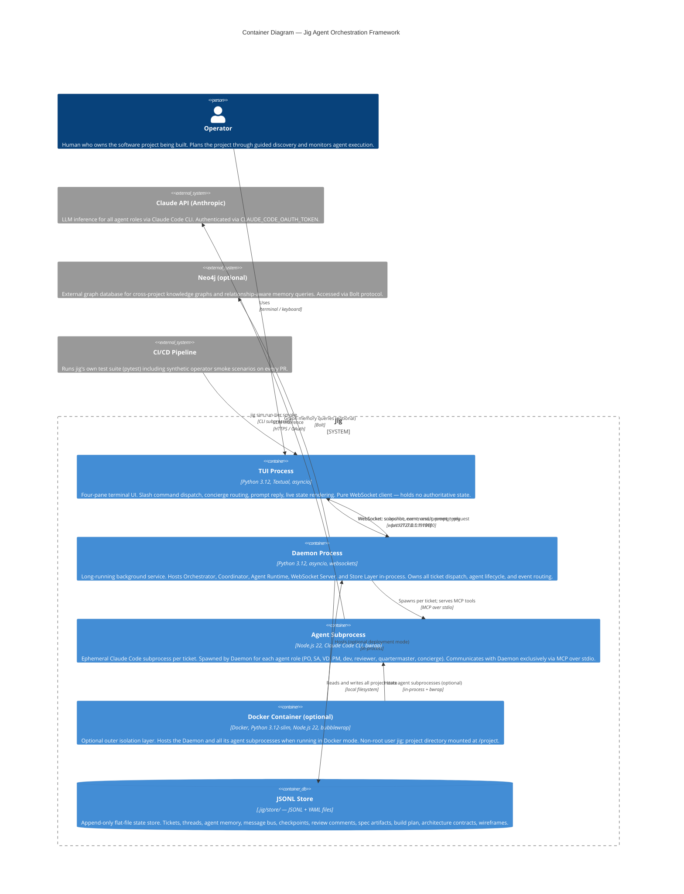

# C4 Container Level: Jig Agent Orchestration Framework

## Overview

Jig runs as four distinct deployment units that must coexist for full operation. Three are OS processes with
independent lifetimes; one is a passive file store that any process may read or write. Two of the four units are
ephemeral: agent subprocesses exist only for the lifetime of a single ticket, and the JSONL store is never a
running process.

The deployment topology reflects two core design decisions: (1) the TUI must be able to start, stop, and crash
without affecting in-flight agents; and (2) agent subprocesses must be isolated from each other and from the host
filesystem. These two decisions force the TUI/daemon split and the bubblewrap sandbox respectively.

---

## Containers

### 1. TUI Process

- **Name**: TUI Process
- **Description**: The operator's terminal UI. A Textual application that connects to the Daemon over WebSocket,
  subscribes to all state topics, and renders live project state across four panes (Now, Tickets, Spec, Events).
  All operator commands flow outbound; all state updates flow inbound. The TUI holds no authoritative state and
  contains no business logic — it is a pure WebSocket client.
- **Type**: Interactive Terminal Application
- **Technology**: Python 3.12, Textual framework, asyncio, `websockets` (client)
- **Entry point**: `jig` (no subcommand) — defined as `jig.__main__:main` in `pyproject.toml`
- **Deployment**: Foreground process in the operator's terminal; not containerized

#### Purpose

Provides the operator interface: four-pane Textual layout, slash command dispatch, concierge routing, prompt
request/reply, and daemon reconnect. Lifecycle is fully independent of the Daemon — stopping the TUI does not
affect in-flight agents.

#### Components

- **TUI** (`jig/tui/`): Textual `App`, four pane widgets, slash command registry, `DaemonClient` WebSocket
  connection manager, prompt reply flow, print-mode (`jig --print`)
  - Documentation: [c4-component.md — TUI](./c4-component.md#12-tui)
- **CLI** (partial): The `jig` entry point without a subcommand launches the TUI; `jig --print` invokes
  print-mode. The daemon lifecycle subcommands (`start`, `stop`, `status`) are also available from this binary
  but run outside the TUI.
  - Documentation: [c4-component.md — CLI](./c4-component.md#1-cli)

#### Interfaces

**Consumed**

| Interface | Protocol | Address | Description |
|-----------|----------|---------|-------------|
| Daemon WebSocket API | WebSocket / JSON | `ws://127.0.0.1:19100` (default) | Subscribe to topics, send commands, receive snapshots and events |

**Exposed**

| Interface | Type | Description |
|-----------|------|-------------|
| `jig` | Shell command | Launch TUI; auto-starts Daemon if not running |
| `jig --print "/<cmd>"` | Shell command | One-shot non-interactive command; prints result to stdout |
| `jig daemon start/stop/status` | Shell commands | Daemon lifecycle (does not open TUI) |
| `jig init` | Shell command | Project initialization (runs L0 PO discovery) |
| `jig validate` | Shell command | Project structure validation |
| `jig sim run <scenario>` | Shell command | Run a synthetic operator scenario |
| `jig sim run-tier <tier>` | Shell command | Run a scenario tier (smoke/full/nightly) |

#### Dependencies

| Dependency | Type | How Used |
|------------|------|----------|
| Daemon Process | WebSocket client → server | All commands, state subscriptions, prompt replies |
| JSONL Store | None (indirect) | TUI never reads the store directly; snapshots arrive via Daemon WebSocket |

---

### 2. Daemon Process

- **Name**: Daemon Process
- **Description**: Long-running background process that hosts the Orchestrator, WebSocket Server, and all
  in-process components. Started with `jig daemon start`; runs detached from the terminal. This is the system's
  central execution engine: it owns ticket dispatch, agent lifecycle, event routing, and operator prompt
  resolution. The Daemon may run on the host OS or inside Docker (see Docker Container below).
- **Type**: Background Service / Event Loop
- **Technology**: Python 3.12, asyncio, `websockets` (server), `claude-agent-sdk`, Click
- **Entry point**: `jig daemon serve` — the daemonized subprocess calls this subcommand to host the Orchestrator
  and WebSocket Server in-process
- **Deployment**: Detached background process (`daemon_start` forks a subprocess or launches Docker); PID and
  address written to `.jig/run/`

#### Purpose

Hosts all orchestration logic: the Orchestrator event loop, Coordinator build-plan state machine, Agent Runtime
(spawns Claude Code subprocesses), WebSocket Server (TUI communication), and the Store Layer (shared state).
The Daemon can survive TUI disconnects, runs until explicitly stopped, and resumes in-progress tickets on
restart.

#### Components

All components except the TUI and Sim Framework live inside the Daemon:

- **CLI** (serve mode): `jig daemon serve` bootstraps `Orchestrator` and `WebSocketServer` in-process
  - Documentation: [c4-component.md — CLI](./c4-component.md#1-cli)
- **WebSocket Server**: Topic pub/sub, snapshot delivery, command dispatch, prompt request/reply, 1,000-event
  history replay
  - Documentation: [c4-component.md — WebSocket Server](./c4-component.md#2-websocket-server)
- **Orchestrator**: Central event loop, ticket dispatch, agent lifecycle, deadlock sweep, stall detection,
  review federation gating, phase completion routing
  - Documentation: [c4-component.md — Orchestrator](./c4-component.md#3-orchestrator)
- **Coordinator**: Build-plan state machine, bones→MVP→final layer materialization, ordering enforcement,
  DEFERRED queue triage, calibration sampling
  - Documentation: [c4-component.md — Coordinator](./c4-component.md#4-coordinator)
- **Agent Runtime**: Claude Code subprocess management, prompt compilation, MCP server factory, context URI
  resolution, capability enforcement, bubblewrap sandbox integration
  - Documentation: [c4-component.md — Agent Runtime](./c4-component.md#5-agent-runtime)
- **PO Hierarchy**: L0–L3 MCP tool handlers for guided discovery conversations (registered in the per-agent
  MCP server, not a standalone process)
  - Documentation: [c4-component.md — PO Hierarchy](./c4-component.md#6-po-hierarchy)
- **SA/VD**: System Architect and Visual Designer MCP tool handlers, wireframe linter, architecture schema
  validation
  - Documentation: [c4-component.md — SA/VD](./c4-component.md#7-savd)
- **PM System**: Planner PM MCP handler (`plan_finalize`), Coordinator dispatch engine, calibration store,
  tier promotion, DEFERRED queue
  - Documentation: [c4-component.md — PM System](./c4-component.md#8-pm-system)
- **Reviewer Federation**: Reviewer dispatch, mechanical and judgment reviewer implementations, auto-apply,
  fix-loop, per-commit hook integration
  - Documentation: [c4-component.md — Reviewer Federation](./c4-component.md#9-reviewer-federation)
- **Store Layer**: `TicketStore`, `ThreadStore`, `MessageBus`, `MemoryStore`, `CheckpointStore`,
  `ReviewCommentsStore`, `EventEmitter` — all in-memory with JSONL persistence on disk
  - Documentation: [c4-component.md — Store Layer](./c4-component.md#11-store-layer)

#### Interfaces

**Exposed**

| Interface | Protocol | Address | Description |
|-----------|----------|---------|-------------|
| WebSocket API | WebSocket / JSON | `ws://127.0.0.1:19100` (default, ephemeral fallback) | TUI client connection; topic subscriptions, command dispatch, event streaming |

**WebSocket message types:**

| Message | Direction | Shape |
|---------|-----------|-------|
| `subscribe` | Client → Daemon | `{"type": "subscribe", "topics": ["tickets", "spec", "agents", "events", "prompts"]}` |
| `command` | Client → Daemon | `{"type": "command", "name": "<cmd>", "args": {...}}` |
| `prompt_reply` | Client → Daemon | `{"type": "command", "name": "prompt_reply", "args": [prompt_id, text]}` |
| `snapshot` | Daemon → Client | `{"type": "snapshot", "topic": "<topic>", "data": [...]}` |
| `event` | Daemon → Client | `{"type": "event", "topic": "<topic>", "kind": "<kind>", "data": {...}}` |
| `result` | Daemon → Client | `{"type": "result", "ok": bool, "data"|"error": ...}` |

**Valid topics**: `tickets`, `threads`, `agents`, `spec`, `events`, `prompts`

**Consumed**

| Interface | Dependency | Protocol | Description |
|-----------|------------|----------|-------------|
| Claude Code subprocess | Agent subprocesses | MCP over stdio (per-agent) | Each spawned agent gets a dedicated MCP server |
| JSONL Store | Local filesystem | File I/O | All store reads and writes |
| Claude API | External | HTTPS / OAuth | Via `claude-agent-sdk` inside each Claude Code subprocess |
| Neo4j (optional) | External | Bolt | Graph memory queries |
| Docker CLI | External | subprocess | Agent container launch (`jig daemon start --docker`) |
| `bwrap` | Host binary | subprocess | Inner per-agent filesystem namespace isolation |
| Git CLI | Host binary | subprocess | Worktree lifecycle, commit operations |

#### Infrastructure

- **PID file**: `.jig/run/daemon.pid`
- **Address file**: `.jig/run/daemon.addr` (host:port of WebSocket server)
- **Error log**: `.jig/run/daemon.err`
- **Port**: 19100 (preferred); OS-assigned ephemeral port if 19100 is in use
- **Scaling**: Single instance per project directory; multiple projects can run concurrent daemons on separate
  ephemeral ports
- **Restart**: `daemon_start` polls briefly for immediate-death; resumes in-progress tickets on restart

---

### 3. Agent Subprocess

- **Name**: Agent Subprocess
- **Description**: A Claude Code CLI process spawned by the Daemon's Agent Runtime for each individual ticket
  or agent role invocation (PO, SA, VD, PM, dev, reviewer, quartermaster, concierge). The subprocess runs
  `@anthropic-ai/claude-code` (Node.js) and communicates with the Daemon exclusively over a per-agent MCP
  server connected via stdio. On Linux (and inside Docker), each subprocess is additionally wrapped in a
  `bwrap` namespace for filesystem isolation.
- **Type**: Ephemeral Agent Subprocess
- **Technology**: Node.js 22, Claude Code CLI (`@anthropic-ai/claude-code`), `claude-agent-sdk` (Python,
  manages the subprocess), bubblewrap (`bwrap`) for sandboxing on Linux
- **Entry point**: `claude` CLI binary (or `bwrap claude` in sandboxed mode), launched by
  `claude_agent_sdk.query()` via `SubprocessCLITransport`
- **Deployment**: One subprocess per active ticket/role; spawned and reaped by the Daemon; not a persistent
  service

#### Purpose

Performs the actual LLM-driven work for each agent role. Each subprocess is:

- Scoped to a single ticket and role (stateless between invocations)
- Given a compiled system + user prompt with resolved `project://` context URIs
- Given a per-agent MCP server (running in the Daemon) via stdio, providing the only channel for reading and
  writing project state
- Optionally wrapped in `bwrap` for read-only root filesystem (only assigned worktree writable at `/workspace`)
- Authenticated to the Claude API via `CLAUDE_CODE_OAUTH_TOKEN`

#### Components

Conceptually, the Daemon's Agent Runtime component manages these subprocesses. The MCP tool handlers from all
agent role components (PO Hierarchy, SA/VD, PM System, Reviewer Federation) are registered in the Daemon and
served to each subprocess over stdio:

- **Agent Runtime** (in Daemon): spawns and manages subprocess lifecycle
  - Documentation: [c4-component.md — Agent Runtime](./c4-component.md#5-agent-runtime)

#### Interfaces

**Consumed (via MCP over stdio — served by Daemon)**

| Tool Group | MCP Module | Description |
|------------|-----------|-------------|
| Ticket CRUD | `jig.ticket_mcp` | create, get, update, list, set_status |
| Thread ops | `jig.thread_mcp` | post question/answer/objection/handoff/escalation/note/proposal |
| PO L0–L3 | `jig.po_l*_mcp` | l0_finalize, discovery_*, l2_finalize, l3_finalize |
| SA | `jig.sa_mcp`, `jig.sa_incremental_mcp` | sa_finalize, sa_edit_module |
| VD | `jig.vd_mcp` | vd_finalize, vd_add_wireframe |
| Planner PM | `jig.planner_pm_mcp` | plan_finalize |
| Reviewer | `jig.reviewer_mcp`, `jig.mcp_server` | post_comment; reviewer_get_diff, reviewer_read_file (opt-in scoped tools) |
| Checkpoints | `jig.checkpoint_mcp` | checkpoint save/restore |
| Ontology | `jig.po_ontology_mcp` | ontology_add_term |
| Quartermaster | `jig.quartermaster` | briefing generation |

**Consumed (external)**

| Interface | Dependency | Protocol | Description |
|-----------|------------|----------|-------------|
| Claude API | Anthropic (external) | HTTPS / OAuth | LLM inference; managed internally by Claude Code CLI |

**Exposed**

Agent subprocesses expose nothing outbound. All output flows back to the Daemon via MCP tool call responses
over stdio, or as the subprocess exit code and stdout captured by the SDK.

#### Infrastructure

- **Lifetime**: Seconds to hours; reaped when the ticket's agent run completes or times out
- **Sandboxing (Docker mode)**: Runs inside the Docker container (see below); bwrap provides inner isolation
- **Sandboxing (host mode)**: bwrap wraps the subprocess directly on the host (Linux only)
- **Worktree**: Each dev-role agent writes to an isolated git worktree under `.worktrees/` in the project root
- **Environment**: `CLAUDE_CODE_OAUTH_TOKEN`, `CLAUDE_CODE_PERMISSION_MODE=bypassPermissions`,
  `CLAUDE_CONFIG_DIR=/tmp/jig-claude-config`, `GIT_CONFIG_COUNT=1` (disables GPG signing)

---

### 4. Docker Container (Optional Agent Sandbox)

- **Name**: Docker Container (Agent Sandbox)
- **Description**: An optional outer isolation layer for the Daemon and all its agent subprocesses. When started
  with `jig daemon start --docker` (or when Docker mode is the configured default), the entire Daemon process
  runs inside a Docker container built from the project's `Dockerfile`. The container packages Python 3.12,
  Node.js 22, bubblewrap, the Claude Code CLI, `ruff`, and `gh`. Agent subprocesses spawned inside the container
  are then additionally wrapped in `bwrap` for inner per-agent isolation.
- **Type**: Container Runtime Environment (optional deployment mode)
- **Technology**: Docker, Python 3.12-slim base image, Node.js 22, bubblewrap, Claude Code CLI
- **Entry point**: `ENTRYPOINT ["jig"]` — the container runs `jig daemon serve` as its command
- **Deployment**: `docker run --detach` launched by `daemon_start`; container ID written to `.jig/run/`

#### Purpose

Provides host OS isolation for the Daemon and all agents when running on macOS or in environments where
bubblewrap cannot provide adequate host isolation alone. The container:

- Runs as non-root user `jig` (Claude Code refuses `bypassPermissions` as root)
- Mounts the project directory at `/project` (read-write) and the operator's Claude config at `~/.claude`
  (read-only)
- Provides `/workspace` as the bwrap mount point for per-agent worktrees

#### Components

Same as the Daemon Process — the Docker container is an alternative deployment mode for the Daemon, not a
separate component boundary.

#### Interfaces

Same WebSocket API as the Daemon Process, exposed on the mapped host port.

**Dockerfile summary:**

| Layer | Contents |
|-------|----------|
| Base | `python:3.12-slim` |
| System tools | `bubblewrap`, `git`, `curl`, `ca-certificates`, `gnupg` |
| Runtime | Node.js 22.x (from NodeSource), `@anthropic-ai/claude-code` (npm global) |
| Python tooling | `ruff` (auto-lint in worktrees), `gh` CLI (PR creation) |
| Application | `jig` package installed from `/opt/jig` |
| User | Non-root user `jig`; `/workspace` owned by `jig` |
| Environment | `CLAUDE_CODE_PERMISSION_MODE=bypassPermissions`, `JIG_IN_CONTAINER=1`, GPG signing disabled |

#### Infrastructure

- **Image**: Built locally by `jig build` (or auto-built on first `jig daemon start --docker`)
- **Container ID file**: `.jig/run/daemon.container`
- **Stop**: `docker stop <container-id>` issued by `daemon_stop`

---

### 5. JSONL Store (`.jig/store/`)

- **Name**: JSONL Store
- **Description**: Append-only flat-file state store under `.jig/store/` in the operator's project directory.
  Not a running process — a passive directory of JSONL files read and written by the Daemon's Store Layer
  component. All project runtime state (tickets, threads, agent memory, message bus, checkpoints, review
  comments) lives here. The operator's project spec artifacts (`.jig/spec/`, `.jig/plan/`, `.jig/design/`)
  are also written here by agent MCP handlers, though in YAML/Markdown rather than JSONL.
- **Type**: Local File Store (not a process)
- **Technology**: JSONL files (append-only), YAML files, Markdown files, Python `asyncio` file I/O
- **Deployment**: Files on the local filesystem; co-located with the operator's project

#### Purpose

Provides durable, auditable, human-readable project state without requiring an external database. Append-only
semantics make concurrent agent writes safe. All stores are in-memory-indexed by the Daemon's Store Layer with
JSONL files as the backing store.

#### Components

- **Store Layer**: All store classes and the `EventEmitter`
  - Documentation: [c4-component.md — Store Layer](./c4-component.md#11-store-layer)

#### Store Files

| File / Path | Store Class | Contents |
|-------------|-------------|----------|
| `.jig/store/tickets.jsonl` | `TicketStore` | All ticket records (status, metadata, plan fields) |
| `.jig/store/comments.jsonl` | `ThreadStore` | All thread entries (Questions, Answers, Objections, Handoffs, Notes, etc.) |
| `.jig/store/bus.jsonl` | `MessageBus` | Inter-component message history |
| `.jig/store/memory/` | `MemoryStore` | Per-agent memory (Handoff learnings, explicit Learning entries) |
| `.jig/store/checkpoints.jsonl` | `CheckpointStore` | Agent checkpoints and deferred-queue items |
| `.jig/store/review_comments.jsonl` | `ReviewCommentsStore` | Reviewer federation comment records |
| `.jig/store/check_results.jsonl` | `CheckResultsStore` | Automated check results per ticket/phase |
| `.jig/spec/` | (spec loader) | PO artifacts: discovery YAML, suites, briefs, ontology |
| `.jig/plan/build-plan.yaml` | (spec loader) | Planner PM build plan |
| `.jig/plan/deferred.jsonl` | (Coordinator) | DEFERRED queue for notable-severity review items |
| `.jig/plan/calibration.jsonl` | (Coordinator) | Per-ticket estimation calibration samples |
| `.jig/arch/` | (spec loader) | SA architecture contracts and module specs |
| `.jig/design/` | (VD MCP) | Wireframes, design system, frontend config |
| `.jig/run/` | (daemon module) | PID, address, container ID, error log — runtime state |
| `.jig/config.yaml` | (config loader) | Project configuration (workflows, roles, escalation, etc.) |

#### Interfaces

The JSONL Store exposes no network or IPC interface. Access is exclusively through the Store Layer component
running inside the Daemon process.

---

### 6. Neo4j (Optional External Graph Memory)

- **Name**: Neo4j
- **Description**: Optional external graph database for cross-project knowledge graphs and relationship-aware
  memory queries. Not required for standard operation. When configured, the Daemon's graph module (`jig/graph/`)
  connects to Neo4j via the Bolt protocol and uses it as a richer memory backend alongside the flat JSONL
  `MemoryStore`.
- **Type**: External Graph Database (optional)
- **Technology**: Neo4j, Bolt protocol
- **Deployment**: Operator-managed external service (not deployed by Jig)

#### Interfaces

| Interface | Protocol | Description |
|-----------|----------|-------------|
| Bolt API | Bolt (TCP, typically port 7687) | Graph queries and writes from Daemon's graph module |

---

## Container Diagram



---

## Container Interaction Flows

### Startup: TUI auto-starts Daemon

```
Operator: jig
  → TUI Process starts
    → DaemonClient checks .jig/run/daemon.addr
      → If no daemon: CLI runs `jig daemon start`
        → daemon.py forks `jig daemon serve` (host) or `docker run jig daemon serve` (Docker)
          → Daemon Process: Orchestrator.startup() + WebSocketServer.start()
      → TUI connects ws://127.0.0.1:19100
        → Daemon sends snapshots for all subscribed topics
          → TUI panes hydrate with current state
```

### Ticket dispatch: Daemon → Agent subprocess

```
Daemon: Orchestrator._start_ready_tickets()
  → Agent Runtime: run_agent(AgentSpawnContext)
    → Build system + user prompt (context URIs resolved)
    → Create per-agent MCP server (all tool handlers registered in-process)
    → claude_agent_sdk.query(): spawns `bwrap claude` subprocess
      → Agent Subprocess: runs Claude Code CLI
        → MCP tool calls over stdio → Daemon in-process handlers
          → Daemon: Store Layer mutated (TicketStore, ThreadStore, ...)
            → EventEmitter.emit(event)
              → WebSocket Server relays event to TUI
                → TUI: pane updates in real time
```

### Operator answers a prompt

```
Daemon: agent posts Question or awaits approval
  → Orchestrator emits prompt_request on "prompts" topic
    → WebSocket Server relays to TUI
      → TUI: Now pane renders prompt; Composer flips to answering mode
        → Operator types and submits
          → TUI: {"type": "command", "name": "prompt_reply", "args": [id, text]}
            → Daemon: resolves agent's awaiting Future
              → Agent Subprocess: MCP call returns; workflow continues
```

---

## Container Boundary Rationale

| Container | Boundary rationale |
|-----------|-------------------|
| TUI Process | Distinct process with independent lifetime from the Daemon. Crashing or stopping the TUI must not kill in-flight agents. WebSocket client only. |
| Daemon Process | The long-lived execution engine. Hosts all orchestration, persistence, and agent management. Survives TUI disconnects. |
| Agent Subprocess | Each agent run is an isolated, ephemeral Claude Code process. One subprocess per ticket per role; no shared process between agents. |
| Docker Container | Alternative deployment mode for the Daemon when host isolation is required (e.g., macOS where bwrap is unavailable). Not a separate logical component — same Daemon, different deployment wrapper. |
| JSONL Store | Not a process. A passive file system location read and written exclusively by the Daemon's Store Layer. Separated here because it is the durable state boundary that outlives all processes. |
| Neo4j | External system outside the Jig boundary. Optional; Jig integrates but does not host it. |

---

## Technology Summary

| Container | Runtime | Key Libraries | Network Interface |
|-----------|---------|--------------|------------------|
| TUI Process | Python 3.12 | Textual, websockets (client), asyncio | WebSocket client to Daemon |
| Daemon Process | Python 3.12 | asyncio, websockets (server), claude-agent-sdk, Pydantic, Click | WebSocket server :19100 |
| Agent Subprocess | Node.js 22 | @anthropic-ai/claude-code, bwrap | MCP stdio (no network) |
| Docker Container | Docker + Python 3.12-slim | (same as Daemon + bubblewrap, gh, ruff) | WebSocket mapped to host |
| JSONL Store | Filesystem | JSONL, YAML, Markdown | None |
| Neo4j | JVM / Neo4j | Bolt driver | Bolt :7687 |

---

## Related Documentation

- [c4-context.md](./c4-context.md) — System context: personas, external systems, system boundaries
- [c4-component.md](./c4-component.md) — Component detail for all twelve logical components within the Daemon
- [c4-code-runtime.md](./c4-code-runtime.md) — Code-level detail for core runtime modules
- [../Dockerfile](../Dockerfile) — Docker container definition
- [../pyproject.toml](../pyproject.toml) — Entry points, dependencies, package data
