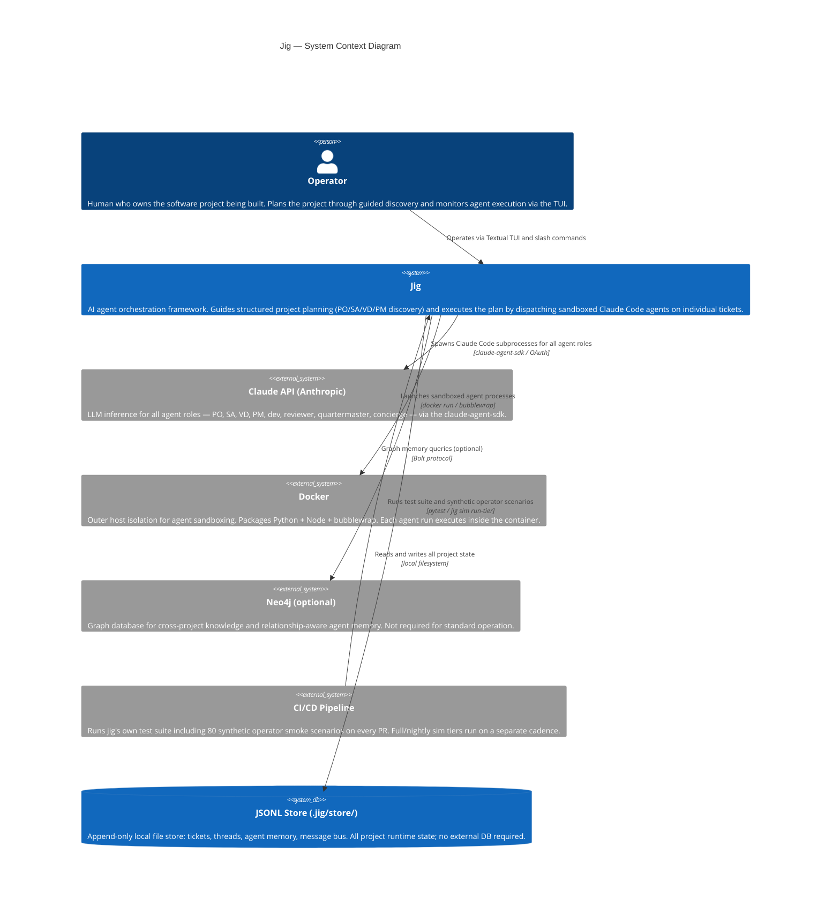

# C4 Context Level: Jig System Context

## System Overview

### Short Description

Jig is an AI agent orchestration framework that guides a human operator through structured software project planning
and then executes that plan by dispatching Claude Code agents on well-scoped tickets.

### Long Description

Jig exists to solve two complementary problems: agents are good at small, well-scoped tasks but fail on large ones,
and humans are good at real-world judgment but skip the structured thinking that medium-to-large software projects
require. Jig addresses both by enforcing a layered planning discipline (Product Owner discovery → System Architect
contracts → Visual Designer wireframes → Project Manager build plan → Developer tickets) before any code is written,
then orchestrating a swarm of Claude Code agents to execute the plan in a controlled, audited way.

The operator interacts with jig through a Textual TUI (terminal UI). A background Daemon hosts the Orchestrator and
a WebSocket server. The Orchestrator spawns Claude Code agent subprocesses — one per ticket — each running inside an
isolated sandbox (Docker + bubblewrap). Agents communicate with the Orchestrator exclusively through a per-agent MCP
server; they never talk to each other or to external services directly. All project state is stored in append-only
JSONL files under `.jig/store/` in the project directory.

The key insight driving the design is that decomposition is easy but coherence under decomposition is hard. Jig
enforces coherence through a multi-level spec (L0 pitch → L1 journey-driven discovery → L2 suite grouping → L3 suite
briefs → L4 tickets), a stable URI scheme (`project://`) for cross-referencing artifacts, and a structured YAML
contract language that agents treat as binding rather than advisory.

---

## Personas

### Operator

- **Type**: Human User
- **Description**: The person who owns the software project being built. Typically an engineer, indie developer, or
  technical founder who wants to ship production software using AI agents. The operator is not a passive approver —
  they are an active thinking partner throughout the planning phase.
- **Goals**:
  - Define what they want to build through guided discovery conversations with PO agents
  - Review and confirm architectural decisions and build plans before code is written
  - Monitor the status of in-flight tickets and agent activity
  - Respond to blocking questions, approve briefs, and resolve escalations from agents
  - Steer the project at strategic decision points without being bottlenecked on every agent step
- **Key Features Used**: TUI (all panes), slash commands, concierge chat, prompt approvals, ticket management, spec
  review, event monitoring, project initialization

### Synthetic Operator (Programmatic)

- **Type**: Programmatic User / Testing Agent
- **Description**: An LLM-driven agent that impersonates a human operator for automated workflow validation. Runs
  scripted scenarios against a fresh isolated daemon to test that the full jig workflow — from PO discovery through
  ticket completion — behaves correctly under various operator behavior profiles (methodical, fast-and-shippy,
  scope-creeper, ambivalent, hostile).
- **Goals**:
  - Execute scenario scripts that exercise specific workflow paths end-to-end
  - Validate that gates fire correctly, artifacts land in the right state, and assertions pass
  - Generate coverage metrics over workflow paths
  - Surface realism gaps between simulated and real operator behavior
- **Key Features Used**: Daemon WebSocket API, slash commands (programmatic), scenario runner CLI (`jig sim run`)

### PO Agent (L0–L3 Product Owner)

- **Type**: Programmatic User (Claude Code subprocess)
- **Description**: A family of agent roles (L0, L1, L2, L3) that conduct structured discovery conversations with the
  operator. Each level produces a distinct artifact: L0 is the project pitch, L1 is persona/journey/capability
  discovery, L2 organizes capabilities into suites, and L3 elaborates each suite into a brief with behaviors and
  acceptance criteria. PO agents are conversational — they ask the operator questions and build artifacts from the
  answers.
- **Goals**:
  - Guide the operator through thinking about users (personas), user paths (journeys), and product scope (capabilities)
  - Produce structured YAML/Markdown artifacts at each level
  - Capture the operator's domain vocabulary in a project ontology
  - Gate on operator confirmation before declaring a level done
- **Key Features Used**: MCP tools (spec CRUD, prompt requests), message bus, ticket store

### SA Agent (System Architect)

- **Type**: Programmatic User (Claude Code subprocess)
- **Description**: Runs after PO discovery completes. Reads the PO artifacts and produces architectural contracts at
  two scopes: project-level (`architecture.yaml`) covering cross-cutting decisions and a module list, and per-module
  (`modules/<m>/contracts.yaml`) covering integration boundaries, data ownership, and API shapes. Also maintains a
  risk register and proposes bounded spike tickets to de-risk unknowns.
- **Goals**:
  - Define integration contracts that all dev agents must respect
  - Identify architectural risks and propose spikes before implementation begins
  - Produce the architectural inputs the Planner PM needs to build the plan
- **Key Features Used**: MCP tools (spec read, architecture write, risk register), message bus

### VD Agent (Visual Designer)

- **Type**: Programmatic User (Claude Code subprocess)
- **Description**: Runs in parallel with the SA after PO discovery. Owns both frontend architecture decisions (stack,
  build tooling, component patterns) and visual design (design system tokens, component specs, HTML wireframes per
  screen). The VD is the architect for the frontend, not just the visual designer. For backend-only projects, VD
  discovery exits immediately.
- **Goals**:
  - Choose the frontend stack and capture it in `frontend.yaml`
  - Produce a design system (tokens + component spec + brand) that is always present (default is a valid permanent state)
  - Generate one structural HTML wireframe per screen derived from L1 journeys
  - Ensure UI tickets reference wireframes and that a visual compliance reviewer fires per ticket
- **Key Features Used**: MCP tools (spec read, wireframe write, design system write), browser-based wireframe preview

### Planner PM Agent

- **Type**: Programmatic User (Claude Code subprocess)
- **Description**: Runs after both SA and VD complete. A strategic PM agent that reads PO and SA artifacts and
  produces a build plan organized by epics, with each epic decomposed into three completeness layers: bones (walking
  skeleton), MVP, and final. Assigns each ticket a type (tracer-bullet, spike, or standard), a dev tier (standard,
  senior, or SA), and a reviewer set. Runs in passes — initially after SA/VD, and again on re-planning triggers.
- **Goals**:
  - Decompose capabilities into tickets in the right order (bones-first across all epics before any MVP)
  - Assign appropriate dev tiers and reviewer sets per ticket
  - Produce the build plan artifact that the Coordinator PM works from
  - Gate on operator confirmation of the plan before dispatch begins
- **Key Features Used**: MCP tools (spec read, ticket create, plan write), message bus

### Coordinator PM Agent

- **Type**: Programmatic User (Claude Code subprocess)
- **Description**: A continuous, event-driven PM agent that works the build plan once the Planner PM is done.
  Dispatches tickets in order, routes escalations from dev agents to the right destination (SA, operator, or
  re-plan), tracks stalled work, and enforces bones-first ordering. Mostly deterministic Python logic with thin LLM
  judgment for cases the deterministic path cannot handle (unstructured escalation classification, cross-ticket
  pattern detection).
- **Goals**:
  - Dispatch tickets to dev agents in the correct bones → MVP → final sequence
  - Surface stalled or blocked tickets to the operator
  - Route escalations correctly without requiring operator involvement on every one
  - Trigger Planner PM re-plan when systemic patterns emerge
- **Key Features Used**: Message bus (event-driven), ticket store, auto-escalation thresholds

### Dev Agent

- **Type**: Programmatic User (Claude Code subprocess)
- **Description**: Implements a single ticket. Runs in an isolated sandbox (Docker + bubblewrap), operates on an
  isolated git worktree, and communicates with the Orchestrator only through MCP tools. Has a strict tool surface
  that matches its assigned dev tier (standard, senior, or SA). Stateless — all coordination happens through the bus
  and ticket store.
- **Goals**:
  - Implement the ticket's acceptance criteria within the stated scope
  - Post structured escalations when blocked
  - Commit to a worktree and hand off for review
- **Key Features Used**: MCP tools (ticket read/update, comments, memory, commits), git worktree, message bus

### Reviewer Agent Federation

- **Type**: Programmatic User (Claude Code subprocesses, multiple in parallel)
- **Description**: Multiple specialized reviewer agents run in parallel on each ticket's PR rather than one
  monolithic reviewer. Each has a narrow focus: architectural compliance, security, error handling, performance,
  pattern conformance, test adequacy, and visual compliance (for UI tickets). Severity is classified as critical
  (must fix), important (should fix), or notable (can defer to the DEFERRED queue).
- **Goals**:
  - Enforce contracts, policies, and spec compliance independently
  - Identify issues early at matched granularity (more reviewers fire at final-layer tickets)
  - Produce structured review output that the Coordinator PM can route
- **Key Features Used**: MCP tools (ticket read, review write, comment), spec read, architecture contracts read

### Quartermaster Agent

- **Type**: Programmatic User (Claude Code subprocess)
- **Description**: A continuous background agent that reads the analytics event stream and produces periodic
  operator-facing briefings. Designed to invert the operator-as-bottleneck assumption: most gates become
  agent-decided with the operator receiving a digest rather than approving every transition. Briefing cadence is
  configurable (default: periodic).
- **Goals**:
  - Identify patterns in the analytics stream worth surfacing to the operator
  - Produce structured briefings: tickets completed, recurring escalation patterns, items needing attention
  - Reduce operator cognitive load by collapsing routine activity into summaries
- **Key Features Used**: Analytics event stream, message bus, TUI events pane

### Concierge Agent

- **Type**: Programmatic User (Claude Code subprocess)
- **Description**: A lightweight, read-only conversational helper available in the TUI's Now pane. When the operator
  types free text (no leading `/`), the input routes to the Concierge rather than the Orchestrator. The Concierge
  answers questions about the project state or recommends slash commands.
- **Goals**:
  - Answer operator questions about the current project state
  - Recommend the appropriate slash command for what the operator wants to do
  - Provide a low-friction entry point that doesn't require knowing the slash command vocabulary
- **Key Features Used**: TUI Composer (answering mode), spec read, ticket store read

---

## System Features

### Multi-Level Spec and Guided Discovery (L0–L3)

- **Description**: A five-level planning hierarchy (L0: pitch, L1: persona/journey/capability discovery, L2: suite
  organization, L3: suite briefs with behaviors and AC, L4: tickets) with a dedicated PO agent mode per level.
  Each level produces a verifiable artifact on disk; each level gates on operator confirmation before the next fires.
  Discovery is journey-driven — capabilities must trace back to a persona's narrative walkthrough — so the operator
  cannot accidentally skip a swath of the product.
- **Users**: Operator, PO Agent (L0–L3)

### System Architecture and Contract Authoring (SA)

- **Description**: After PO discovery, an SA agent conducts a discovery loop to produce project-level and
  per-module architectural contracts. Contracts cover integration boundaries, data ownership, API shapes, and
  cross-cutting policies. The SA also maintains a risk register and proposes spike tickets. Contracts are
  YAML-structured and enforced by the reviewer federation on every PR.
- **Users**: Operator, SA Agent, Reviewer Agent Federation

### Frontend Architecture and Wireframe Generation (VD)

- **Description**: Parallel to SA, a VD agent produces the frontend architecture decision (`frontend.yaml`), a
  design system (tokens + component spec + brand, always present with a valid default), and one structural HTML
  wireframe per screen. Wireframes are the starting code for bones-layer implementation — they transition additively,
  not thrown away. A visual compliance reviewer diffs implementation screenshots against wireframes at MVP and final
  layers.
- **Users**: Operator, VD Agent, Reviewer Agent Federation (visual compliance)

### Build Planning (Planner PM)

- **Description**: After SA and VD complete, the Planner PM produces a build plan organized by epics with a
  bones / MVP / final three-layer progression. Each ticket is typed (tracer-bullet, spike, standard), assigned a
  dev tier, and tagged with a reviewer set. Bones-first ordering ensures the system's walking skeleton is validated
  across all epics before any MVP work begins. The operator confirms the plan before dispatch starts.
- **Users**: Operator, Planner PM Agent

### Continuous Ticket Dispatch and Escalation Routing (Coordinator PM)

- **Description**: The Coordinator PM works the build plan continuously, dispatching tickets to dev agents in the
  correct order, routing escalations to the right destination, surfacing stalled work, and enforcing the
  bones → MVP → final progression. Mostly deterministic with thin LLM judgment for ambiguous routing situations.
- **Users**: Coordinator PM Agent, Dev Agent, Operator (for escalations)

### Agent Sandboxed Ticket Implementation (Dev)

- **Description**: Dev agents implement individual tickets inside a two-layer sandbox (Docker outer + bubblewrap
  inner per agent). Each agent operates on an isolated git worktree, sees a read-only root filesystem with only
  their worktree writable, and communicates only through MCP tools. Agents are stateless; all coordination happens
  through the bus and ticket store.
- **Users**: Dev Agent, Orchestrator

### Federated Code Review

- **Description**: Multiple specialized reviewer agents run in parallel on each PR rather than a single monolithic
  reviewer. Default reviewers: architectural compliance, cross-cutting policy, spec compliance. Add-on reviewers
  (security, error handling, performance, pattern conformance, test adequacy, visual compliance) fire based on ticket
  characteristics and build layer. Issues are classified by severity (critical / important / notable). Notable items
  go to the DEFERRED queue for later triage.
- **Users**: Reviewer Agent Federation, Coordinator PM Agent, Operator (for critical issues)

### Terminal UI (TUI)

- **Description**: A Textual-based terminal interface providing four panes: Now (conversational command input +
  concierge + prompt replies), Tickets (ticket list and management), Spec (spec tree browser), and Events (live
  event tail). The footer shows project name, git branch, and daemon state. The TUI is a client to the Daemon over
  WebSocket; it can start and stop independently of the daemon.
- **Users**: Operator

### Slash Command Surface

- **Description**: `/word args…` commands typed in the TUI Composer that dispatch to the daemon. Local commands
  (`/help`, `/quit`) are handled in the TUI; everything else dispatches via the typed command WebSocket envelope.
  A slash popup filters candidates as the operator types. One-shot non-interactive mode available via
  `jig --print "/<command>"`.
- **Users**: Operator, Synthetic Operator

### Analytics and Quartermaster Briefings

- **Description**: All significant system events (ticket state changes, operator overrides, escalations,
  auto-escalations, review findings) emit structured analytics events. The Quartermaster agent reads this stream and
  produces periodic operator briefings. Events tagged `simulator: true` when emitted during synthetic operator runs
  to keep simulator and real-project corpora separate. Event data feeds future features (adversarial pairing design,
  ensemble decision targeting).
- **Users**: Quartermaster Agent, Operator, Synthetic Operator

### Synthetic Operator Simulation

- **Description**: A test infrastructure that drives the full jig workflow end-to-end using an LLM-driven operator
  agent with one of five behavior personas (methodical, fast-and-shippy, scope-creeper, ambivalent, hostile).
  Scenarios are YAML scripts describing a project shape, operator persona, turn sequence, and assertions. The driver
  spawns a fresh isolated daemon per run and produces a structured pass/fail report with coverage metrics over
  workflow paths.
- **Users**: Synthetic Operator, CI/CD pipeline

### Project URI Scheme (`project://`)

- **Description**: A stable addressing scheme for any artifact or sub-element in a jig project. Multi-authority:
  `project://spec/...` (PO output), `project://arch/...` (SA contracts), `project://design/...` (VD wireframes +
  system), `project://plan/...` (PM build plan), `project://store/...` (runtime state). Supports path-style
  fragments for nested key lookup and revision pins for historical references. Used in tickets, reviewer comments,
  cascade audit trails, and cross-artifact references.
- **Users**: All agents, Operator

### Project Initialization and Scaffolding

- **Description**: `jig init` initializes a greenfield project by running the L0 PO agent to capture the pitch
  and scaffold the `.jig/` directory structure. `jig onboard <path>` imports an existing codebase: a scanner
  agent reads the repository and writes `.jig/onboard/observations.md`, then the standard PO read pass, spec
  generator, and PM profile selection run to produce the initial brief and project profile. Scaffold templates
  ship with the package for common project types.
- **Users**: Operator

---

## User Journeys

### New Project — Operator Journey

1. **Initialize**: Operator runs `jig` in a new project directory; TUI auto-starts the daemon if not running.
2. **L0 Pitch**: Operator types `/init` (or jig detects unconfigured state); L0 PO agent asks 3–5 questions to
   capture the one-sentence pitch, problem statement, audience, and product-level non-goals. Operator confirms.
3. **L1 Discovery**: L1 PO agent walks the operator through personas and journeys (narrative walkthroughs per
   persona), building a capability roster traceable to journeys. Operator declares "all personas covered."
4. **L2 Suite Organization**: L2 PO agent groups capabilities into suites (3–5 capabilities each). Operator confirms
   every capability is assigned and suite groupings make sense.
5. **L3 Suite Briefs**: L3 PO agent elaborates each suite in turn — behaviors, acceptance criteria, non-goals.
   Operator confirms each suite brief.
6. **SA Architecture**: SA agent fires; walks operator through tech decisions and module list; produces contracts and
   a risk register. Operator declares SA done.
7. **VD Discovery** (parallel with SA): VD agent fires; walks operator through frontend stack choice, design system,
   and one wireframe per screen. Operator confirms wireframe coverage.
8. **Spike Tickets** (if SA flagged risks): Dev agents work bounded spike tickets; SA folds learnings back in via a
   delta pass.
9. **Build Plan**: Planner PM reads all artifacts and produces the epics × bones/MVP/final build plan. Operator
   confirms tier assignments and reviewer set selections.
10. **Execution**: Coordinator PM dispatches tickets in bones-first order. Operator monitors via Events and Now
    panes; responds to escalation prompts; reads Quartermaster briefings.

### Ticket Implementation — Dev Agent Journey

1. **Dispatch**: Coordinator PM marks ticket `in_progress` and emits dispatch event to the bus.
2. **Spawn**: Orchestrator receives the event; spawns a Claude Code subprocess for the dev role with
   `AgentSpawnContext` (stores + project + role config).
3. **Context Assembly**: Agent reads the ticket spec, the relevant suite brief section, the module contracts for
   its scope, and any referenced `project://` URIs.
4. **Implementation**: Agent implements within its worktree, making MCP tool calls (ticket CRUD, comments, memory,
   commits) to record progress.
5. **Escalation** (if blocked): Agent posts a structured escalation comment with an `escalation_kind` tag.
   Coordinator PM routes it to SA, operator, or Planner re-plan.
6. **Commit and Handoff**: Agent commits to its worktree and calls the ticket-done MCP tool.
7. **Review**: Reviewer federation agents spawn in parallel, each checking their narrow concern.
8. **Fix Loop**: If critical or important issues are found, dev agent iterates. Cap at 3 fix cycles; exhaustion
   triggers auto-escalation.
9. **Merge**: Coordinator PM merges the worktree and dispatches the next ticket in cycle order.

### Operator Response to Prompt — Journey

1. **Prompt Request**: Daemon emits a `prompt_request` event on the `prompts` topic (e.g., `brief_approval`,
   `question_answer`).
2. **TUI Renders**: Now pane shows the prompt inline; Composer flips to "answering mode."
3. **Operator Responds**: Operator types a reply and submits. The reply routes as a `prompt_reply` command to the
   daemon.
4. **Daemon Resolves**: The awaiting agent future resolves; the workflow gate opens or closes.

### Synthetic Operator Simulation — Journey

1. **Scenario Selection**: CI pipeline (or operator via `jig sim run`) selects a smoke/full/nightly scenario.
2. **Isolated Daemon**: Driver spawns a fresh daemon with an isolated `.jig/` store; no state bleed between runs.
3. **Persona Load**: Synthetic operator agent loads the persona profile (behavior patterns, gate-confirmation policy,
   override probability, avoid-behaviors).
4. **Turn Execution**: Driver plays the scripted operator turns against the daemon; agent makes judgment calls
   consistent with the persona for unscripted situations.
5. **Assertion Check**: Driver evaluates assertions (workflow gate reached, artifact shape, event sequence).
6. **Report**: Produces `report.yaml` with pass/fail, coverage delta, and captured analytics events tagged
   `simulator: true`.

---

## External Systems and Dependencies

### Claude API / Anthropic (via claude-agent-sdk)

- **Type**: External AI Service
- **Description**: Anthropic's Claude models, accessed through the `claude-agent-sdk` Python package using a
  `SubprocessCLITransport`. All agent roles (PO, SA, VD, PM, dev, reviewer, quartermaster, concierge) are Claude
  Code processes that call the Claude API for LLM inference.
- **Integration Type**: Subprocess (Claude Code CLI process), authenticated via `CLAUDE_CODE_OAUTH_TOKEN`
- **Purpose**: Provides the LLM inference behind every agent role. Jig does not call the API directly; it spawns
  Claude Code subprocesses that manage API calls internally.

### MCP Protocol (Model Context Protocol)

- **Type**: Inter-process Communication Protocol
- **Description**: Each spawned agent gets a dedicated per-agent MCP server (`mcp_server.py`). Agents call MCP
  tools to read and write project state (ticket CRUD, comments, memory, spec lookup, commit operations). Agents
  have a strict tool surface — they cannot call tools outside their role's allowed set. The MCP server is the
  only channel between an agent and the Orchestrator.
- **Integration Type**: Local stdio MCP server per agent subprocess
- **Purpose**: Enforces strict tool surfaces (tenet 2: exact context, no more), provides the only coordination
  channel between stateless agents and shared state stores, and decouples agent implementation from store internals.

### Docker

- **Type**: Container Runtime
- **Description**: Provides outer host isolation for agent sandboxing. The jig Dockerfile packages Python 3.12 +
  Node 22 + bubblewrap. `jig start` auto-builds the Docker image on first run if not present. The container runs
  as non-root user `jig` (Claude Code refuses `bypassPermissions` as root). The operator can bypass Docker with
  `jig start --no-docker` for development.
- **Integration Type**: Docker CLI + `docker run` subprocess launch
- **Purpose**: Isolates agent filesystems from the host; prevents agents from reaching host resources they should
  not touch.

### Bubblewrap (bwrap)

- **Type**: Linux Namespace Sandboxing Tool
- **Description**: Provides inner per-agent isolation within the Docker container. Each spawned Claude Code agent
  runs inside a bwrap namespace where it sees a read-only root filesystem with only its own git worktree writable
  at `/workspace`. The `BwrapTransport` class overrides `SubprocessCLITransport._build_command()` to prepend bwrap
  arguments.
- **Integration Type**: Subprocess (`bwrap` prepended to each agent's Claude Code CLI command)
- **Purpose**: Prevents agents from reading or writing files outside their assigned worktree, enforcing the "strict
  tool surfaces" tenet at the filesystem level.

### Git (via worktrees)

- **Type**: Version Control System
- **Description**: Each dev agent gets an isolated git worktree under `.worktrees/` in the project root. The
  `worktree.py` module manages worktree lifecycle (create, commit, lint, cleanup). GPG signing is disabled inside
  the container via `GIT_CONFIG_COUNT` environment variables.
- **Integration Type**: Git CLI subprocess
- **Purpose**: Provides per-agent isolated working directories so concurrent agents cannot step on each other's
  changes. Merges happen after review completes.

### JSONL File Store (`.jig/store/`)

- **Type**: Local File-based State Store
- **Description**: All project runtime state is stored as append-only JSONL files under `.jig/store/` in the
  project directory. Stores include: `TicketStore` (ticket state), `ThreadStore` (ticket threads and comments),
  `MemoryStore` (agent memory), and `MessageBus` (inter-agent communication bus). No external database is required
  for normal operation.
- **Integration Type**: Local filesystem read/write
- **Purpose**: Provides durable, auditable, human-readable state without requiring an external database. Append-only
  semantics make the store safe for concurrent agent writes.

### Neo4j (optional graph memory)

- **Type**: External Graph Database (optional)
- **Description**: An optional graph database integration available through the `jig/graph/` module. When
  configured, provides graph-based memory and relationship queries beyond what the flat JSONL MemoryStore supports.
  Not required for standard operation.
- **Integration Type**: Neo4j driver / Bolt protocol
- **Purpose**: Enables richer cross-project knowledge graphs and relationship-aware memory queries for long-running
  projects where flat memory is insufficient.

### WebSocket Server (port 9100)

- **Type**: Internal Communication Channel (daemon ↔ TUI)
- **Description**: The daemon hosts a WebSocket server on port 9100 (`ws_server.py`). The TUI connects as a client
  (`DaemonClient`) on startup and subscribes to topics (`tickets`, `spec`, `agents`, `events`, `prompts`,
  `threads`). The daemon sends snapshots on subscribe and streams typed events as state changes. Commands flow
  client → daemon; results and prompt requests flow daemon → client.
- **Integration Type**: WebSocket (local, `websockets` library)
- **Purpose**: Decouples the TUI process from the daemon process — the TUI can start, stop, and reconnect
  independently without affecting agent execution.

### CI/CD Pipeline (GitHub Actions / similar)

- **Type**: External Build and Test System
- **Description**: Runs `pytest tests/` on every PR, including the 80 smoke-tier synthetic operator scenario tests
  (`-m sim_smoke`). Full and nightly simulation tiers run via `jig sim run-tier <tier>` with looser cost and
  runtime budgets outside of pytest.
- **Integration Type**: `uv run pytest`, `jig sim run-tier` CLI
- **Purpose**: Validates jig's own codebase correctness and, via the synthetic operator, validates the workflow
  design choices as they are made.

---

## System Context Diagram

---

## System Boundaries

### Inside the Jig System Boundary

- Textual TUI (operator interface, WebSocket client)
- Daemon process (Orchestrator, WebSocket server, event bus routing)
- All agent roles as Claude Code subprocesses (PO L0–L3, SA, VD, Planner PM, Coordinator PM, dev, reviewer
  federation, quartermaster, concierge, synthetic operator)
- Per-agent MCP servers (tool surface enforcement, ticket/spec/memory access)
- Git worktree lifecycle management
- JSONL-backed stores (TicketStore, ThreadStore, MemoryStore, MessageBus)
- Docker container build and launch
- Bubblewrap per-agent namespace isolation
- Slash command registry and dispatch
- Analytics event emission and tagging
- Project URI resolver (`project://`)
- Synthetic operator simulation driver, scenario runner, assertion framework, and coverage tracker
- Structured spec artifacts (`.jig/spec/`, `.jig/arch/`, `.jig/design/`, `.jig/plan/`)

### Outside the Jig System Boundary

- The Claude API (Anthropic's hosted inference; jig does not own or operate it)
- The operator's software project source code (jig orchestrates agents on it but does not own it)
- Neo4j (optional external graph database; jig integrates with it but does not host it)
- The CI/CD pipeline (external; runs jig's tests but is not part of jig itself)
- The operator's git remote (GitHub, GitLab, etc.; jig manages local worktrees but the remote is external)
- Docker Hub / container registry (jig builds and runs the image locally; the registry is external)

---

## Related Documentation

- [Ontology](../ontology.md) — authoritative vocabulary for all jig concepts used in code, commits, and design
- [Tenets](../TENETS.md) — the five design principles that all jig features are evaluated against
- [First Principles](../FIRST_PRINCIPLES.md) — the four design laws underlying jig's architecture
- [Multi-level Spec Design](./v2.0/multi-level-spec/design.md) — L0–L4 planning hierarchy detail
- [SA Architecture Design](./v2.0/sa-architecture/design.md) — system architect discovery loop and contracts
- [Visual Design Design](./v2.0/visual-design/design.md) — VD discovery loop, wireframes, design system
- [PM Workflow Design](./v2.0/pm-workflow/design.md) — Planner PM and Coordinator PM roles and artifacts
- [Agent Leverage](./v2.0/agent-leverage/problem.md) — six agent-leverage features (intent layer, synthetic
  operator, quartermaster, adversarial pairing, ensemble decisions, translation renderers)
- [Synthetic Operator Design](./v2.0/synthetic-operator/design.md) — simulation driver, scenarios, personas
