# Project Init Workflow

Working document for the brainstorm session of 2026-04-24. Shows the
end-to-end startup flow under the redesigned `jig init` so we can verify
a shared mental model before committing to a design spec.

## Actors

- **User** — the human running `jig init`.
- **CLI** — the `jig init` command process. Orchestrates the interactive
  loop, talks to stdin/stdout, spawns agents via the orchestrator.
- **Orchestrator** — the jig orchestrator. Manages tickets, bus, agent
  lifecycle. Same component that runs everything else; no new process.
- **PO agent** — Product Owner role. Spawned once per init. Runs in the
  usual agent sandbox. Produces the brief. (per docs/04-ownership.md)
- **SA agent** — Systems Architect role (per `docs/04-ownership.md`).
  Spawned only if the user opts in to SA-led template selection.
  Produces (and seeds) the architecture doc + recommends a template.
- **File system** — the project directory. `.jig/project.yaml`,
  `.jig/spec/project.md`, `.jig/spec/architecture.md`, and the
  scaffolded tree once the template is applied.

## High-level flow

```mermaid
flowchart TD
    Start([user: jig init my-project]) --> Stub[CLI: create .jig/<br/>project.yaml, empty project.md,<br/>empty architecture.md not yet]
    Stub --> BriefTicket[CLI → Orch:<br/>create brief ticket<br/>WorkType.BRIEF, id=&quot;brief&quot;]
    BriefTicket --> SpawnPO[Orch: spawn PO agent]
    SpawnPO --> POConv{PO ↔ User<br/>inline CLI conversation}
    POConv -->|more turns| POConv
    POConv -->|user edits project.md out-of-band| Reread[PO re-reads project.md<br/>before next action]
    Reread --> POConv
    POConv -->|PO: po_finish_brief&#40;summary&#41;| Branch{CLI prompt:<br/>SA / Direct pick / Stay}
    Branch -->|Stay| POConv
    Branch -->|SA - default| ArchTicketSA[Orch: create arch ticket<br/>WorkType.ARCHITECTURE, id=&quot;architecture&quot;]
    ArchTicketSA --> SpawnSA[Orch: spawn SA,<br/>inject brief as context]
    SpawnSA --> SAConv{SA ↔ User<br/>short conversation}
    SAConv -->|SA: sa_propose_scaffold&#40;template, rationale, config&#41;| ConfirmSA{CLI prompt:<br/>confirm template?}
    ConfirmSA -->|no / swap| SAConv
    ConfirmSA -->|yes| Scaffold
    Branch -->|Direct| ArchTicketDirect[Orch: create arch ticket<br/>one SystemEvent: sa_skipped]
    ArchTicketDirect --> TemplateList[CLI: show numbered template list]
    TemplateList --> UserPick[User picks template]
    UserPick --> Scaffold[CLI: apply template to<br/>project directory]
    Scaffold --> Record[Orch:<br/>- record template in project.yaml<br/>- seed / finalize architecture.md<br/>- emit scaffold_applied SystemEvent<br/>  on arch ticket]
    Record --> SpecGen[CLI: spawn spec-generator agent<br/>reads project.md → writes<br/>project.structured.yaml<br/>emit spec_generated SystemEvent]
    SpecGen --> Summary[CLI: print summary<br/>brief / spec / arch / template / next step]
    Summary --> Exit([CLI: exit 0])
```



## Step-by-step narrative

### 1. Entry

`jig init my-project` runs. CLI checks the target directory:

- Directory doesn't exist → create it, cd into it, proceed
- Directory exists, no `.jig/` → proceed; treat as fresh init.
- Directory exists, `.jig/` exists, brief ticket in progress → **resume**
  the PO conversation from where it left off.
- Directory exists, `.jig/` exists, scaffold already applied → error,
  point user at the next command.
- Directory exists, `.jig/` broken / partial → error with `--force` as
  the escape hatch.

### 2. Stub creation

Minimal on-disk footprint:

```
.jig/
  project.yaml            # { id, name, created_at }
  spec/
    project.md            # empty or just "# <name>"
```

No `architecture.md` yet — that file is seeded after the SA conversation
or the skip-SA path, not at stub time.

### 3. Brief ticket + PO spawn

CLI asks the orchestrator to create the brief ticket
(`WorkType.BRIEF`, reserved id `"brief"`) and spawn the PO agent on it.
PO agent runs in the usual agent sandbox with the usual MCP surface,
plus the brief-specific tools (`brief_set_section`, `brief_get_section`,
`brief_list_sections`, `po_finish_brief`).

PO's system prompt constrains it to product concerns: what we're
building, for whom, success criteria, non-goals, constraints
(market / regulatory / timeline, *not* tech). Tech decisions are
explicitly out of scope for PO.

### 4. PO conversation loop

The CLI streams PO output to stdout and reads user input from stdin.
Each turn persists as thread entries on the brief ticket:

- PO's questions → `Question` entries.
- User's answers → `Answer` entries (or `Note` if unsolicited).
- PO's writes → `brief_set_section(name, markdown)` tool calls (each
  call is a tool-use event visible in the thread; each write replaces
  the named section atomically).

The user may open `project.md` in any editor at any time. Before every
action, the PO re-reads sections from disk via `brief_get_section` /
`brief_list_sections`. If the user has made edits, PO sees them and
acknowledges / adjusts in the next turn.

Interruption (Ctrl-C) at any point is safe: thread entries are
persisted; re-running `jig init my-project` resumes from the saved
state. The PO re-spawns, reads the thread, reads `project.md` from
disk, and continues.

### 5. PO finishes the brief

When PO judges the brief is complete, it calls `po_finish_brief(summary)`.
This emits a `Handoff` thread entry on the brief ticket with
`target_role="sa"`. The orchestrator sees the handoff and notifies the
CLI that PO is done.

### 6. Branch — SA, direct, or stay

CLI prompts the user:

```
[Y] Hand off to SA for template recommendation  (default)
[p] Pick a template yourself from the list
[s] Keep talking to PO — not done yet
```

- **Y** → create architecture ticket, spawn SA (step 7).
- **p** → create architecture ticket, record `sa_skipped` SystemEvent,
  show template list, user picks (step 8).
- **s** → re-spawn PO with the same context; loop back to step 4.

### 7. SA path

Orchestrator creates the architecture ticket (`WorkType.ARCHITECTURE`,
reserved id `"architecture"`) and spawns SA with the brief available as
context. SA has its own MCP surface: `arch_set_section`,
`arch_get_section`, `arch_list_sections`, `sa_propose_scaffold`.

SA's conversation is short — typically 1–3 turns. It reads the brief,
recommends a template, may ask one or two clarifying questions (language
preference, deploy target), and calls
`sa_propose_scaffold(template_name, rationale, config)`.

The CLI intercepts `sa_propose_scaffold` and prompts the user to
confirm (`[Y/n/swap]`). Swap re-enters the conversation with the new
template as context; decline terminates; accept proceeds to step 9.

### 8. Direct-pick path

No SA conversation. CLI shows a numbered list of available templates
(2–3 in v1), user picks by number. Architecture ticket has one
SystemEvent (`sa_skipped`) and no thread entries beyond that.

### 9. Scaffold application

CLI applies the chosen template to the project directory. Records the
template name + timestamp in `.jig/project.yaml`. Seeds or finalizes
`.jig/spec/architecture.md`:

- SA path: `architecture.md` already has SA-authored sections (via
  `arch_set_section`); CLI appends/updates the "Initial architecture
  (init, <date>)" section with template + rationale.
- Direct path: CLI writes a minimal `architecture.md` stub: title,
  template name, note that SA was skipped.

Emits a `SystemEvent` with `event_type="scaffold_applied"` on the
architecture ticket for the `jig story` trail.

### 10. Spec generation (brief → structured spec)

After scaffold, the CLI spawns a **spec-generator agent** — short-lived,
single-purpose, no interaction. Inputs:

- Read access to `.jig/spec/project.md`.
- Read access to the schema described in `docs/02-project-spec.md` (the
  structure `project.structured.yaml` must follow).
- One tool: `spec_publish(yaml: str)` — writes
  `.jig/spec/project.structured.yaml` atomically and records a
  `SystemEvent` on the architecture ticket with
  `event_type="spec_generated"`.

The agent reads the brief, produces a structured YAML projection, calls
`spec_publish`, and exits. No conversation, no user interaction. Runs
in seconds.

**Why this lives here, not in a later sub-project:** the spec is what
downstream agents consume instead of the brief (the brief is the
human's document; the spec is the agent-facing view). Without it,
`jig start` and every worker agent after it lack the project context
they need — "init" wouldn't actually produce a working starting state.

**What this is NOT:** the full spec agent. This is the generator only —
one-shot, triggered by the init flow. The reactive spec agent (edit
detection, drift detection, issue surfacing, automatic regeneration on
user edits) is a separate sub-project that will wrap this generator
with event-driven triggers.

On generation failure (agent crash, invalid YAML, schema mismatch): log
the error, leave `project.structured.yaml` absent, and print a warning
in the summary. Do NOT block exit — init is "done enough" with a
missing spec (user can manually retry via a later command), and
blocking exit on a failed agent is worse than a missing artifact.

### 11. Summary and exit

CLI prints:

```
Brief:        .jig/spec/project.md
Spec:         .jig/spec/project.structured.yaml
Architecture: .jig/spec/architecture.md
Template:     python-api

Setup log:    jig story brief
              jig story architecture

Next:         [a later sub-project will define this — e.g., "jig start"
              once tickets exist]
```

If spec generation failed in step 10, the `Spec:` line is replaced
with `Spec:         (generation failed — see logs; retry with <TBD>)`.

Exit 0. `jig init` is done.

## Edge cases and failure modes

- **User Ctrl-C during PO conversation.** Thread entries are persisted.
  Re-run auto-resumes.
- **User Ctrl-C during SA conversation.** Same — architecture ticket's
  thread is persisted. Re-run detects the mid-SA state and resumes.
- **User Ctrl-C between SA proposal and user confirmation.** Architecture
  ticket has the `sa_propose_scaffold` tool call recorded but no
  accept/reject. Re-run re-prompts for confirmation.
- **Template application fails mid-scaffold.** Ticket state shows
  `scaffold_applied` SystemEvent was never emitted. Re-run detects the
  half-scaffolded state. For v1: error out and point user at
  `--force`. Transactional scaffolding is deferred.
- **PO or SA agent crash.** Tickets remain open; thread has whatever
  was persisted. Re-run re-spawns the relevant agent with the full
  thread as context.
- **User edits `project.md` while PO is mid-turn.** PO's next tool call
  reads the updated content via `brief_get_section`. If edits
  contradict in-progress PO reasoning, PO acknowledges in the next
  turn. No locking, no conflict detection — honoring
  "user is in complete control."
- **User edits `architecture.md` while SA is mid-turn.** Same as above.

## What this doc deliberately does NOT cover

- The PO system prompt text (implementation detail).
- The SA system prompt text (implementation detail).
- Canonical section names for `project.md` / `architecture.md`
  (deferred to implementation; plan will propose).
- The template-context library (different sub-project).
- The reactive spec agent — edit detection, drift detection, issue
  surfacing, automatic regeneration when the user edits `project.md`
  out-of-band after init (different sub-project). The one-shot
  spec-generator triggered by init is in scope (step 10).
- Ongoing post-init behavior: how edits to `project.md` trigger the
  reactive spec agent (different sub-project).
- PM / issues / plans / worker agent flows (out of scope entirely).

## Open questions (flagged, not blockers)

- Does `po_finish_brief` immediately spawn SA, or does the CLI decouple
  by prompting first? This doc shows the CLI-prompts-first flow.
  Alternative: PO's handoff goes directly to SA spawn, and the
  "Y/p/s" prompt happens at SA spawn time. Same UX; different internal
  ordering. Decision: **CLI prompts first** — simpler for the
  orchestrator (no need to delay SA spawn behind a user prompt).
- Should the `--force` escape be `--force` (nuclear: delete everything
  and restart) or something safer (`--reset-init` that only wipes init
  state, leaving user-added files alone)? v1: `--force` only, with a
  clear confirmation prompt. Safer variants can be added later.
