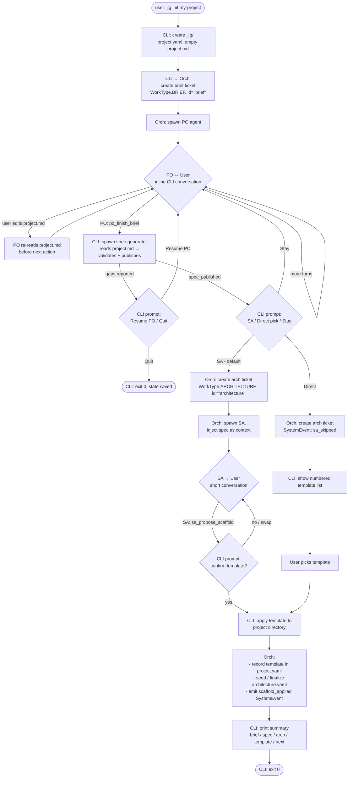

# jig init process — Design

## Summary

`jig init <name>` becomes a multi-phase, ticket-backed workflow. The
user converses with a PO agent to author the brief (`project.md`) on
a reserved `WorkType.BRIEF` ticket. When PO finishes, a one-shot
spec-generator agent translates the brief into the structured spec
(`project.structured.yaml`) and validates it against the brief —
both schema-level and for semantic contradictions. Validation gates
progression: a failing brief cannot proceed to scaffold. The user
then branches into SA-led architecture, a direct template pick, or
back to PO. After scaffold, init exits with brief, spec, and
`architecture.yaml` all populated. Every conversation and event is
persisted; Ctrl-C at any point resumes cleanly on the next run.

## Approach

### Design principles

1. **Brief / spec separation is load-bearing.** `project.md` is
   human-facing. `project.structured.yaml` is agent-facing. Only the
   PO and the spec-generator read the brief. SA, PM, and all worker
   agents consume the spec. This is not optional and not relaxed
   anywhere in the flow.
2. **Only the brief is free-form markdown.** Every other
   machine-authored artifact (`project.structured.yaml`,
   `architecture.yaml`) is structured YAML, because every other
   artifact is an agent-to-agent contract. The brief is the single
   exception because it is human-authored.
3. **The user is always in control of the brief.** They can edit
   `project.md` directly in any editor at any point during the PO
   conversation. PO re-reads the file before every action.
4. **Tickets are the state.** PO and spec-gen produce thread entries
   and SystemEvents on a reserved brief ticket; SA and scaffold
   produce them on a reserved architecture ticket. There is no
   separate state machine — the tickets *are* the state.
5. **Validation is a gate, not a suggestion.** An invalid spec blocks
   scaffold. The only forward paths after a failing spec-gen run are
   resume-PO or quit.
6. **Reuse existing primitives.** `Question`, `Answer`, `Note`,
   `Handoff`, `SystemEvent` are the only thread entry kinds used. No
   new entry types.
7. **SA asks project and scoping questions, never tech preferences.**
   SA's conversation is about the *shape* of the thing being built —
   "will this have a web interface," "how many concurrent users,"
   "does it need to store data." Language, framework, and deploy
   target are SA's to *derive* from the brief and the scoping
   answers, not to elicit from the user. A user who wants to pick
   tech directly takes the direct path. This keeps the SA path
   equally usable for non-technical and technical users — the
   vocabulary never leaves the domain of the problem.

### High-level flow



### Step-by-step narrative

#### 1. Entry

`jig init <name>` runs. CLI checks the target directory:

- Directory doesn't exist → create, cd in, proceed.
- Directory exists, no `.jig/` → proceed; treat as fresh init.
- Directory exists, `.jig/` exists, init in progress → **resume** from
  last persisted state (see §Resume).
- Directory exists, `.jig/` exists, scaffold already applied → error,
  point the user at the next command.
- Directory exists, `.jig/` broken / partial → error with `--force` as
  the escape hatch.

#### 2. Stub creation

Minimal on-disk footprint at start:

```
.jig/
  project.yaml        # { id, name, created_at }
  spec/
    project.md        # empty, or just "# <name>"
```

`architecture.yaml` is not created at stub time — it's seeded after
the architecture branch resolves.

#### 3. Brief ticket + PO spawn

CLI asks the orchestrator to create the brief ticket
(`WorkType.BRIEF`, reserved id `"brief"`) and spawn the PO agent on
it. PO runs in the standard agent sandbox with the standard MCP
surface plus brief-specific tools (see §Interfaces).

PO's system prompt constrains it to product concerns as defined in
`docs/reference/02-project-spec.md` — the product's shape (what it
is, for whom), a capability lifecycle (Built / Planned committed /
Planned not committed / Backlog), and explicit Non-goals. On a fresh
init nothing is Built, so PO is primarily eliciting Planned
capabilities, Backlog items, and Non-goals, with an intro paragraph
that captures product shape. Language, framework, and deploy
decisions are explicitly out of scope for PO — those belong to SA.

#### 4. PO conversation loop

CLI streams PO output to stdout and reads user input from stdin. Each
turn persists as thread entries on the brief ticket:

- PO's questions → `Question` entries.
- User's answers → `Answer` entries (or `Note` if unsolicited).
- PO's writes → `brief_set_section` tool calls, visible as tool-use
  events on the thread. Each write replaces a named section
  atomically.

The user may open `project.md` in any editor at any time. Before
every action, PO re-reads sections from disk via `brief_get_section`
/ `brief_list_sections`. If the user has edited, PO sees the edits
and acknowledges / adjusts in its next turn.

Ctrl-C is safe: thread entries are persisted; re-running `jig init`
resumes from the saved state.

#### 5. PO finishes the brief

When PO judges the brief complete, it calls `po_finish_brief(summary)`.
This emits a `Handoff` thread entry on the brief ticket with
`target_role="spec-generator"`. The orchestrator sees the handoff and
the CLI triggers spec generation.

#### 6. Spec generation (validation gate)

CLI spawns the **spec-generator agent** — short-lived, single-
purpose, no user interaction.

Inputs:
- Read-only access to `docs/brief.md`.
- Read-only access to the spec schema referenced in
  `docs/reference/02-project-spec.md`.

Tool surface (two completion paths):
- `spec_publish(yaml: str, advisory_notes: list[str] = [])` —
  happy path. Writes `.jig/spec/project.structured.yaml` atomically,
  emits `SystemEvent(event_type="spec_generated")` on the brief
  ticket. Advisory notes (non-blocking nitpicks) are posted as a
  `Note` on the brief ticket.
- `spec_report_gaps(gaps: list[Gap])` — failure path. Writes no
  spec. Posts a structured `Note` on the brief ticket with the
  gap list as payload content. Emits
  `SystemEvent(event_type="spec_gaps_reported")`.

The generator reads the brief, produces a YAML projection, checks
the projection against the brief for schema-level validity
(parseability, required fields, type correctness) and semantic
validity (contradictions between sections, direct ambiguities),
and calls exactly one of the two tools. It does not run a
conversation.

**Gap shape** (structured Note payload):

```yaml
kind: missing | contradiction | ambiguity | under_specified
location: <brief section name>
description: <human-readable>
suggested_question: <optional — what PO could ask user>
severity: blocking | advisory
```

- `blocking` gaps always take the `spec_report_gaps` path and
  prevent publish.
- `advisory` gaps are attached to `spec_publish` as
  `advisory_notes`; they don't block.

If gaps were reported, CLI prompts:

```
Spec generation found gaps in the brief:
  - <gap 1>
  - <gap 2>
[R] Resume PO conversation to address  (default)
[Q] Quit (state saved; resume later with `jig init <name>`)
```

`R` re-spawns PO with full thread context including the gap Note. PO
engages the user on each gap. On next `po_finish_brief`, spec-gen
re-runs. Loop until publish.

**No override mechanism.** If the user believes the generator is
wrong, the resolution path is to clarify the brief via PO. There is
no CLI flag to bypass validation.

**Validation bar, v1.** Schema-level: mandatory. Semantic: best-effort
LLM-judgment, tuned through the generator's system prompt. Calibrated
on real briefs; expected to be imperfect. The design accepts some
false positives as preferable to silent pass-through of broken
briefs (see §Risks).

#### 7. Branch — SA, direct, or stay

With a valid spec in place, CLI prompts the user:

```
[Y] Hand off to SA for architecture + template  (default)
[p] Pick a template yourself from the list
[s] Keep talking to PO — brief needs more work
```

- **Y** → create architecture ticket, spawn SA (step 8).
- **p** → create architecture ticket, record `sa_skipped`
  SystemEvent, show template list, user picks (step 9).
- **s** → re-spawn PO with same context; loop back to step 4. The
  spec is kept; next `po_finish_brief` re-runs spec-gen.

#### 8. SA path

Orchestrator creates the architecture ticket
(`WorkType.ARCHITECTURE`, reserved id `"architecture"`) and spawns
SA with the **structured spec** as input context — not the brief.
SA's MCP surface (see §Interfaces) gives it read access to
`project.structured.yaml` and write tools for its own output
(`architecture.yaml`).

SA's conversation is typically short (0–2 turns — often zero,
because the brief already answers what SA needs). Per principle 7,
SA's questions are *project-shape* and *scoping* questions. Sample
question shapes:

- "Does this need a web interface, or is it backend-only?"
- "Will people interact with this in real time, or is it
  batch / scheduled?"
- "Roughly how many concurrent users or requests per second?"
- "Does it need to store data? Roughly how much, and how structured?"
- "Any compliance or regulatory constraints (data residency, audit
  trail, encryption at rest)?"

What SA does NOT ask:

- "Python or TypeScript?"
- "FastAPI or Django?"
- "What deploy target do you want?"

Those are *derivations*, not elicitations. SA reads brief + scoping
answers, selects a template, writes fields (including `language`,
`framework`, `deploy_target`, `rationale`) via `arch_set_field`, and
calls `sa_propose_scaffold(template_name, rationale, config)`.

**Adaptive rule.** If the user volunteers technical language
("I want a FastAPI backend with Postgres"), SA acknowledges and
works with it — but still doesn't solicit tech preferences in later
turns. A user who wants to drive tech choices should be on the
direct path.

CLI intercepts `sa_propose_scaffold` and prompts the user:
`[Y/n/swap]`. The prompt shows the rationale so non-technical users
have something intelligible to accept or reject. Swap re-enters the
SA conversation with the new template as context; decline
terminates init; accept proceeds to step 10.

#### 9. Direct-pick path

No SA conversation. CLI shows a numbered list of available templates
(2–3 in v1), user picks by number. Architecture ticket has a single
`sa_skipped` SystemEvent and no thread entries beyond that.

The direct path is the escape hatch for users with tech preferences.
It's also the correct path for users who already know exactly what
they want and don't need architectural guidance. Template metadata
still populates `language` and `framework` in the resulting
`architecture.yaml` — downstream context hydration needs those
fields regardless of which path produced the file — but there is no
`rationale`, no `config`, and no scoping fields.

#### 10. Scaffold application

CLI applies the chosen template to the project directory. Records
the template name and timestamp in `.jig/project.yaml`. Seeds or
finalizes `.jig/spec/architecture.yaml`:

- **SA path**: `architecture.yaml` already has SA-authored fields
  (via `arch_set_field`). CLI fills in the required top-level keys
  (`template`, `template_applied_at`, `sa_path: true`) alongside
  SA's fields. If SA did not set `language` / `framework` /
  `deploy_target`, CLI backfills them from template metadata so
  downstream consumers can rely on their presence.
- **Direct path**: CLI writes `architecture.yaml` from template
  metadata only — the three required keys plus `language` and
  `framework` (and `deploy_target` if the template declares one).
  No `rationale`, no `config`, no scoping fields.

Emits `SystemEvent(event_type="scaffold_applied")` on the
architecture ticket for the `jig story` trail.

#### 11. Summary and exit

CLI prints:

```
Brief:        docs/brief.md
Spec:         .jig/spec/project.structured.yaml
Architecture: .jig/spec/architecture.yaml
Template:     python-api

Setup log:    jig story brief
              jig story architecture

Next:         [a later sub-project will define this]
```

Exit 0. `jig init` is done.

### Resume mechanics

Re-running `jig init <name>` when `.jig/` already exists:

1. Load `.jig/project.yaml`. If `scaffold_applied_at` is present →
   error ("already initialized; next: ...").
2. Find reserved tickets by id (`"brief"`, `"architecture"`).
3. Dispatch based on thread state:

| State                                                                 | Action                                                     |
|-----------------------------------------------------------------------|------------------------------------------------------------|
| Brief ticket open, no `Handoff`                                       | Re-spawn PO with full thread + reread project.md           |
| Brief ticket has `Handoff`, no `spec_generated` and no gap Note       | Re-run spec-generator                                      |
| Brief ticket has gap Note, no user decision recorded                  | Re-prompt Resume-PO / Quit                                 |
| Brief ticket has `spec_generated`, no branch decision                 | Re-prompt SA / Direct / Stay                               |
| Architecture ticket open, no `sa_propose_scaffold`                    | Re-spawn SA with spec + thread                             |
| Architecture ticket has `sa_propose_scaffold`, no accept/reject       | Re-prompt for confirmation                                 |
| `scaffold_applied` present                                            | Error: already initialized                                 |
| Partial filesystem state (scaffold started but not completed)         | Error, point at `--force`                                  |

No new state machine. Thread entries and SystemEvents on the two
reserved tickets are the state. "Resume" is pure inspection of
persisted records.

## Interfaces

### CLI

```
jig init <name>           # fresh init or resume
jig init <name> --force   # wipe .jig/ state and restart
```

No other flags in v1. `--resume` is implicit in the bare invocation.

### PO agent MCP tools

Brief-specific, on top of the standard MCP surface:

- `brief_get_section(name: str) -> str`
- `brief_list_sections() -> list[str]`
- `brief_set_section(name: str, markdown: str)` — atomic replace of
  a named section in `project.md`. Each call records a tool-use
  event on the brief ticket thread.
- `po_finish_brief(summary: str)` — emits a `Handoff` thread entry
  with `target_role="spec-generator"`.

### Spec-generator agent MCP tools

Read-only file access plus two completion tools. The agent has no
conversational surface.

- `spec_publish(yaml: str, advisory_notes: list[str] = [])` — writes
  `project.structured.yaml` atomically, emits `spec_generated`
  SystemEvent on the brief ticket, posts advisory notes as a `Note`
  if any.
- `spec_report_gaps(gaps: list[Gap])` — posts a structured `Note` on
  the brief ticket with the gap list, emits `spec_gaps_reported`
  SystemEvent.

Exactly one of these two MUST be called before the agent exits. If
the agent exits without calling either, CLI treats it as an
infrastructure failure (see §Risks).

### SA agent MCP tools

Spec-read and architecture-write tools. **No brief tools.** Both
spec and architecture are structured YAML, so the SA surface is
field-based on both sides.

- `spec_get_field(path: str) -> Any` — YAML-path lookup into
  `project.structured.yaml`.
- `spec_list_fields() -> list[str]` — enumerate top-level (or
  recursive) field paths.
- `arch_get_field(path: str) -> Any`
- `arch_set_field(path: str, value: Any)` — atomic per-field write
  into `architecture.yaml`. Each call records a tool-use event on
  the architecture ticket thread.
- `arch_list_fields() -> list[str]`
- `sa_propose_scaffold(template_name: str, rationale: str, config: dict)`

### File formats

- `.jig/project.yaml` — `{ id, name, path, created_at,
  template_name?, template_applied_at? }`. Template fields populated
  only after scaffold.
- `docs/brief.md` — the brief. Human-authoring format
  defined by `docs/reference/02-project-spec.md`: intro paragraph
  describing product shape, then `## Built`, `## Planned
  (committed)`, `## Planned (not yet committed)`, `## Backlog`,
  and `## Non-goals` sections. Capabilities are level-3 headers
  with prose when elaborated, bullets when one-liners.
- `.jig/spec/project.structured.yaml` — the spec. Schema per
  `docs/reference/02-project-spec.md`.
- `.jig/spec/architecture.yaml` — the architecture. Structured YAML.
  SA-authored on SA path, minimal three-key stub on direct path.
  Starter schema (v1):

  ```yaml
  # Required on every architecture.yaml (both paths):
  template: <string>              # template name, e.g. "python-api"
  template_applied_at: <ISO8601>  # UTC timestamp
  sa_path: <bool>                 # true if SA conversation occurred
  language: <string>              # e.g. "python" — from template or SA
  framework: <string>             # optional, e.g. "fastapi"
  deploy_target: <string>         # optional, e.g. "container"

  # Present only on SA path:
  rationale: |                    # SA's reasoning, readable by user
    multi-line string
  config: {<free-form dict>}      # template parameters
  data_stores: []                 # optional, list of {type, purpose}
  external_services: []           # optional, list of {name, purpose}
  deferred_decisions: []          # optional, list of {question, reason}
  ```

  `language`, `framework`, and `deploy_target` are populated from
  template metadata on the direct path and from SA's `arch_set_field`
  calls on the SA path (with CLI backfill from template metadata if
  SA didn't set them).

  The schema is consumed by downstream context hydration (separate
  sub-project). SA may add fields not listed here; downstream
  consumers MUST tolerate unknown keys.

### SystemEvents introduced

Emitted on the brief ticket:
- `spec_generated` — spec published.
- `spec_gaps_reported` — generator reported blocking gaps.

Emitted on the architecture ticket:
- `sa_skipped` — user chose direct-pick.
- `scaffold_applied` — template applied, init complete.

## Data model

### Enum additions

```python
class WorkType(str, Enum):
    ...
    BRIEF = "brief"
    ARCHITECTURE = "architecture"
```

### Reserved ticket ids

Two ids are reserved for `jig init` in every project:
- `"brief"` — the `WorkType.BRIEF` ticket for PO conversation + spec
  generation.
- `"architecture"` — the `WorkType.ARCHITECTURE` ticket for SA
  conversation + scaffold.

Reserved ids are chosen over sequential generation so resume logic
can find them by id without a query on work_type.

### Gap payload

Carried inside a `Note` thread entry (no new entry kind). The Note's
`content` field holds the rendered human-readable form; its
`payload` field (already-existing JSON-dict on `Note`) holds the
structured list:

```yaml
payload:
  gaps:
    - kind: missing | contradiction | ambiguity | under_specified
      location: <brief section name>
      description: <human-readable>
      suggested_question: <optional>
      severity: blocking | advisory
```

PO reads this via thread iteration on re-spawn; the CLI reads it
for the prompt text and for resume-state inspection.

### On-disk tree at each stage

After stub (step 2):
```
.jig/
  project.yaml
  spec/
    project.md
  store/
    tickets.jsonl     # brief ticket
    comments.jsonl    # PO thread entries as they accumulate
```

After spec generation success (step 6):
```
.jig/
  project.yaml
  spec/
    project.md
    project.structured.yaml
  store/ ...
```

After scaffold (step 10):
```
.jig/
  project.yaml              # now includes template_name, applied_at
  spec/
    project.md
    project.structured.yaml
    architecture.yaml
  store/ ...
<scaffolded project tree>
```

## Alternatives considered

### SA asks tech preferences vs project / scoping questions

**Chose project / scoping questions.** The original framing had SA
asking "Python or TypeScript?" and similar preference questions as
clarifying follow-ups. That's wrong: a user who wants to pick tech
should be on the direct path, not the SA path. The SA path exists
for users who want *architectural guidance based on the problem*,
not to pick a framework. Tech preference questions would also put
non-technical users in an impossible position (they don't have an
opinion on FastAPI vs Django and shouldn't need one). By limiting
SA's questions to project shape ("will this have a web interface")
and scoping ("how many concurrent users"), the path is equally
useful for technical and non-technical users, and SA always has
enough information to derive the tech stack itself.

### `architecture.md` (markdown) vs `architecture.yaml` (structured)

**Chose YAML.** Original draft had SA author section-structured
markdown mirroring the brief. The brief / spec separation rationale
does not apply here: the brief is markdown because the *user*
authors it and needs a readable narrative format. Architecture is
agent-authored and agent-consumed — the user opts into (or out of)
SA but never *writes* the architecture doc. Markdown would force
context hydration to either parse loose prose or demand
section-name discipline from SA's prompt; YAML makes the agent-to-
agent contract explicit. Rationale lives as a YAML string field, so
human readers still get prose where it matters.

### Scaffold before SA (legacy `jig init` flow)

**Rejected.** Today's init does exactly this: template pick is the
entire flow. It produces no brief, no spec, no architecture
deliberation. Incompatible with the brief / spec separation and with
downstream agents needing real project context.

### Spec generation after scaffold

**Rejected.** Originally proposed as a terminal step — "produce the
agent-facing artifact once everything else is decided." That framing
treats spec generation as pure serialization. Reframing it as *brief
validation* (this doc's choice) puts it between PO and SA, because
it's now the gate that catches under-specified briefs before
committing to architecture. Also: SA takes the spec as input (brief /
spec separation rule), so SA can't run until spec exists.

### SA always-on vs opt-in with default Y

**Chose opt-in with default Y.** Rationale: the user always controls
the brief, but may or may not care about architectural deliberation
("I just want a python-api template, I know what I need"). Forcing
an SA conversation for users who don't want one is friction. Default
Y keeps the opinionated path in front of new users. Even in the
direct-pick path the user still cannot skip spec generation — spec
is non-optional context for downstream agents.

### `Gap` as a new thread entry type vs structured `Note`

**Chose structured `Note`.** Rationale: `Note` already carries a
`payload` dict. Adding a new entry kind propagates through
`ThreadStore` serialization, `story.py` renderers,
`prompt_builder.py`, and several other places for minimal semantic
gain — the Gap is fundamentally a message from the generator to the
PO / user, which is what `Note` is for. The "adding new entry kinds
is a last resort" constraint argues against a dedicated type.

### Gap reporting as conversation vs structured payload

**Chose structured payload.** The generator does not converse; it
reports. A conversational generator would blur the line with the
reactive spec agent (deferred). Keeping the generator one-shot and
structured preserves the boundary.

### One-shot generator vs reactive agent from day one

**Chose one-shot, deferred reactive.** The reactive agent — edit
detection, drift warnings, out-of-band regeneration — has meaningful
lifecycle complexity (file watching, triggering policies, batching)
that is a separate sub-project. The one-shot generator is enough for
init to produce a working starting state, which is this
sub-project's exit criterion.

### Authorship spectrum: pick one mode for v1 or expose all modes

**Chose one mode, with spectrum acknowledged.** Ultimately the
design should support a range from "I barely speak, PO writes
everything" to "I write the whole thing, PO just validates." v1
ships the middle: collaborative conversation with user-edits-anytime
on disk, PO re-reads before every action. This covers the common
case and the endpoints emerge naturally from it (a silent user
converges toward PO-authored; a talkative user editing the file
directly converges toward user-authored). Explicit mode selection is
deferred.

### `--reset-init` vs `--force`

**Chose `--force` only for v1.** Nuclear option with a typed
confirmation prompt. A safer `--reset-init` that preserves
user-added files in the project directory is a reasonable v2
feature but not blocking.

### Fail-open vs fail-closed on spec generation

**Chose fail-closed.** An init that proceeds to scaffold with no
valid spec creates a broken starting state: `jig start` can't hand
real context to workers. Better to block, route back to PO, and
force the user to address gaps (or quit and return later). The
"continue anyway" option was considered and discarded — it defeats
the validation's purpose.

## Risks

### LLM-judgment-based semantic validation has false positives

The generator will occasionally flag gaps that don't exist, or miss
gaps that do. Too aggressive = init becomes annoying; too lenient =
broken briefs slip through. Mitigation: tuneable via the generator's
system prompt, calibrated through testing on real briefs during
implementation. Acceptable for v1; the cost of a false positive is
one extra PO turn to clarify a section, which is a tolerable
annoyance.

### Long PO conversations may exceed model context

PO's thread can grow without bound. For v1, not a practical
constraint — brief authoring converges in a few tens of turns.
Thread summarization / compaction is deferred (see
`docs/reference/DEFERRED.md` — cross-phase, thread summarization).

### Agent crash mid-flow

PO, SA, or spec-generator crashes leave their ticket's thread
populated with whatever persisted. Resume on next `jig init` re-
spawns the relevant agent with the full thread as context. No
automatic retry in v1 — user re-runs explicitly.

### User edits `project.md` while PO is mid-turn

PO's next tool call reads updated content via `brief_get_section`.
If edits contradict in-progress PO reasoning, PO acknowledges and
adjusts. No locking, no conflict detection — consistent with "user
is always in control."

The same applies to `architecture.yaml` during SA conversations —
the `arch_get_field` call reads from disk.

### Half-applied scaffold

Template application is not transactional. If it fails partway,
project.yaml lacks `template_applied_at`, no `scaffold_applied`
SystemEvent, but the project tree has random files. Next `jig init`
detects this and errors; user must `--force` to restart. Real
staging / rollback is deferred.

### Generator exits without calling either completion tool

Treated as an infrastructure failure. CLI prompts
`[R]etry / [Q]uit`. No Note is posted; the brief ticket has a
`Handoff` with no subsequent `spec_generated` or
`spec_gaps_reported`, which resume detects as "re-run generator."

### Template library churn

Templates will evolve. `architecture.yaml` records *which* template
was applied and the config used, not the template's contents. A
template change does not retroactively invalidate a project's
architecture doc.

## Out of scope

- Reactive spec agent (edit detection, drift, auto-regeneration on
  user out-of-band edits).
- PM role, issues, plans, capability specs, worker agent flows.
- Template-context library (template-aware context composition for
  downstream agents).
- Canonical section names for brief and architecture.
- Transactional scaffolding / rollback.
- TUI integration.
- `--reset-init` and other safer-than-`--force` escape hatches.
- Streaming progress UI during spec generation.
- Override mechanism for spec-generator findings.
- Multi-template scaffolds (combining more than one template in a
  single init).
- **Template specification.** What a template *is* — its directory
  layout, required metadata (name, language, framework,
  deploy_target, defaults), config-parameter schema, scaffolding
  hooks — is not defined in this sub-project. v1 uses an informal
  convention shared between `jig init` and the existing `templates/`
  directory. A proper template spec lands when the template library
  grows past the initial 2–3 entries or when third parties need to
  author templates.

## Open questions

- [ ] Exact initial template set. Likely two or three in v1
  (python-api, python-cli, typescript-cli). Locked during
  implementation.
- [ ] Whether `sa_propose_scaffold`'s `config` dict needs a schema
  or is free-form in v1. Leaning free-form (it's SA's note-to-self
  about template parameters); a schema can be added if templates
  demand it.
- [ ] Whether the orchestrator needs a `target_role="spec-generator"`
  convention or whether the CLI triggers the generator directly
  without a handoff. Leaning toward handoff for story trail
  consistency, but CLI-triggered is simpler. Decision defers to
  implementation, minor impact.

## Change log

- 2026-04-24: Initial draft (brent)
- 2026-04-24: architecture artifact is YAML, not markdown. SA tool
  surface is field-based (`arch_get_field` / `arch_set_field` /
  `arch_list_fields`) on both spec and architecture. Added starter
  architecture schema and alternatives entry. (brent)
- 2026-04-24: SA asks project and scoping questions only, never
  tech preferences (that's the direct path). Added principle 7,
  step 8 question shapes, direct-path architecture.yaml
  clarification, schema split between required-both-paths and
  SA-path-only fields, and alternatives entry. (brent)
- 2026-04-24: Template specification noted as out of scope; lands
  when the template library grows past the v1 starter set. (brent)
- 2026-04-24: Brief format is defined in
  docs/reference/02-project-spec.md (state-category sections,
  level-3 capability headers, bullets for one-liners, intro
  paragraph). Removed stale "canonical section names" open
  question. (brent)
